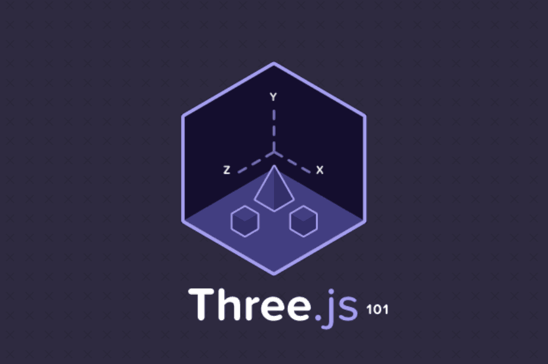

## 学习 Three.js 之前要知道的



<!--more-->

### 什么是 WebGL？

WebGL（Web 图形库）是一种 JavaScript API，用于在任何兼容的 Web 浏览器中呈现交互式 3D 和 2D 图形，而无需使用插件。WebGL 通过引入一个与 OpenGL ES 2.0 紧密相符合的 API，可以在 HTML5 `<canvas>` 元素中使用。WebGL 给我们提供了一系列的图形接口，能够让我们通过 JavaScript 去使用 GPU 来进行浏览器图形渲染的工具。

### 什么是 Three.js？

Three.js 是一款 webGL 框架，由于其易用性被广泛应用。Three.js 在 WebGL 的 API 接口基础上，又进行的一层封装。Three.js 以简单、直观的方式封装了 3D 图形编程中常用的对象。Three.js 在开发中使用了很多图形引擎的高级技巧，极大地提高了性能。另外，由于内置了很多常用对象和极易上手的工具，Three.js 的功能也非常强大，Three.js 还是完全开源的。

#### WEBGL 和 Three.js 的关系

WebGL 原生 API 是一种非常低级的接口，而且还需要一些数学和图形学的相关技术。对于没有相关基础的人来说，入门真的很难，Three.js 将入门的门槛降低了一大截，对 WebGL 进行封装，简化我们创建三维动画场景的过程。

用最简单的一句话概括：WebGL 和 Three.js 的关系，相当于 JavaScript 和 jQuery 的关系。

#### 功能概述

Three.js 作为 WebGL 框架中的佼佼者，由于它的易用性和扩展性，使得它能够满足大部分的开发需求，Three.js 的具体功能如下：

1. **Three.js 掩盖了 3D 渲染的细节**：Three.js 将 WebGL 原生 API 的细节抽象化，将 3D 场景拆解为网格、材质和光源（即它内置了图形编程常用的一些对象种类）。
2. **面向对象**：开发者可以使用上层的 JavaScript 对象，而不是仅仅调用 JavaScript 函数。
3. **功能非常丰富**：Three.js 除封装了 WebGL 原始 API 之外，Three.js 还包含了许多实用的内置对象，可以方便地应用于游戏开发、动画制作、幻灯片制作、髙分辨率模型和一些特殊的视觉效果制作。
4. **速度很快**：Three.js 采用了 3D 图形最佳实践来保证在不失可用性的前提下，保持极高的性能。
5. **支持交互**：WebGL 本身并不提供拾取（Picking）功能（即是否知道鼠标正处于某个物体上）。而 Three.js 则固化了拾取支持，这就使得你可以轻松为你的应用添加交互功能。
6. **包含数学库**：Three.js 拥有一个强大易用的数学库，你可以在其中进行矩阵、投影和矢量运算。
7. **内置文件格式支持**：你可以使用流行的 3D 建模软件导出文本格式的文件，然后使用 Three.js 加载，也可以使用 Three.js 自己的 JSON 格式或二进制格式。
8. **扩展性很强**：为 Three.js 添加新的特性或进行自定义优化是很容易的事情。如果你需要某个特殊的数据结构，那么只需要封装到 Three.js 即可。
9. **支持 HTML5 Canvas**：Three.js 不但支持 WebGL，而且还支持使用 Canvas2D、Css3D 和 SVG 进行渲染。在未兼容 WebGL 的环境中可以回退到其它的解决方案。

#### 缺点

- 官网文档非常粗糙，对于新手极度不友好。
- 国内的相关资源匮乏。
- Three.js 所有的资料都是以英文格式存在，对国内的朋友来说又提高了门槛。
- Three.js 不是游戏引擎，一些游戏相关的功能没有封装在里面，如果需要相关的功能需要进行二次开发。

#### Three.js 与其他库的对比

| 库名       | 描述                                                                                                                  | 相比 Three.js                                                                                                                                                                                                                                                                                                                                                                                                                                                      |
| ---------- | --------------------------------------------------------------------------------------------------------------------- | ------------------------------------------------------------------------------------------------------------------------------------------------------------------------------------------------------------------------------------------------------------------------------------------------------------------------------------------------------------------------------------------------------------------------------------------------------------------ |
| Babylon.js | 是最好的 JavaScript 3D 游戏引擎，它能创建专业级三维游戏。主要以游戏开发和易用性为主                                   | <p> Three.js 比较全面，而 Babylon.js 专注于游戏方面。 </p> <p>Babylon.js 提供了对碰撞检测、场景重力、面向游戏的照相机，Three.js 本身不自带，需要依靠引入插件实现。</p><p> 对于 WebGL 的封装，双方做得各有千秋，Three.js 浅一些，好处是易于扩展，易于向更底层学习；Babylon.js 深一些，好处是易用，但扩展难度大一些。 </p><p> Three.js 的发展依靠社区推动，出来的比较早，发展比较成熟，Babylon.js 由微软公司在 2013 推出，文档和社区都比较健全，国内还不怎么火。</p> |
| PlayCanvas | 是一个基于 WebGL 游戏引擎的企业级开源 JavaScript 框架，它有许多的开发工具能帮你快速创建 3D 游戏                       | PlayCanvas 的优势在于它有云端的在线可视化编辑工具。 PlayCanvas 的扩展性不如 Three.js。 最主要是 PlayCanvas 不完全开源，还商业付费。                                                                                                                                                                                                                                                                                                                                |
| Cesium     | 是国外一个基于 JavaScript 编写的使用 WebGL 的地图引擎，支持 3D、2D、2.5D 形式的地图展示，可以自行绘制图形，高亮区域。 | Cesium 是一个地图引擎，专注于 GIS，相关项目推荐使用它，其它项目还是算了。 至于库的扩展，其它的配套插件，以及周边的资源都不及 Three.js。                                                                                                                                                                                                                                                                                                                            |

Three.js 在其库的扩展性，易用性以及功能方面有很好的优势。

### Three.js-master 源码目录结构

- build：里面含有 Three.js 构建出来的 JavaScript 文件，可以直接引入使用，并有压缩版；
- docs：Three.js 的官方文档；
- editor：Three.js 的一个网页版的模型编辑器；
- examples：Three.js 的官方案例，如果全都学会，必将成为大神；
- src：这里面放置的全是编译 Three.js 的源文件；
- test：一些官方测试代码，我们一般用不到；
- utils：一些相关插件；
- 其他：开发环境搭建、开发所需要的文件，如果不对 Three.js 进行二次开发，用不到。

### 使用 Three.js

#### 第一个案例

<div class="note info">所有关于Threejs的代码均在https://github.com/Cenergy/webpack-threejs.git</div>
```html
<!DOCTYPE html>
<html>
  <head>
    <meta charset="utf-8" />
    <title>第一个Three.js案例</title>
    <style>
      body {
        margin: 0;
      }

      canvas {
        width: 100%;
        height: 100%;
        display: block;
      }
    </style>

  </head>
  <body onload="init()">
    <script src="https://cdn.bootcss.com/three.js/108/three.js"></script>
    <script>
      //声明一些全局变量
      var renderer, camera, scene, geometry, material, mesh;

      //初始化渲染器
      function initRenderer() {
        renderer = new THREE.WebGLRenderer(); //实例化渲染器
        renderer.setSize(window.innerWidth, window.innerHeight); //设置宽和高
        document.body.appendChild(renderer.domElement); //添加到dom
      }

      //初始化场景
      function initScene() {
        scene = new THREE.Scene(); //实例化场景
      }

      //初始化相机
      function initCamera() {
        camera = new THREE.PerspectiveCamera(
          45,
          window.innerWidth / window.innerHeight,
          0.1,
          200
        ); //实例化相机
        camera.position.set(0, 0, 15);
      }

      //创建模型
      function initMesh() {
        geometry = new THREE.BoxGeometry(2, 2, 2); //创建几何体
        material = new THREE.MeshNormalMaterial(); //创建材质
        mesh = new THREE.Mesh(geometry, material); //创建网格
        scene.add(mesh); //将网格添加到场景
      }

      //运行动画
      function animate() {
        requestAnimationFrame(animate); //循环调用函数
        mesh.rotation.x += 0.01; //每帧网格模型的沿x轴旋转0.01弧度
        mesh.rotation.y += 0.02; //每帧网格模型的沿y轴旋转0.02弧度
        renderer.render(scene, camera); //渲染界面
      }

      //初始化函数，页面加载完成是调用
      function init() {
        initRenderer();
        initScene();
        initCamera();
        initMesh();
        animate();
      }
    </script>

  </body>
</html>
```


