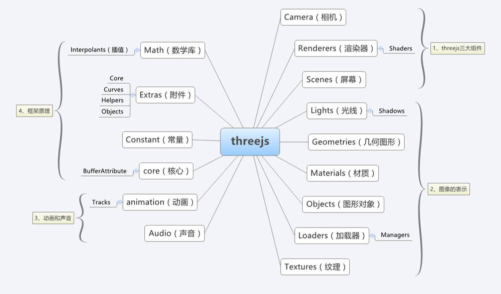

<!--more-->

## 概述

**使用 Three.js 显示创建的内容，我们必须需要的三大件是：渲染器、相机和场景。**相机获取到场景内显示的内容，然后再通过渲染器渲染到画布上面。

要在屏幕上展示3D图形，思路大体上都是这样的：

1. 构建一个三维空间
   - Three中称之为场景(Scene)
2. 选择一个观察点，并确定观察方向/角度等
   - Three中称之为相机(Camera)
3. 在场景中添加供观察的物体
   - Three中的物体有很多种，包括Mesh,Line,Points等，它们都继承自Object3D类
4. 将观察到的场景渲染到屏幕上的指定区域
   - Three中使用Renderer完成这一工作

<div class="note info">拿电影来类比的话，场景对应于整个布景空间，相机是拍摄镜头，渲染器用来把拍摄好的场景转换成胶卷。</div>
### 场景 Scene

场景是所有物体的容器，也对应着我们创建的三维世界。场景允许你设置哪些对象被Three.js渲染以及渲染在哪里。在场景中放置对象、灯光和相机。

### 相机 Camera

```js
// 初始化相机
function initCamera() {
  camera = new THREE.PerspectiveCamera(45, window.innerWidth / window.innerHeight, 0.1, 200); // 实例化相机
  camera.position.set(0, 0, 15);
}
```

#### 相机

Three中的相机有两种，分别是正投影相机THREE.OrthographicCamera和透视投影相机THREE.PerspectiveCamera。 


正交投影与透视投影的区别如上图所示，左图是正交投影，物体发出的光平行地投射到屏幕上，远近的方块都是一样大的；右图是透视投影，近大远小，符合我们平时看东西的感觉。 
[维基百科：三维投影](https://link.zhihu.com/?target=https%3A//zh.wikipedia.org/wiki/%E4%B8%89%E7%BB%B4%E6%8A%95%E5%BD%B1)

##### 正交投影相机

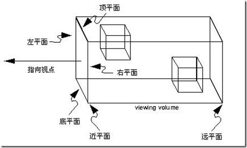

可以近似地认为，视景体里的物体平行投影到近平面上，然后近平面上的图像被渲染到屏幕上。

##### 透视投影相机

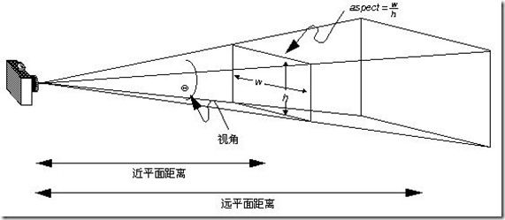

#### 坐标系

Camera是三维世界中的观察者，为了观察这个世界，首先我们要描述空间中的位置，Three中使用采用常见的[右手坐标系](https://link.zhihu.com/?target=https%3A//zh.wikipedia.org/wiki/%E7%AC%9B%E5%8D%A1%E5%84%BF%E5%9D%90%E6%A0%87%E7%B3%BB%23.E4.B8.89.E7.B6.AD.E7.A9.BA.E9.96.93)定位：

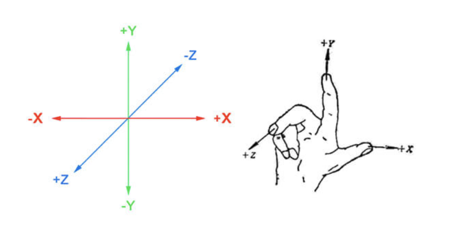

我们这里使用到的是 `THREE.PerspectiveCamera`，这个相机模拟人眼看到的效果，就是具有透视的效果，近大远小。

第一行，我们实例化了一个透视相机，需要四个值，分别是视野、宽高比、近裁面和远裁面。

- 视野：当前相机视野的宽度，值越大，渲染出来的内容也会更多。
- 宽高比：默认是按照画布显示的宽高比例来设置，如果比例设置的不对，会发现渲染出来的画面有拉伸或者压缩的感觉。
- 近裁面和远裁面：这个是设置相机可以看到的场景内容的范围，如果场景内的内容位置不在这两个值内的话，将不会被显示到渲染的画面中。

第二行，我们设置了相机的位置。

### 渲染器 Renderer

```js
//初始化渲染器
function initRenderer() {
    renderer = new THREE.WebGLRenderer(); //实例化渲染器
    renderer.setSize(window.innerWidth, window.innerHeight); //设置宽和高
    document.body.appendChild(renderer.domElement); //添加到dom
}
```

第一行实例化了一个 `THREE.WebGLRenderer`，这是一个基于 WebGL 渲染的渲染器，当然，Three.js 向下兼容，还有 CanvasRenderer、CSS2DRenderer、CSS3DRenderer 和 SVGRenderer，这四个渲染器分别基于 canvas2D、CSS2D、CSS3D 和 SVG 渲染的渲染器。由于，作为 3D 渲染，WebGL 渲染的效果最好，并且支持的功能更多。

第二行，调用了一个设置函数 setSize 方法，这个是设置需要显示的窗口大小。案例是基于浏览器全屏显示，所以设置了浏览器窗口的宽和高。

第三行，`renderer.domElement` 是在实例化渲染器时生成的一个 Canvas 画布，渲染器渲染界面生成的内容，都将在这个画布上显示。所以，我们将这个画布添加到了 DOM 当中，来显示渲染的内容。

### 模型 Object3D

渲染器，场景和相机都全了，是不是就能显示东西了？不能！因为场景内没有内容，即使渲染出来也是一片漆黑，所以我们需要往场景里面添加内容。接下来，我们将查看 initMesh 方法，看看如何创建一个最简单的模型：

```js
//创建模型
function initMesh() {
    geometry = new THREE.BoxGeometry( 2, 2, 2 ); //创建几何体
    material = new THREE.MeshNormalMaterial(); //创建材质

    mesh = new THREE.Mesh( geometry, material ); //创建网格
    scene.add( mesh ); //将网格添加到场景
}
```

创建一个网格（模型）需要两种对象：几何体和材质。

- 几何体代表模型的形状，它是由固定的点的位置组成，点绘制出面，面组成了模型。
- 材质是我们看到当前模型显示出来的效果，如显示的颜色，质感等。

Three中供显示的物体有很多，它们都继承自Object3D类

#### Mesh

我们都知道，计算机的世界里，一条弧线是由有限个点构成的有限条线段连接得到的。线段很多时，看起来就是一条平滑的弧线了。 
计算机中的三维模型也是类似的，普遍的做法是用三角形组成的网格来描述，我们把这种模型称之为Mesh模型。 

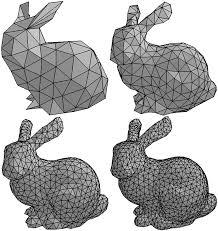

> 这是那只著名的[斯坦福兔子](https://link.zhihu.com/?target=https%3A//en.wikipedia.org/wiki/Stanford_bunny)。它在3D图形中的地位与数字图像处理领域中著名的[Lenna]([https://baike.baidu.com/item/%E8%8E%B1%E5%A8%9C%E5%9B%BE/3797874?fr=aladdin)是类似的。 
> 看这只兔子，随着三角形数量的增加，它的表面越来越平滑

在Three中，Mesh的构造函数是这样的：Mesh( geometry, material ) 
geometry是它的形状，material是它的材质。 
不止是Mesh，创建很多物体都要用到这两个属性。下面我们来看看这两个重要的属性。Material和Geometry是相辅相成的，必须结合使用。

##### Geometry

Geometry，形状，相当直观。Geometry通过存储模型用到的点集和点间关系(哪些点构成一个三角形)来达到描述物体形状的目的。 
Three提供了立方体(其实是长方体)、平面(其实是长方形)、球体、圆形、圆柱、圆台等许多基本形状； 
你也可以通过自己定义每个点的位置来构造形状； 
对于比较复杂的形状，我们还可以通过外部的模型文件导入。

##### Material

Material，材质，这就没有形状那么直观了。 
材质其实是物体表面除了形状以为所有可视属性的集合，例如色彩、纹理、光滑度、透明度、反射率、折射率、发光度。 
这里讲一下材质(Material)、贴图(Map)和纹理(Texture)的关系。 
材质上面已经提到了，它包括了贴图以及其它。 
贴图其实是‘贴’和‘图’，它包括了图片和图片应当贴到什么位置。 
纹理嘛，其实就是‘图’了。 
Three提供了多种材质可供选择，能够自由地选择漫反射/镜面反射等材质。

### 光影Light

神说：要有光！ 
光影效果是让画面丰富的重要因素。 
Three提供了包括环境光AmbientLight、点光源PointLight、 聚光灯SpotLight、方向光DirectionalLight、半球光HemisphereLight等多种光源。 
只要在场景中添加需要的光源就好了。

### 让场景动起来

动画，就是多幅图片一直切换便可显示动画的效果。为了能显示动画的效果，我们首先要了解一个函数 requestAnimationFrame，这个函数专门为了动画而出现。它与 setInterval 相比，优势在于不需要设置多长时间重新渲染，而是在当前线程内 JS 空闲时自动渲染，并且最大帧数控制在一秒60帧。所以，我们书写了一个可以循环调用的函数：

```js
function animate() {
    requestAnimationFrame(animate); //循环调用函数
    // ...
}
```

在循环调用的函数中，每一帧我们都让页面重新渲染相机拍摄下来的内容：

```js
renderer.render( scene, camera ); //渲染界面
```

渲染的 render 方法需要两个值，第一个值是场景对象，第二个值是相机对象。这意味着，你可以有多个相机和多个场景，可以通过渲染不同的场景和相机让画布上显示不同的画面。

但是，如果现在一直渲染的话，我们发现就一个立方体在那，也没有动，我们需要做的是让立方体动起来：

```js
mesh.rotation.x += 0.01; //每帧网格模型的沿x轴旋转0.01弧度
mesh.rotation.y += 0.02; //每帧网格模型的沿y轴旋转0.02弧度
```

每一个实例化的网格对象都有一个 rotation 的值，通过设置这个值可以让立方体旋转起来。在每一帧里，我们让立方体沿 x 轴方向旋转0.01弧度，沿 y 轴旋转0.02弧度（1π 弧度等于180度角度）。

### Threejs性能检测插件

在 Three.js 里面，遇到最多的问题就是性能问题，所以我们需要时刻检测当前的 Three.js 的性能。现在 Three.js 常使用的一款插件叫 stats。接下来我们看看如何将 stats 插件在 Three.js 的项目中使用。

- 首先在页面中引入插件代码：

```js
<script src="http://www.wjceo.com/lib/js/libs/stats.min.js"></script>
```

这是     一个 CDN 的地址，直接引入即可。

- 然后，我们需要实例化一个 stats 对象，然后把对象内生成的 DOM 添加到页面当中。

```js
stats = new Stats();
document.body.appendChild(stats.dom);
```

- 最后一步，我们需要在 requestAnimationFrame 的回调里面更新每次渲染的时间：

```js
function animate() {
    requestAnimationFrame(animate); //循环调用函数
    stats.update(); //更新性能插件
    renderer.render( scene, camera ); //渲染界面
}
```

使用了性能检测插件以后，整个代码如下：

```html
<!DOCTYPE html>
<html>
  <head>
    <meta charset="utf-8" />
    <meta
      name="viewport"
      content="width=device-width, user-scalable=no, initial-scale=1.0, maximum-scale=1.0, minimum-scale=1.0"
    />
    <meta http-equiv="X-UA-Compatible" content="ie=edge" />
    <title>Stats插件案例</title>
    <style>
      body {
        margin: 0;
      }

      canvas {
        width: 100%;
        height: 100%;
        display: block;
      }
    </style>
  </head>
  <body onload="init()">
    <script src="https://cdn.bootcss.com/three.js/92/three.js"></script>
    <script src="http://www.wjceo.com/lib/js/libs/stats.min.js"></script>
    <script>
      //声明一些全局变量
      var renderer, camera, scene, geometry, material, mesh, stats;
      //初始化渲染器
      function initRenderer() {
        renderer = new THREE.WebGLRenderer(); //实例化渲染器
        renderer.setSize(window.innerWidth, window.innerHeight); //设置宽和高
        document.body.appendChild(renderer.domElement); //添加到dom
      }

      //初始化场景
      function initScene() {
        scene = new THREE.Scene(); //实例化场景
      }

      //初始化相机
      function initCamera() {
        camera = new THREE.PerspectiveCamera(
          45,
          window.innerWidth / window.innerHeight,
          0.1,
          200
        ); //实例化相机
        camera.position.set(0, 0, 15);
      }

      //创建模型
      function initMesh() {
        geometry = new THREE.BoxGeometry(2, 2, 2); //创建几何体
        material = new THREE.MeshNormalMaterial(); //创建材质
        mesh = new THREE.Mesh(geometry, material); //创建网格
        scene.add(mesh); //将网格添加到场景
      }

      //运行动画
      function animate() {
        requestAnimationFrame(animate); //循环调用函数
        mesh.rotation.x += 0.01; //每帧网格模型的沿x轴旋转0.01弧度
        mesh.rotation.y += 0.02; //每帧网格模型的沿y轴旋转0.02弧度
        stats.update(); //更新性能检测框
        renderer.render(scene, camera); //渲染界面
      }

      //性能检测框
      function initStats() {
        stats = new Stats();
        document.body.appendChild(stats.dom);
      }

      //初始化函数，页面加载完成是调用
      function init() {
        initRenderer();
        initScene();
        initCamera();
        initMesh();
        initStats();
        animate();
      }
    </script>
  </body>
</html>
```

## 场景Scene 

场景是我们每个 Three.js 项目里面放置内容的容器，我们也可以拥有多个场景进行切换展示，你可以在场景内放置你的模型、灯光和照相机。还可以通过调整场景的位置，让场景内的所有内容都一起跟着调整位置。

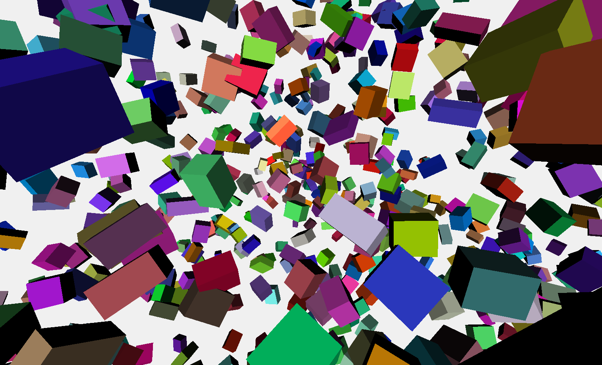


### 场景的结构

之前在刚刚开始学 JavaScript 基础时，我们总免不了去操作 DOM 对象，而且我们都知道 DOM 的结构是树形结构的，Three.js 也遵循了这样的理念，将所有可以添加到场景内的结构梳理成了一种树形的结构，方便我们能够更好的理解Three.js。

我们可以把 Scene 想象成一个 body，body 内可以添加 DOM 对象，scene 内也可以添加它的 3D 对象，这样一层层的嵌套出来，组成了我们现在需要的项目。所以，在 Three.js 中，为了方便操作，将所有 3D 对象共同的内容抽象成了一个基类，就是 `THREE.Object3D`。

### THREE.Object3D

为了方便操作，Three.js 将每个能够直接添加到场景内的对象都继承自一个基类——`THREE.Object3D`，以后我们将继承自这个基类的对象称为 3D 对象，判断一个对象是否是继承自 `THREE.Object3D`，我们可以这么做：

```js
obj instanceof THREE.Object3D
//继承至返回 true 否则返回false
```

这个基类上封装了我们常用的一些方法，下面我们分别介绍下。

#### 添加一个 3D 对象

```js
scene.add(mesh); //将网格添加到场景
```

将一个立方体添加到场景内显示。

这个方法不光能够在场景内使用，而且也可以将一个 3D 对象添加到另一个 3D 对象里面，代码如下：

```js
parent.add(child);
```

#### 获取一个 3D 对象

获取一个 3D 对象可以使用 getObjectByName 通过 3D 对象的 name 值进行获取，在获取前我们首先要设置当前 3D 对象的 name 值：

```js
object3D.name = "firstObj";
scene.add(object3D);
scene.getObjectByName("firstObj"); //返回第一个匹配的3d对象
```

另一种方式就是使用 getObjectById 通过 3D 对象的 id 值进行获取，3D 对象的 id 值只能读取，它是在添加到场景时，按 1、2、3、4、5……的顺序默认生成的一个值，无法自定义：

```js
scene.getObjectById(1); //返回id值为1的3d对象
```

#### 删除一个 3D 对象

如果我们想隐藏一个 3D 对象，而不让它显示，可以通过设置它的 visible的值来实现：

```js
mesh.visible = false; //设置为false，模型将不会被渲染到场景内
```

如果一个模型不再被使用到，需要彻底删除，我们可以使用 remove 方法进行删除：

```js
scene.add(mesh); //将一个模型添加到场景当中
scene.remove(mesh); //将一个模型从场景中删除
```

#### 获取到所有的子类

每一个 3D 对象都有一个 children 属性，这是一个数组，里面包含所有添加的 3D 对象：

```js
scene.add(mesh1);
scene.add(mesh2);
console.log(scene.children);
// [mesh1, mesh2]
```

如果想获取 3D 对象下面所有的 3D 对象，我们可以通过 traverse方法获取：

```js
mesh1.add(mesh2); //mesh2是mesh1的子元素
scene.add(mesh1); //mesh1是场景对象的子元素
scene.traverse(fucntion(child){
    console.log(child);
});
//将按顺序分别将mesh1和mesh2打印出来
```

#### 获取 3D 对象的父元素

每个 3D 对象都有一个父元素，可以通过 parent 属性进行获取：

```js
scene.add(mesh); //将模型添加到场景
console.log(mesh.parent === scene); //true
```

#### 修改 3D 对象

前面介绍了场景的结构以及场景的 3D 对象添删查，下面，我们接着介绍对场景内模型的一些操作。

##### 修改位置方式

我们可以通过设置模型的 position 属性来修改模型的当前位置，具体方法有以下几种。

- 单独设置每个方向的属性。

```js
mesh.position.x = 3; //将模型的位置调整到x正轴距离原点为3的位置。
mesh.position.y += 5; //将模型的y轴位置以当前的位置向上移动5个单位。
mesh.position.z -= 6;
```

- 直接一次性设置所有方向的属性。

```js
mesh.position.set(3, 5, -6);  //直接将模型的位置设置在x轴为3，y轴为5，z轴为-6的位置
```

- Three.js 模型的位置属性是一个 `THREE.Vector3`（三维向量）的对象，我们可以直接重新赋值一个新的对象。

```js
mesh.position = new THREE.Vector3(3, 5, -6); //上面的设置位置也可以通过这样设置。
```

##### 修改大小的方式

模型导入后，很多情况下都需要调整模型的大小。我们可以通过设置模型的 scale 属性来调整大小。

- 第一种方式是单独设置每个方向的缩放。

```js
mesh.scale.x = 2; //模型沿x轴放大一倍
mesh.scale.y = 0.5; //模型沿y轴缩小一倍
mesh.scale.z = 1; //模型沿z轴保持不变
```

- 第二种是使用 set 方法。

```js
mesh.scale.set(2, 2, 2); //每个方向等比放大一倍
mesh.scale.set(0.5, 0.5, 0.5); //每个方向等比缩小一倍
```

- 第三种方式，由于 scale 属性也是一个三维向量，我们可以通过赋值的方式重新修改。

```js
mesh.scale = new THREE.Vector3(2, 2, 2); //每个方向都放大一倍
```

##### 修改模型的转向

很多情况下，我们需要对模型进行旋转，以达到将模型显示出它需要显示的方位，我们可以通过设置模型的 rotation 属性进行旋转（注意：旋转 Three.js 使用的是弧度不是角度）。

- 第一种方式是单独设置每个轴的旋转。

```js
mesh.rotation.x = Math.PI; //模型沿x旋转180度
mesh.rotation.y = Math.PI * 2; //模型沿y轴旋转360度，跟没旋转一样的效果。。。
mesh.rotation.z = - Math.PI / 2; //模型沿z轴逆时针旋转90度 
```

- 第二种方式就是使用 set 方法重新赋值。

```js
mesh.rotation.set(Math.PI, 0, - Math.PI / 2); //旋转效果和第一种显示的效果相同
```

正常模型的旋转方式是按照 XYZ 依次旋转的，如果你想先旋转其他轴，我们可以添加第四项修改，有可能的情况为：YZX、ZXY、XZY、YXZ 和 ZYX。

```js
mesh.rotation.set(Math.PI, 0, - Math.PI / 2, "YZX"); //先沿y轴旋转180度，再沿z轴旋转0度，最后沿x轴逆时针旋转90度
```

- 第三种方式，模型的 rotation 属性其实是一个欧拉角对象（`THREE.Euler`），欧拉角后面会讲解到，我们可以通过重新赋值一个欧拉角对象来实现旋转调整：

```js
mesh.rotation = new THREE.Euler(Math.PI, 0, - Math.PI / 2, "YZX"); 
```

### 使用 dat.GUI 实现页面调试

有些时候，我们需要调整模型的位置或者大小等，且需要每次都去场景内调试，一种常用的插件 `dat.GUI`

- 首先，需要将插件的源码引入到页面当中，我这里直接使用 CDN 的连接。

```js
<script src="https://cdn.bootcss.com/dat-gui/0.7.1/dat.gui.min.js"></script>
```

- 创建一个对象，在里面设置我们需要修改的一些数据。

```js
controls = {
    positionX:0,
    positionY:0,
    positionZ:0
};
```

- 实例化`dat.GUI`对象，将需要修改的配置添加对象中，并监听变化回调。

```js
gui = new dat.GUI();
gui.add(controls, "positionX", -1, 1).onChange(updatePosition);
gui.add(controls, "positionY", -1, 1).onChange(updatePosition);
gui.add(controls, "positionZ", -1, 1).onChange(updatePosition);

function updatePosition() {
    mesh.position.set(controls.positionX, controls.positionY, controls.positionZ);
}
```

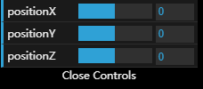

这样，只要我们每次修改对象里面的值，都会触发 `updatePosition` 回调，来更新模型的位置。这样，我们就实现了一个简单的案例。

接下来，我列出一下经常会使用到一些方式和方法。

#### 生成一个输入框

`dat.GUI` 能够根据 controls 值的不同而生成不同的操作方法，如果值的类型为字符串或者数字类型，则可以生成一个默认的输入框：

```js
gui.add(controls, "positionX");
gui.add(controls, "positionY");
gui.add(controls, "positionZ");
```

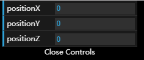

#### 生成一个可以滑动的滑块

使用 `gui.add()` 方法，如果值为数字类型，传入的第三个值（最小值）和第四个值（最大值），就限制了值能够取值的范围，这样就生成了可以滑动的滑块：

```js
gui.add(controls, "positionX", -1, 1); //设置了最小值和最大值，可以生成滑块
gui.add(controls, "positionY").max(1); //只设置了最大值，无法生成滑块
gui.add(controls, "positionZ").min(-1); //只设置了最小值，也无法生成滑块
```

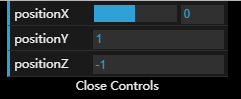

我们还可以通过 step() 方法来限制每次变化的最小值，也就是你增加或者减少，必须都是这个值的倍数：

```js
gui.add(controls, "positionX", -10, 10).step(1); //限制必须为整数
gui.add(controls, "positionY", -10, 10).step(0.1); //每次变化都是0.1的倍数
gui.add(controls, "positionZ", -10, 10).step(10); //每次变化都是10的倍数
```

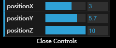

#### 生成一个下拉框

只要按规则在 `gui.add()` 的第三个值传入一个对象或者数组，`dat.GUI` 就能够自动匹配生成一个下拉框：

```js
controls = {
    positionX:0,
    positionY:false,
    positionZ:"middle"
};

gui = new dat.GUI();
gui.add(controls, "positionX", {left:-10, middle:0, right:10}); //数字类型的下拉框
gui.add(controls, "positionY", [true, false]); //布尔值类型的下拉框
gui.add(controls, "positionZ", ["left", "middle", "right"]); //字符串类型的下拉框
```


#### 生成一个 Checkbox

只要 controls 的值是一个布尔类型，使用 `gui.add()` 方法就可以生成一个复选框：

```js
controls = {
    positionX:true,
    positionY:false,
    positionZ:false
};

gui = new dat.GUI();
gui.add(controls, "positionX");
gui.add(controls, "positionY");
gui.add(controls, "positionZ");
```

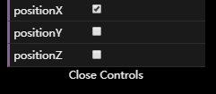

#### 生成一个点击事件按钮

如果 controls 的值为一个函数 Function，`dat.GUI` 会自动生成一个可以点击的按钮，当按下时就会触发这个函数事件：

```js
        controls = {
            positionX:function () {},
            positionY:function () {},
            positionZ:function () {}
        };

        gui = new dat.GUI();
        gui.add(controls, "positionX");
        gui.add(controls, "positionY");
        gui.add(controls, "positionZ");
```

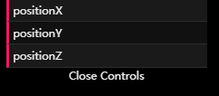

#### 修改显示的名称

我们可以在后面使用 name() 事件设置显示的名称：

```js
gui.add(controls, "positionX", -1, 1).name("x轴");
gui.add(controls, "positionY", -1, 1).name("y轴");
gui.add(controls, "positionZ", -1, 1).name("z轴");
```

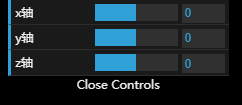

#### 颜色选择框

实现颜色选择框，首先需要一种正常格式的颜色值，比如 CSS 的颜色样式或者 RGB 格式，然后再使用 `gui.addColor()` 的方法添加：

```js
controls = {
    positionX:"#cccccc", //css样式
    positionY: [0, 255, 255], //RGB格式
    positionZ: [0, 255, 255, 0.6] //RGBA格式
};

gui = new dat.GUI();
gui.addColor(controls, "positionX").name("x轴");
gui.addColor(controls, "positionY").name("y轴");
gui.addColor(controls, "positionZ").name("z轴");
```

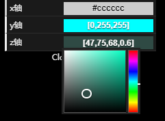

#### 监听事件回调

`dat.GUI` 给我们提供了监听事件回调的方法 onChange()，如果值变化就能够触发函数回调：

```js
gui.add(controls, "positionX", -1, 1).onChange(updatePosition);
gui.add(controls, "positionY", -1, 1).onChange(updatePosition);
gui.add(controls, "positionZ", -1, 1).onChange(updatePosition);

function updatePosition() {
    mesh.position.set(controls.positionX, controls.positionY, controls.positionZ);
}
```

#### 创建分组

我们可以使用 `gui.addFolder()` 方法来创建分组：

```js
gui = new dat.GUI();
var first = gui.addFolder("第一个分组"); //创建第一个分组
first.add(controls, "positionX", -1, 1).onChange(updatePosition);
first.open();

var two = gui.addFolder("第二个分组");
two.add(controls, "positionY", -1, 1).onChange(updatePosition);
two.add(controls, "positionZ", -1, 1).onChange(updatePosition);
```

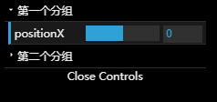

## 几何体Geometry 

一个模型是由几何体 Geometry 和材质 Material 组成。Three.js 内置了很多的几何体种类，如立方体、三棱锥、球、八面体、十二面体、二十面体等等，将介绍这些几何体的模型创建和几何体的通用方法。

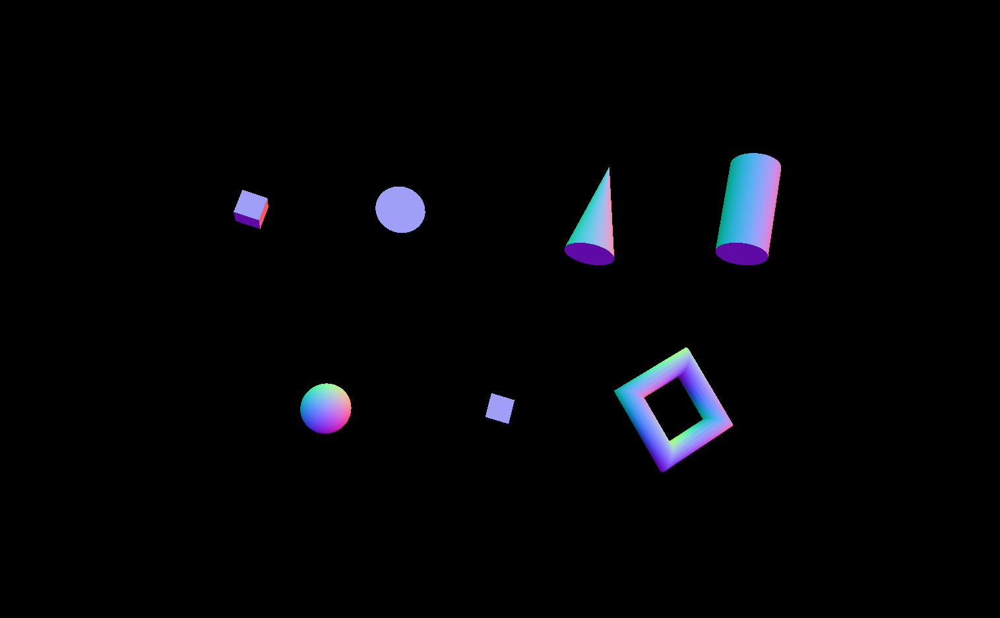


### Geometry 和 BufferGeometry

当前 Three.js 内置了这两种几何体类型，这两个几何体类型都用于存储模型的顶点位置、面的索引、法向量、颜色、UV 纹理以及一些自定义的属性。

它们两个的区别是：BufferGeometry 存储的都是一些原始的数据，性能比 Geometry 高，很适合存储一些放入场景内不需要再额外操作的模型。而 Geometry 的优势刚好相反，Geometry 比 BufferGeometry 更友好，使用了 Three.js 提供的 `THREE.Vector3` 或者 `THREE.Color` 这样的对象来存储数据（顶点位置、面、颜色等），这些对象易于阅读和编辑，但效率低于 BufferGeometry 使用的类型化数组。

所以，我们可以根据项目的大小来使用不同的几何体，**小项目可以使用 Geometry 实现，中大型的项目还是推荐 BufferGeometry。**

我们将使用较为简单的 Geometry 来实现案例。

#### Geometry 和 BufferGeometry 互转

在这里插一点内容，两种几何体类型可以互转，所以，不要担心现在使用的是哪种。

- Geometry 转换成 BufferGeometry

转换代码，如下：

```js
//实例化一个Geometry对象
var geo = new THREE.Geometry(); 
//调用对象的fromBufferGeometry方法，并将需要转换的geometry传入
var bufferGeo = geo.fromBufferGeometry(geometry);
//返回的对象转换成的BufferGeometry
```

- `BufferGeometry`转换成`Geometry`

```js
//实例化一个BufferGeometry对象
var bufferGeo = new THREE.BufferGeometry(); 
//调用对象的fromGeometry方法，并将需要转换的bufferGeometry传入
var geo = bufferGeo.fromGeometry(bufferGeometry);
//返回的对象转换成的Geometry
```

接下来，我们将讲解一下 Three.js 内置几何体。

#### 立方体 BoxGeometry 和 BoxBufferGeometry

立方体是最早接触的几何体，可以通过设置长宽高来创建各种各样的立方体。

看下面的案例，代码：

```js
var geometry = new THREE.BoxGeometry( 1, 1, 1 );
var material = new THREE.MeshBasicMaterial( {color: 0x00ff00} );
var cube = new THREE.Mesh( geometry, material );
scene.add( cube );
```

案例中的构造函数：

```js
BoxGeometry(width : '浮点类型', height : '浮点类型', depth : '浮点类型', widthSegments : '整数类型', heightSegments : '整数类型', depthSegments : '整数类型')
```

各参数的含义：

- width：沿 X 轴的宽度，默认值为1；
- height：沿 Y 轴的高度，默认值为1；
- depth：沿 Z 轴的深度，默认值为1；
- widthSegments：可选，沿着边的宽度的分割面的数量。默认值为1；
- heightSegments：可选，沿着边的高度的分割面的数量。默认值为1；
- depthSegments：可选，沿着边的深度的分割面的数量。缺省值是1；

案例查看：[请点击这里](https://threejs.org/docs/scenes/geometry-browser.html#BoxGeometry)。

#### 圆 CircleGeometry 和 CircleBufferGeometry

**在 WebGL 里，所有的模型都是通过三角形面组成，圆形是由多个三角形分段构成，这些三角形分段围绕一个中心点延伸并且延伸到给定半径以外。它从起始角度和给定的中心角度逆时针方向构建。它也可以用来创建规则的多边形，其中线段的数量决定了边的数量。**

看下面案例，代码如下：

```js
var geometry = new THREE.CircleGeometry( 5, 32 );
var material = new THREE.MeshBasicMaterial( { color: 0xffff00 } );
var circle = new THREE.Mesh( geometry, material );
scene.add( circle );
```

案例中的构造函数，如下：

```js
CircleGeometry(radius : '浮点类型', segments : '整数类型', thetaStart : '浮点类型', thetaLength : '浮点类型')
```

各参数的含义：

- radius：圆的半径，默认值为1；
- segments：段数（三角形），最小值为3，默认值为8；
- thetaStart：第一段的起始角度，默认值为0；
- thetaLength：圆形扇形的中心角，通常称为 theta。默认值是 2 * Pi，画出一个整圆。

案例查看：[请点击这里](https://threejs.org/docs/scenes/geometry-browser.html#CircleGeometry)。

#### 圆锥 ConeGeometry 和 ConeBufferGeometry

这是一个可以创建圆锥体的类。

看下面案例，代码如下：

```js
var geometry = new THREE.ConeGeometry( 5, 20, 32 );
var material = new THREE.MeshBasicMaterial( {color: 0xffff00} );
var cone = new THREE.Mesh( geometry, material );
scene.add( cone );
```

案例中的构造函数，如下：

```js
ConeGeometry(radius : '浮点类型', height : '浮点类型', radialSegments : '整数类型', heightSegments : '整数类型', openEnded : '布尔类型', thetaStart : '浮点类型', thetaLength : '浮点类型')
```

各参数含义：

- radius：底部圆锥的半径，默认值为1；
- height：圆锥体的高度，默认值为1；
- radialSegments：圆锥周围的分段面数，默认值为8；
- heightSegments：沿圆锥体高度的面的行数，默认值为1；
- openEnded：圆锥体底部是是隐藏还是显示，默认值为 false，显示；
- thetaStart：第一段的起始角度，默认值是0（Three.js 的0度位置）
- thetaLength — 圆形扇形的中心角，通常称为 theta。默认值是2 * Pi，画出一个整圆。

案例查看：[请点击这里](https://threejs.org/docs/scenes/geometry-browser.html#ConeGeometry)。

#### 圆柱 CylinderGeometry 和 CylinderBufferGeometry

这是一个可以创建圆柱几何体的类。

看下面案例，代码如下：

```js
var geometry = new THREE.CylinderGeometry( 5, 5, 20, 32 );
var material = new THREE.MeshBasicMaterial( {color: 0xffff00} );
var cylinder = new THREE.Mesh( geometry, material );
scene.add( cylinder );
```

案例中的构造函数，如下：

```js
CylinderGeometry(radiusTop : '浮点类型', radiusBottom : '浮点类型', height : '浮点类型', radialSegments : '整数类型', heightSegments : '整数类型', openEnded : '布尔类型', thetaStart : '浮点类型', thetaLength : '浮点类型')
```

各参数含义：

- radiusTop：顶部圆柱体的半径。默认值为1；
- radiusBottom：底部圆柱体的半径。默认值为1；
- height：圆柱体的高度。默认值为1；
- radialSegments：圆柱周围的分段面数。默认值为8；
- heightSegments：沿圆柱体高度的面的行数。默认值为1；
- openEnded：圆柱体的两端是否显示，默认值是 false，显示；
- thetaStart：第一段的起始角度，默认值是0（Three.js 的0度位置）。
- thetaLength — 圆形扇形的中心角，通常称为 theta。默认值是2 * Pi，画出一个整圆。

案例查看：[请点击这里](https://threejs.org/docs/scenes/geometry-browser.html#CylinderGeometry)。

#### 球 SphereGeometry 和 SphereBufferGeometry

这是一个可以创建球体几何体的类。

看下面案例，代码如下：

```js
var geometry = new THREE.SphereGeometry( 5, 32, 32 );
var material = new THREE.MeshBasicMaterial( {color: 0xffff00} );
var sphere = new THREE.Mesh( geometry, material );
scene.add( sphere );
```

案例中的构造函数，如下 ：

```js
SphereGeometry(radius : '浮点类型', widthSegments : '整数类型', heightSegments : '整数类型', phiStart : '浮点类型', phiLength : '浮点类型', thetaStart : '浮点类型', thetaLength : '浮点类型')
```

各参数含义：

- radius：球体半径。默认值是1；
- widthSegments：水平线段的数量。最小值是3，默认值是8；
- heightSegments：垂直段的数量。最小值是2，默认值是6；
- phiStart：指定水平渲染起始角度。默认值为0；
- phiLength：指定水平渲染角度大小。默认值是 Math.PI * 2；
- thetaStart：指定垂直渲染起始角度。默认值为0；
- thetaLength：指定垂直渲染角度大小。默认是 Math.PI。

默认是渲染整个的圆，如果线段越多，显得球体越圆滑。

案例查看：[请点击这里](https://threejs.org/docs/scenes/geometry-browser.html#SphereGeometry)。

#### 平面 PlaneGeometry 和 SphereBufferGeometry

这是一个可以创建平面几何体的类。

看下面案例，代码如下：

```js
var geometry = new THREE.PlaneGeometry( 5, 20, 32 );
var material = new THREE.MeshBasicMaterial( {color: 0xffff00, side: THREE.DoubleSide} );
var plane = new THREE.Mesh( geometry, material );
scene.add( plane );
```

案例中的构造函数，如下 ：

```js
PlaneGeometry(width : '浮点类型', height : '浮点类型', widthSegments : '整数类型', heightSegments : '整数类型')
```

各参数含义：

- width：沿 X 轴的宽度。默认值为1；
- height：沿着 Y 轴的高度。默认值为1；
- widthSegments：宽度的分段数，可选。默认值为1；
- heightSegments：高度的分段数，可选。默认值为1。

案例查看：[请点击这里](https://threejs.org/docs/scenes/geometry-browser.html#PlaneGeometry)。

#### 圆环 TorusGeometry 和 TorusBufferGeometry

一个可以创建圆环几何体的类。

看下面案例，代码如下：

```js
var geometry = new THREE.TorusGeometry( 10, 3, 16, 100 );
var material = new THREE.MeshBasicMaterial( { color: 0xffff00 } );
var torus = new THREE.Mesh( geometry, material );
scene.add( torus );
```

案例中的构造函数，如下 ：

```js
TorusGeometry(radius : '浮点类型', tube : '浮点类型', radialSegments : '整数类型', tubularSegments : '整数类型', arc : '浮点类型')
```

各参数含义：

- radius：圆环的半径，从圆环的中心到管的中心。默认值为1；
- tube：管的半径。默认值是0.4；
- radialSegments：横向分段数，默认值是8；
- tubularSegments：纵向分段数，默认值是6；
- arc — 绘制的弧度。默认值是 Math.PI * 2，绘制整个圆环。

案例查看：[请点击这里](https://threejs.org/docs/scenes/geometry-browser.html#TorusGeometry)。

以上是 Three.js 内置的一些基础的几何体，Three.js 还内置了一些其他的几何体模型（如字体几何体、拉伸几何体、车床几何体等），由于篇幅原因和难度原因，在这里不一一讲解。

如果迫不及待得想了解这一块的内容可以通过[官方文档](https://threejs.org/docs/)或者我的博客中[关于 Three.js 的笔记](https://blog.csdn.net/qq_30100043/article/category/7003591)来了解更多。

### 常用方法

Geometry 和 BufferGeomety 内置了一些常用的方法，在每一种几何体上面，我们都可以调用相关的方法来达到我们的目的。

#### center()

此方法为居中方法，可以根据边界框居中几何图形。

#### computeBoundingBox()

此方法可以计算几何的边界框，方法调用后，会更新 `Geometry.boundingBox` 属性，我们可以通过 `Geometry.boundingBox` 属性获取到一个包围几何体的立方体的每个轴向的最大值和最小值。

#### dispose()

将几何体从内存中删除，这个方法必须记得使用。如果频繁的删除模型，一定要记得将几何体从内存中删除掉。

### 总结案例

最后，我将上面介绍的所有几何体放到一个场景内，制作了一个小案例，案例代码地址如下：

- [Github 地址](https://github.com/Cenergy/webpack-threejs/blob/master/src/test/second.js)

## 材质Material 

模型的表现，也就是我们看到的的模型外观——材质。

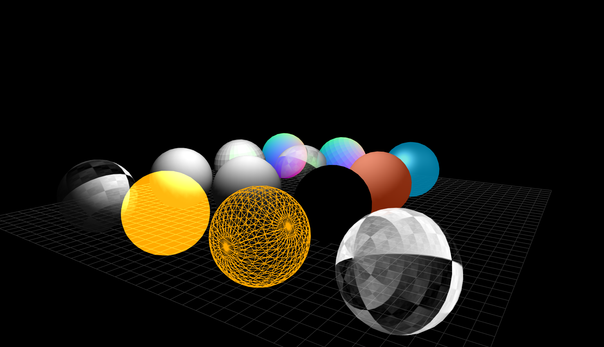


简单的说，就是物体看起来是什么质地。材质可以看成是材料和质感的结合。在渲染程序中，它是表面各种可视属性的结合，这些可视属性是指表面的色彩、纹理、光滑度、透明度、反射率、折射率、发光度等。Three.js 给我们封装好了大部分的材质效果，避免我们使用复杂的 Shader 语言自己去实现。接下来我们先介绍下 Material 常用的一些属性和方法。

### 基本属性和方法

#### needsUpdate

如果修改了 Material 内的内容，需要将 needsUpdate 属性设置为 true，Three.js 会在下一帧里将修改内容同步到 WebGL 的显存内。切记不要在 requestAnimationFrame 方法内更新，会浪费性能，只需要在更新 Material 属性后设置一次即可。

#### side

此属性可以定义当前面的哪个方向会被渲染，默认值是 `THREE.FrontSide`（只渲染正面），可选值有：`THREE.BackSide`（只渲染背面）和 `THREE.DoubleSide`（正面和背面都会渲染）。

#### transparent

此属性定义了材质是否可以透明，因为对于透明需要材质进行特殊处理，并在不透明的物体渲染完成后再渲染透明物体。当设置此属性为`true`后，可以通过设置`opacity`来调整透明度，默认为`false`。

#### opacity

此属性可以定义材质的透明度，必须将材质的 transparent 设置为 true 才可使透明度管用。取值范围为 0.0 到 1.0。默认值是1.0，也就是不透明。

#### map

此属性可以配置当前材质的纹理贴图，是一个 `THREE.Texture` 对象，下面我们将会讲解如何给材质贴图。这是大部分材质都会有的属性，只有极其个别的材质如 `LineBasicMaterial`（线材质）等没有这个属性。

#### wireframe

是否将模型渲染成线框，默认为 false。个别材质也没有这个属性。

#### dispose()

此方法用于将材质从内存中删除，在不需要使用当前材质时使用，但不会将材质的纹理贴图删除，如果需要将纹理贴图也删除，需要调用 `material.map.dispose()`。

### 配置纹理贴图

由于经常使用纹理贴图，所以在这里单独讲解一下如何实现一个纹理贴图。 实现纹理贴图有以下两种方式。

第一种，使用 `THREE.TextureLoader` 进行生成纹理对象：

```js
var texture = new THREE.TextureLoader().load( "textures/water.jpg" ); 
material.map = texture; //将纹理赋值给材质
```

或者直接实例化：

```js
var texture = new THREE.Texture(canvas); //实例化的第一个对象可以是`img`、`canvas`和`video`。
material.map = texture; //将纹理赋值给材质
```

#### 纹理重复问题

如果图片不是标准的2的幂数（2、4、8、16、32、64、128、256、512、1024、2048……），在控制台会给我们提示：“THREE.WebGLRenderer: image is not power of two”，意思就是说图片不是标准格式高宽不是2的幂数。我们需要的水平方向和垂直方向上设置的图片重复显示。需要配置的两个属性是：`texture.wrapS`（水平方向重复）和 `texture.wrapT`（垂直方向重复），默认值是：`THREE.ClampToEdgeWrapping`，即纹理的最后一个像素延伸到网格的边缘。可选项有：`THREE.RepeatWrapping`，表示纹理将重复无穷大；`MirroredRepeatWrapping`，表示镜像重复，可以理解为重复时，反着绘制一个然后正着绘制一个，达到的效果就是没有强烈的过渡感觉。

#### needsUpdate 属性

如果更新了纹理的相关属性，需要将此属性设置为 true，将数据同步到 WebGL。

#### repeat

纹理在整个表面水平方向和垂直方向重复多少次，也会受纹理重复设置的影响，设置方式为：

```js
var texture = new THREE.TextureLoader().load( "textures/water.jpg" );
texture.wrapS = THREE.RepeatWrapping; //设置水平方向无限循环
texture.wrapT = THREE.RepeatWrapping; //设置垂直方向无限循环
texture.repeat.set( 4, 4 ); //水平方向和垂直方向都重复四次
```

### 内置常用材质

在讲解常用材质之前，我们先讲解一下如何实例化一个材质和一些需要注意的地方。我们使用第一个讲到的材质 MeshBasicMaterial 作为例子。

#### MeshBasicMaterial 和设置颜色的方法

这种材质是一种简单的材质，不会受到光的影响，直接看到的效果就是整个物体的颜色都是一样，没有立体的感觉。在实例化材质时，我们可以传入一个对象，设置材质的相关属性可以通过对象属性的方式传入，但是属性 color（颜色）例外，实例化的时候可以传入十六进制数，也可以写十六进制字符串。实例化完成后再修改需要重新赋值 `THREE.Color` 对象，或者调用 `material.color.set` 方法赋值。

```js
var material = new THREE.MeshBasicMaterial({color:0x00ffff});
var geometry = new THREE.BoxGeometry(1, 1, 1);

var mesh = new THREE.Mesh(geometry, material);
scene.add(mesh);
```

上面的案例就是使用 MeshBasicMaterial 材质创建了一个立方体，我们设置了显示颜色为一种浅蓝色，除了上面实例化的时候进行设置，后面也可以再修改：

```js
var material = new THREE.MeshBasicMaterial({color:0x00ffff}); //设置初始的颜色为浅蓝色
material.color.set(0xff00ff); //将颜色修改为紫色
```

我们也可以直接赋值一个新的 `THREE.Color` 对象，如：

```js
var material = new THREE.MeshBasicMaterial({color:0x00ffff}); //设置初始的颜色为浅蓝色
material.color = new THREE.Color(0xff00ff); //将颜色修改为紫色
```

我们可以通过 `new THREE.Color` 创建一个颜色对象，Three.js 支持的颜色书写方式比较丰富，如：

```js
//直接传入十六进制数或者字符串
var color = new THREE.Color( 0xff0000 );
var color = new THREE.Color( "#ff0000" );

//RGB 字符串
var color = new THREE.Color("rgb(255, 0, 0)");
var color = new THREE.Color("rgb(100%, 0%, 0%)");

//支持一百四十多中颜色名称
var color = new THREE.Color( 'skyblue' );

//HSL 字符串
var color = new THREE.Color("hsl(0, 100%, 50%)");

//支持RGB值设置在0到1之间的方式
var color = new THREE.Color( 1, 0, 0 );
```

#### MeshNormalMaterial 法向材质

这种材质会根据面的方向不同自动改变颜色，也是我们之前一直在用的材质。此材质不受灯光影响。

```js
geometry = new THREE.BoxGeometry( 2, 2, 2 ); //创建几何体
material = new THREE.MeshNormalMaterial(); //创建材质

mesh = new THREE.Mesh( geometry, material ); //创建网格
scene.add( mesh ); //将网格添加到场景
```

#### LineBasicMaterial 线条材质

在上一篇我们讲几何体时，没有讲解如何画直线，是由于直线需要单独的材质进行实现，所以我们将直线放到了材质这一篇中进行讲解。注意，由于 Windows 系统的原因，线的宽度只能为1。

要绘制线段，我们需要确定两个点，就是起点和终点，案例中我们使用了四个顶点创建了三条线。然后 Geometry 对象使用这组顶点配置几何体，实例化线的材质，最后使用 `THREE.Line` 生成线。

```js
//添加直线
var pointsArr = [
    new THREE.Vector3( -10, 0, -5 ),
    new THREE.Vector3( -5, 15, 5 ),
    new THREE.Vector3( 20, 15, -5 ),
    new THREE.Vector3( 10, 0, 5 )
];

var lineGeometry = new THREE.Geometry(); //实例化几何体
lineGeometry.setFromPoints(pointsArr); //使用当前点的属性配置几何体

var lineMaterial = new THREE.LineBasicMaterial({color:0x00ff00}); //材质

line = new THREE.Line(lineGeometry, lineMaterial);
scene.add(line);
```

#### LineDashedMaterial 虚线

我们也可以创建虚线，这里我们来点新花样，就是实现曲线。曲线也和直线一样，在 Windows 系统线的粗度只能为1。

要创建曲线，我们需要使用到 `THREE.CatmullRomCurve3` 来生成一个 curve 对象，这是一个曲线对象，可以从对象获取生成的曲线的点的集合，在这里科普一下，曲线也是由无数段的直线组成的，段数分的越清晰，曲线过渡越顺滑。

```js
var pointsArr = [
    new THREE.Vector3( -10, 0, -5 ),
    new THREE.Vector3( -5, 15, 5 ),
    new THREE.Vector3( 20, 15, -5 ),
    new THREE.Vector3( 10, 0, 5 )
];
//指定一些用于生成曲线线的三维顶点
var curve = new THREE.CatmullRomCurve3(pointsArr);

var points = curve.getPoints( 50 ); //使用getPoints获取当前曲线分成50段后的所有顶点
var curveGeometry = new THREE.BufferGeometry().setFromPoints( points ); //使用顶点生成几何体

var curveMaterial = new THREE.LineDashedMaterial( { color : 0xff0000 } ); //创建一条红色的线材质

// 使用THREE.Line创建线
curveLine = new THREE.Line( curveGeometry, curveMaterial );
curveLine.computeLineDistances(); //需要重新计算位置才能显示出虚线
scene.add(curveLine);
```

#### 添加光

由于 MeshBasicMaterial 不会受光的影响，即使有光也不会影响它的效果，前面我们也没有添加光。但是后面介绍的材质会受到光源的影响，在介绍之前，我们需要添加一个光源，来影响材质的显示效果。

```js
//创建灯光
function initLight() {
    var light = new THREE.DirectionalLight(0xffffff); //添加了一个白色的平行光
    light.position.set(20, 50, 50); //设置光的方向
    scene.add(light); //添加到场景

    //添加一个全局环境光
    scene.add(new THREE.AmbientLight(0x222222));
}
```

上面我们添加了一个模拟太阳光线的平行光和一个对每一个物理都造成影响的环境光，具体的内容将会在下一篇讲解。

下面介绍的材质都是对光有反应的，而且如果场景内没有光，模型将无法显示。

#### MeshLambertMaterial 兰伯特材质

这种材质会对光有反应，但是不会出现高光，可以模拟一些粗糙的材质的物体，比如木头或者石头。

实现案例，如下：

```js
geometry = new THREE.BoxGeometry( 2, 2, 2 ); //创建几何体
material = new THREE.MeshLambertMaterial({color:0x00ffff}); //创建材质

mesh = new THREE.Mesh( geometry, material ); //创建网格
scene.add( mesh ); //将网格添加到场景
```

#### MeshPhongMaterial 高光材质

这种材质具有高光效果，可以模拟一些光滑的物体的材质效果，比如油漆面，瓷瓦等光滑物体。

实现案例如下：

```js
geometry = new THREE.BoxGeometry( 2, 2, 2 ); //创建几何体
material = new THREE.MeshPhongMaterial({color:0x00ffff}); //创建材质

mesh = new THREE.Mesh( geometry, material ); //创建网格
scene.add( mesh ); //将网格添加到场景
```

#### MeshStandardMaterial 基于物理的渲染（PBR）材质

这种材质基于物理的渲染（PBR）材质，生成的材质效果更佳，但是相应也占用更多的计算量。这种材质我们可以定义它的粗糙度来确定反光效果，经常用于模拟金属的质感，使金属质感更加真实。

实现案例如下：

```js
geometry = new THREE.BoxGeometry( 2, 2, 2 ); //创建几何体
material = new THREE.MeshPhongMaterial({color:0x00ffff}); //创建材质
material.metalness = 0.1; //设置的值的范围为0-1，值越小，材质越光滑，高光越明显
material.metalnessMap = 0.1; //设置的值的范围为0-1，值越大，越有生锈金属的质感，值越小反光越清晰

mesh = new THREE.Mesh( geometry, material ); //创建网格
scene.add( mesh ); //将网格添加到场景
```

### 案例代码

## 相机Camera 

相机是 Three.js 抽象出来的一个对象，使用此对象，我们可以定义显示的内容，并且可以通过移动相机位置来显示不同的内容。

下面讲解一下 Three.js 中相机的通用属性和常用的相机对象。

### 相机通用属性和方法


我们常用的相机有正交相机（OrthographicCamera）和透视相机（PerspectiveCamera）两种，用于来捕获场景内显示的物体模型。它们有一些通用的属性和方法。

#### Object3D 的所有属性和方法

由于相机都继承自 THREE.Object3D 对象，所以像设置位置的 position 属性、rotation 旋转和 scale 缩放属性，可以直接对相机对象设置。我们甚至还可以使用 `add()` 方法，给相机对象添加子类，移动相机它的子类也会跟随着一块移动，我们可以使用这个特性制作一些比如 HUD 类型的显示界面。

#### target 焦点属性和 lookAt() 方法

这两个方法的效果一定，都是调整相机的朝向，可以设置一个 `THREE.Vector3`（三维向量）点的位置：

```
camera.target = new THREE.Vector3(0, 0, 0);
camera.lookAt(new THREE.Vector3(0, 0, 0));
```

上面两个都是朝向了原点，我们也可以将相机的朝向改为模型网格的 position，如果物体的位置发生了变化，相机的焦点方向也会跟随变动：

```
var mesh = new THREE.Mesh(geometry, material);
camera.target = mesh.position;
//或者
camera.lookAt(mesh.position);
```

#### getWorldDirection()

getWorldDirection() 方法可以获取当前位置到 target 位置的世界中的方向。方向也可以使用 `THREE.Vector3` 对象表示，所以该方法返回一个三维向量。

### OrthographicCamera 正交相机

使用正交相机 OrthographicCamera 渲染出来的场景，所有的物体和模型都按照它固有的尺寸和精度显示，一般使用在工业要求精度或者 2D 平面中，因为它能完整的显示物体应有的尺寸。

#### 创建正交相机

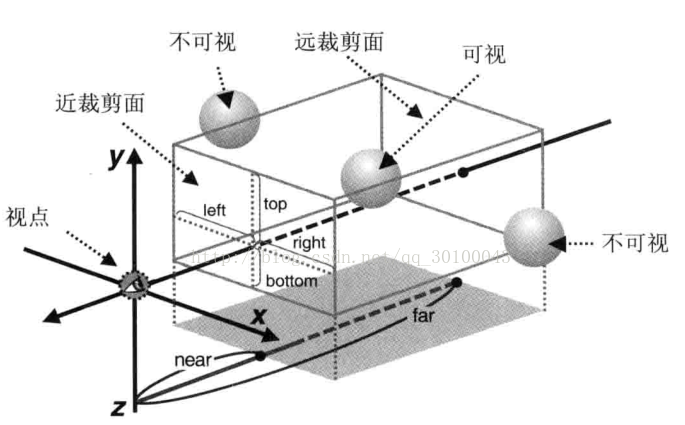

上面的图片可以清晰的显示出正交相机显示的范围，它显示的内容是一个立方体结构，通过图片我们发现，只要确定 top、left、right、bottom、near 和 far 六个值，我们就能确定当前相机捕获场景的区域，在这个区域外面的内容不会被渲染，所以，我们创建相机的方法就是：

```
new THREE.OrthographicCamera( left, right, top, bottom, near, far );
```

下面我们创建了一个显示场景中相机位置前方长宽高都为4的盒子内的物体的正交相机：

```
var orthographicCamera = new THREE.OrthographicCamera(-2, 2, 2, -2, 0, 4);
scene.add(orthographicCamera); //一般不需要将相机放置到场景当中，如果需要添加子元素等一些特殊操作，还是需要add到场景内
```

正常情况相机显示的内容需要和窗口显示的内容为同样的比例才能够显示没有被拉伸变形的效果：

```
var frustumSize = 1000; //设置显示相机前方1000高的内容
var aspect = window.innerWidth / window.innerHeight; //计算场景的宽高比
var orthographicCamera = new THREE.OrthographicCamera( frustumSize * aspect / - 2, frustumSize * aspect / 2, frustumSize / 2, frustumSize / - 2, 1, 2000 ); //根据比例计算出left，top，right，bottom的值
```

#### 动态修改正交相机属性

我们也可以动态的修改正交相机的一些属性，注意修改完以后需要调用相机 updateProjectionMatrix() 方法来更新相机显存里面的内容，代码如下：

```
var frustumSize = 1000; //设置显示相机前方1000高的内容
var aspect = window.innerWidth / window.innerHeight; //计算场景的宽高比
var orthographicCamera = new THREE.OrthographicCamera(); //实例化一个空的正交相机
orthographicCamera.left = frustumSize * aspect / - 2; //设置left的值
orthographicCamera.right = frustumSize * aspect / 2; //设置right的值
orthographicCamera.top = frustumSize / 2; //设置top的值
orthographicCamera.bottom = frustumSize / - 2; //设置bottom的值
orthographicCamera.near = 1; //设置near的值
orthographicCamera.far = 2000; //设置far的值

//注意，最后一定要调用updateProjectionMatrix()方法更新
orthographicCamera.updateProjectionMatrix();
```

#### 窗口变动后的更新

由于浏览器的窗口可以随意修改，我们有时候需要监听浏览器窗口的变化，然后获取到最新的宽高比，再重新设置相关属性：

```
var aspect = window.innerWidth / window.innerHeight; //重新获取场景的宽高比

//重新设置left right top bottom 四个值
orthographicCamera.left = frustumSize * aspect / - 2; //设置left的值
orthographicCamera.right = frustumSize * aspect / 2; //设置right的值
orthographicCamera.top = frustumSize / 2; //设置top的值
orthographicCamera.bottom = frustumSize / - 2; //设置bottom的值

//最后，记得一定要更新数据
orthographicCamera.updateProjectionMatrix();

//显示区域尺寸变了，我们也需要修改渲染器的比例
renderer.setSize(window.innerWidth, window.innerHeight);
```

### PerspectiveCamera 透视相机

透视相机是最常用的也是模拟人眼视角的一种相机，它所渲染生成的页面是一种近大远小的效果。

#### 创建透视相机

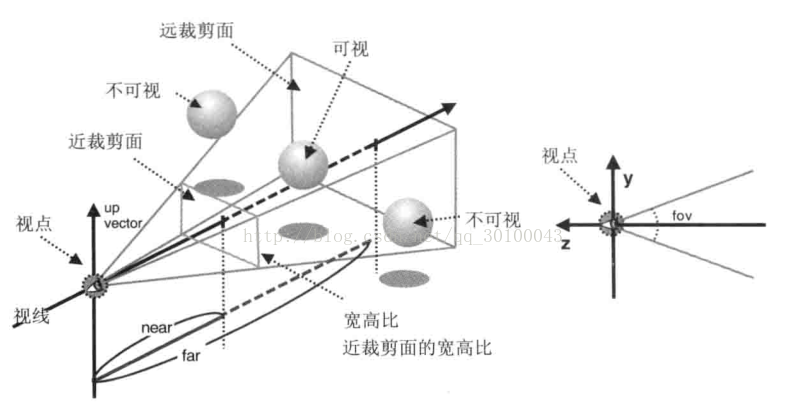

上面的图片就是一个透视相机的生成原理，我们先看看渲染的范围是如何生成的：

- 首先，我们需要确定一个 fov 值，这个值是用来确定相机前方的垂直视角，角度越大，我们能够查看的内容就越多。
- 然后，我们又确定了一个渲染的宽高比，这个宽高比最好设置成页面显示区域的宽高比，这样我们查看生成画面才不会出现拉伸变形的效果，这时，我们可以确定前面生成内容的范围是一个四棱锥的区域。
- 最后，我们需要确定的就是相机渲染范围的最小值 near 和最大值 far，注意，这两个值都是距离相机的距离，确定完数值后，相机会显示的范围就是一个近小远大的四棱柱的范围，我们能够看到的内容都是在这个范围内的。

通过上面的原理，我们需要设置 fov 垂直角度，aspect 视角宽高比例和 near 最近渲染距离 far 最远渲染距离，就能确定当前透视相机的渲染范围。

下面代码展示了一个透视相机的创建方法：

```
var perspectiveCamera = new THREE.PerspectiveCamera( 45, width / height, 1, 1000 );
scene.add( perspectiveCamera );
```

我们设置了前方的视角为45度，宽度和高度设置成显示窗口的宽度除以高度的比例即可，显示距离为1到1000距离以内的物体。

#### 动态修改透视相机的属性

透视相机的属性创建完成后我们也可以根据个人需求随意修改，但是注意，相机的属性修改完成后，以后要调用 `updateProjectionMatrix()` 方法来更新：

```
var perspectiveCamera = new THREE.PerspectiveCamera( 45, width / height, 1, 1000 );
scene.add( perspectiveCamera );

//下面为修改当前相机属性
perspectiveCamera.fov = 75; //修改相机的fov
perspectiveCamera.aspect = window.innerWidth/window.innerHeight; //修改相机的宽高比
perspectiveCamera.near = 100; //修改near
perspectiveCamera.far = 500; //修改far

//最后更新
perspectiveCamera.updateProjectionMatrix();
```

#### 显示窗口变动后的回调

如果当前场景浏览器的显示窗口变动了，比如修改了浏览器的宽高后，我们需要设置场景自动更新，下面是一个常用的案例：

```
function onWindowResize() {
    camera.aspect = window.innerWidth / window.innerHeight; //重新设置宽高比
    camera.updateProjectionMatrix(); //更新相机
    renderer.setSize(window.innerWidth, window.innerHeight); //更新渲染页面大小
}
window.onresize = onWindowResize;
```

最后，我写了一个案例来查看透视相机和正交相机的显示区别：[点击这里案例 Demo](https://johnson2heng.github.io/GitChat-Three.js/07第七节 camera/index.html)。

左侧是透视相机显示的效果，这种更符合人眼看到的效果，场景更加的立体。而右侧则是正交相机实现的效果，渲染出来的数值更加准确，但是却不符合人眼查看的效果。

案例代码查看地址：[点击这里](https://github.com/johnson2heng/GitChat-Three.js/blob/master/07第七节 camera/index.html)。

#### 制作相机控制器

在实际生产当中，很多时候我们需要切换相机的位置，以达到项目需求。 Three.js 也有很多相机控制插件，这个我们会在后面的课程当中讲解。

下面是我书写的一个小案例，能够通过鼠标左键拖拽界面让相机围绕模型周围查看模型。

首先，先上案例地址：[点击这里](https://johnson2heng.github.io/GitChat-Three.js/07第七节 camera/control.html)。

代码查看地址：[点击这里](https://github.com/johnson2heng/GitChat-Three.js/blob/master/07第七节 camera/control.html)。

其实和以前的代码相比，我们也只是多出来了一个 initControl 方法，在这个方法里面绑定鼠标事件。实现的思路也很简单：

- 首先绑定鼠标按下事件，获取到按下时的相机位置和距离原点的距离，计算出来相对于 Z 轴正方向的偏移。绑定鼠标移动事件。
- 然后，在鼠标移动事件里面获取到距离鼠标按下的偏移，通过鼠标偏移数值计算出现在相机位置，并赋值。

思路就这么简单，虽然实现起来会麻烦，我也尽量写的简单，大家尽量能够自己也写出来。

## 粒子Points 


我们将学习到 Sprite 精灵和 Points 粒子，这两种对象共同点就是我们通过相机查看它们时，始终看到的是它们的正面，它们总朝向相机。通过它们的这种特性，我们可以实现广告牌的效果，或实现更多的比如雨雪、烟雾等更加绚丽的特效。

### Sprite 精灵

精灵由于一直正对着相机的特性，一般使用在模型的提示信息当中。通过 `THREE.Sprite` 创建生成，由于 `THREE.Sprite` 和 `THREE.Mesh` 都属于 `THREE.Object3D` 的子类，所以，我们操作模型网格的相关属性和方法大部分对于精灵都适用。和精灵一起使用的还有一个 `THREE.SpriteMaterial` 对象，它专门配合精灵的材质。注意，精灵没有阴影效果。

下面首先创建一个最简单的精灵：

```
var spriteMaterial = new THREE.SpriteMaterial( { color: 0xffffff } );
var sprite = new THREE.Sprite( spriteMaterial );
scene.add( sprite );
```

创建一个带有纹理图片的精灵：

```
var spriteMap = new THREE.TextureLoader().load( "sprite.png" );
var spriteMaterial = new THREE.SpriteMaterial( { map: spriteMap, color: 0xffffff } );
var sprite = new THREE.Sprite( spriteMaterial );
scene.add( sprite );
```

直接使用 canvas 创建精灵：

```
var spriteMap = new THREE.Texture(canvas);
var spriteMaterial = new THREE.SpriteMaterial( { map: spriteMap, color: 0xffffff } );
var sprite = new THREE.Sprite( spriteMaterial );
scene.add( sprite );
```

#### 相关属性

精灵特有的属性就一个，即 center 属性，值是一个二维向量 `THREE.Vector2`，这个属性意义就是当前设置的精灵位置点的位置处于精灵图中的位置。如果 center 的值是 `0,0`旋转的位置就在左下角，如果值为 `1,1` 的话，那旋转的位置则在精灵图的右上角，默认值是 `0.5,0.5`：

```
sprite.center.set(0.5, 0); //设置位置点处于精灵的最下方中间位置
```

接下来，我们查看一下精灵的案例：[点击这里](https://johnson2heng.github.io/GitChat-Three.js/08第八节 points/sprite.html)。

案例代码查看地址：[点击这里](https://github.com/johnson2heng/GitChat-Three.js/blob/master/08第八节 points/sprite.html)。

案例效果从左到右依次是，普通的精灵，贴图纹理的精灵和 `canvas` 创建的精灵。

### points 粒子

粒子和精灵的效果是一样的，它们之间的区别是，如果当前场景内的精灵过多的话，就会出现性能问题。粒子的作用就是为解决很多精灵而出现的，我们可以使用粒子去模型数量很多的效果，比如下雨，下雪等，数量很多的时候就适合使用粒子来创建，相应的，提高性能的损失就是失去了对单个精灵的操作，所有的粒子的效果都是一样。总的来说，粒子就是提高性能减少的一些自由度，而精灵就是为了自由度而损失了一些性能。

#### 粒子的创建

粒子 `THREE.Points` 和精灵 `THREE.Sprite` 还有网格 `THREE.Mesh` 都属于 `THREE.Object3D` 的一个扩展，但是粒子有一些特殊的情况就是 `THREE.Points` 是它们粒子个体的父元素，它的位置设置也是基于 `THREE.Points` 位置而定位，而修改 `THREE.Points` 的 scale 属性只会修改掉粒子个体的位置。下面我们看下一个粒子的创建方法。创建一个粒子，需要一个含有顶点的几何体，和粒子纹理 `THREE.PointsMaterial` 的创建：

```
//球体
var sphereGeometry = new THREE.SphereGeometry(5, 24, 16);
var sphereMaterial = new THREE.PointsMaterial({color: 0xff00ff});
var sphere = new THREE.Points(sphereGeometry, sphereMaterial);
scene.add(sphere);
```

上面是通过球体几何体创建的一个最简单的粒子特效。

使用任何几何体都可以，甚至自己生成的几何体都可以，比如创建星空的案例：

```
var starsGeometry = new THREE.Geometry();
//生成一万个点的位置
for (var i = 0; i < 10000; i++) {
    var star = new THREE.Vector3();
    //THREE.Math.randFloatSpread 在区间内随机浮动* - 范围 / 2 *到* 范围 / 2 *内随机取值。
    star.x = THREE.Math.randFloatSpread(2000);
    star.y = THREE.Math.randFloatSpread(2000);
    star.z = THREE.Math.randFloatSpread(2000);
    starsGeometry.vertices.push(star);
}
var starsMaterial = new THREE.PointsMaterial({color: 0x888888});
var starField = new THREE.Points(starsGeometry, starsMaterial);
scene.add(starField);
```

使用一个空的几何体，将自己创建的顶点坐标放入，也可以实现一组粒子的创建。如果我们需要单独设置每一个粒子的颜色，可以给 geometry 的 colors 数组添加相应数量的颜色：

```
for (var i = 0; i < 10000; i++) {
    var star = new THREE.Vector3();
    //THREE.Math.randFloatSpread 在区间内随机浮动* - 范围 / 2 *到* 范围 / 2 *内随机取值。
    star.x = THREE.Math.randFloatSpread(2000);
    star.y = THREE.Math.randFloatSpread(2000);
    star.z = THREE.Math.randFloatSpread(2000);
    starsGeometry.vertices.push(star);

    starsGeometry.colors.push(new THREE.Color("rgb("+Math.random()*255+", "+Math.random()*255+", "+Math.random()*255+")")); //添加一个随机颜色
}
```

#### THREE.PointsMaterial 粒子的纹理

如果我们需要设置粒子的样式，还是需要通过设置 `THREE.PointsMaterial` 属性实现：

```
var pointsMaterial = new THREE.PointsMaterial({color: 0xff00ff}); //设置了粒子纹理的颜色
```

我们还可以通过 PointsMaterial 的 size 属性设置粒子的大小：

```
var pointsMaterial = new THREE.PointsMaterial({color: 0xff00ff, size:4}); //粒子的尺寸改为原来的四倍
//或者直接设置属性
pointsMaterial.size = 4;
```

我们也可以给粒子设置纹理：

```
var pointsMaterial = new THREE.PointsMaterial({color: 0xff00ff, map:texture}); //添加纹理
```

默认粒子是不受光照影响的，我们可以设置 lights 属性为 true，让粒子受光照影响：

```
var pointsMaterial = new THREE.PointsMaterial({color: 0xff00ff, lights:true}); 
//或者
pointsMaterial.lights = true; //开启受光照影响
```

我们也可以设置粒子不受到距离的影响产生近大远小的效果：

```
var pointsMaterial = new THREE.PointsMaterial({color: 0xff00ff, sizeAttenuation: false}); 
//或者
pointsMaterial.sizeAttenuation = false; //关闭粒子的显示效果受距离影响
```

粒子的效果就介绍到这里，希望大家熟练了以后能够做出来各种各样的花哨效果。

接下来展示下我给大家准备的粒子案例：[点击这里](https://johnson2heng.github.io/GitChat-Three.js/08第八节 points/points.html)。

代码查看地址：[点击这里](https://github.com/johnson2heng/GitChat-Three.js/blob/master/08第八节 points/points.html)。

这个案例和精灵的案例区别就是，将球体改成了粒子，然后将立方体修改成了带有 canvas 纹理的粒子，并且在背景里面添加了一万个粒子 

