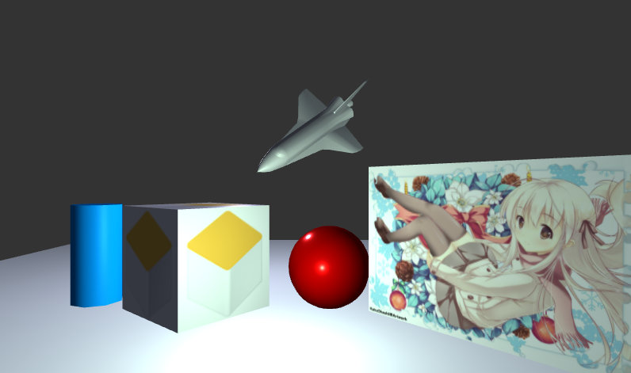
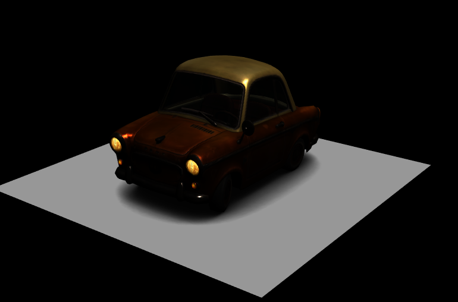
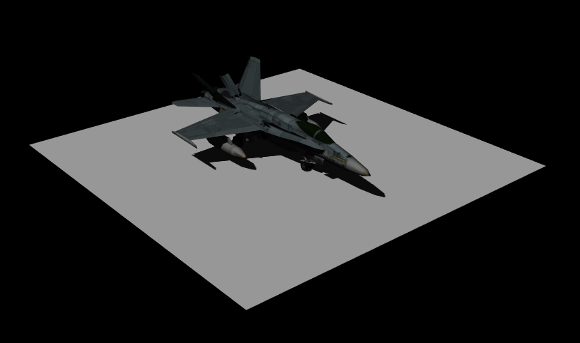
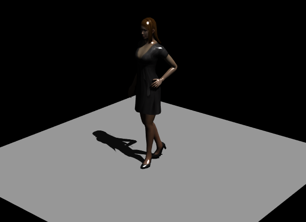
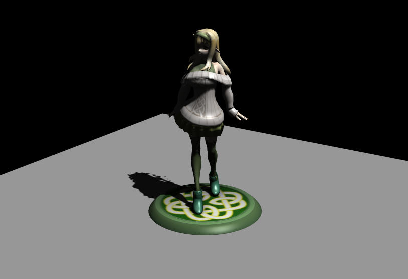
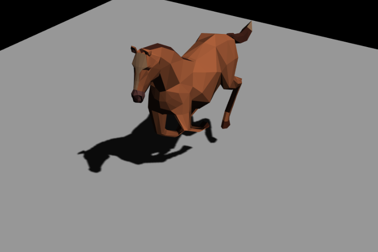
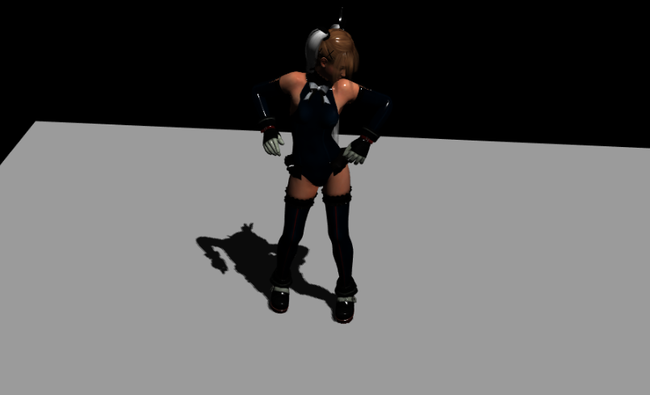
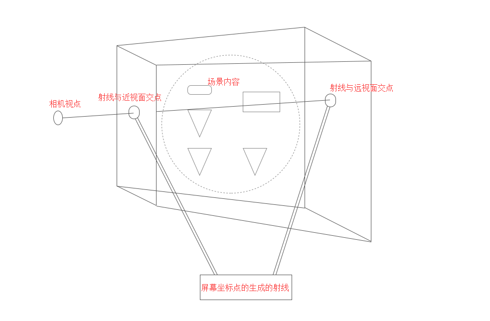

## 相机控制器Controls 

相机的基本内容我们已经了解。



<!--more-->

正常的项目中，大家的需求都是不一样的，又通常会碰上需求中途改变的情况，我们之前做的简易版相机控制器很难满足此类项目对相机的操作需求。而且，造轮子的前提是当前的框架以及插件已经无法满足自身的需求时，才会考虑造轮子。要不然，项目的进度会被拖得很慢，甚至有可能因此而错过红利期。

好在 Three.js 官方和同道中的朋友们给我们提供了很多相关的插件，我们可以根据需求引入相关的插件来实现需求，本文我们就来看一下官方案例中提供的相机控制器。

从官网下载的代码包里可以发现有很多的相机控制器，文件夹地址为：`/examples/js/controls/`，里面的文件插件都是和控制相机和控制模型相关的插件，我们罗列一下相关插件：

- DeviceOrientationControls：陀螺仪相机控制器，实现移动端陀螺仪控制相机。
- DragControls：控制鼠标拖拽移动物体的功能。
- EditorControls：实现相机的旋转、缩放、平移功能，相对于 OrbitControls 的功能差不少，不建议使用。
- FirstPersonControls：第一视角相机控制器。
- FlyControls：飞行相机控制器。
- OrbitControls：轨道控制器。
- OrthographicTrackballControls：正交轨迹球控制器——正交相机使用的轨迹球控制器。
- TrackballControls：轨迹球控制器——透视相机使用的轨迹球控制器。
- PointerLockControls：鼠标锁定相机控制器。
- TransformControls：控制模型位置、缩放、旋转的控制器。
- VRControls：实现 VR 双屏相机控制器。

由于篇幅有限，上面的控制器无法一一介绍，我们将重点介绍三种常用的相机控制器。

### OrbitControls

OrbitControls 控制器是我们常用的相机控制器，它的功能丰富，使用简单，为大多数项目的使用插件。

#### 使用操作

使用 OrbitControls 控制器我们可以实现旋转、缩放、平移等功能，下面简单列一下 OrbitControls 控制器的操作方法：

- 围绕焦点旋转：使用鼠标左键拖拽；
- 放大和缩小：使用鼠标中键按住拖拽或者鼠标中键滑动滚轮；
- 平移相机：按住鼠标右键拖拽或者使用键盘的上下左右键。

#### 控制器引入

在项目中使用 OrbitControls 控制器，可分为下面几步。

- 首先，将插件文件引入到项目中：

```
<script src="../js/OrbitControls.js"></script>
```

- 然后，通过相机和渲染器的 Dom 对象实例化相机：

```
control = new THREE.OrbitControls(camera, renderer.domElement);
```

- 最后，在每一帧渲染里面更新相机的位置：

```
function render() {
    control.update();
    renderer.render(scene, camera);
}
```

这样，我们就完成了一个最简单的 OrbitControls 控制器使用。

#### 属性和方法

OrbitControls 控制器最大的优势就是有丰富的配置项，供我们修改来实现项目中的需求，接下来我们看看有哪些属性配置。

| 属性               | 描述                                                         |
| :----------------- | :----------------------------------------------------------- |
| enabled            | 是否开启当前控制器，默认值是 True，如果设置为 False，将无法通过操作修改相机。 |
| target             | 控制器的焦点位置，是一个 `THREE.Vector3` 对象，默认是 `(0, 0, 0)` |
| minDistance        | 相机距离焦点的最近距离，默认值是0。 此属性适用于透视相机 PerspectiveCamera。 |
| maxDistance        | 相机距离焦点的最远距离，默认值是 Infinity（无限远）， 此属性适用于透视相机 PerspectiveCamera。 |
| minZoom            | 相机距离焦点的最近距离，默认值是0，此属性适用于正交相机 OrthographicCamera。 |
| maxZoom            | 相机距离焦点的最远距离，默认值是 Infinity（无限远），此属性适用于正交相机 OrthographicCamera。 |
| minPolarAngle      | 相机位置和焦点与焦点和最上方组成的最小夹角限制，默认值是0。  |
| maxPolarAngle      | 相机位置和焦点与焦点和最上方组成的最大夹角限制，默认值是 Math.PI，也就是180度角。 |
| minAzimuthAngle    | 当前相机沿水平方向顺时针旋转的弧度，默认值是 `- Infinity`。  |
| maxAzimuthAngle    | 当前相机沿水平方向逆时针旋转的弧度，默认值是 `Infinity`。    |
| enableDamping      | 是否开启拖拽惯性移动，即拖拽停止相机会有缓慢停止的距离移动，默认值是 False。 |
| dampingFactor      | 拖拽惯性移动的阻力，默认值是 0.25。                          |
| enableZoom         | 是否开启缩放操作，默认值是 True。                            |
| zoomSpeed          | 缩放速度，默认值是 1.0。                                     |
| enableRotate       | 是否开启相机绕焦点旋转操作，默认值是 True。                  |
| rotateSpeed        | 旋转速度，默认值是 1.0。                                     |
| enablePan          | 是否开启相机平移操作，默认值是 True。                        |
| panSpeed           | 平移的速度，默认值是 1.0。                                   |
| screenSpacePanning | 修改相机平移的方向，默认值是 False，即沿 x 轴正负方向和 y 轴正负方向移动。可选值是 True，可以修改为沿 x 轴正负方向和 y 轴正负方向移动。 |
| keyPanSpeed        | 键盘上下左右键移动相机的速度，默认值是 7.0。                 |
| autoRotate         | 当前相机是否自动旋转，默认值是 False，不自动旋转。           |
| autoRotateSpeed    | 自动旋转的速度，默认值是 2.0，即渲染满60帧的情况下30秒旋转360度。 |
| enableKeys         | 是否开启键盘控制先机平移，默认值是 True。                    |

OrbitControls 控制器的属性配置介绍完了，我们看看 OrbitControls 控制器还有那些方法。

##### **update()**

OrbitControls 控制器更新相机的方法，需要在每一帧里面调用。

##### **reset()**

重置方法，相机回到初始位置。

##### **dispose()**

销毁当前实例化的 OrbitControls 控制器。

##### **change 回调**

我们还可以监听相机改变回调，如果控制器修改了相机，将会产生一个回调：

```
controls.addEventListener('change', function(){
    console.log("相机动了！");
});
```

最后，我附上 OrbitControls 控制器案例：

- [点击这里](https://johnson2heng.github.io/GitChat-Three.js/09第九节 controls/OrbitControls.html)

也可以从这里获取案例源码：

- [点击这里](https://github.com/johnson2heng/GitChat-Three.js/blob/master/09第九节 controls/OrbitControls.html)

### TrackballControls

TrackballControls 控制器比 OrbitControls 控制器更自由，TrackballControls 控制器能够沿焦点进行球形旋转，没有死角，但比 OrbitControls 控制器少一些相关的功能配置。如何选择使用它们还是看项目需求，接下来还是先看如何操作。

注意，透视相机和正交相机使用的不是一个插件，此插件为透视相机使用，如果是正交相机请使用 OrthographicTrackballControls。

#### 使用操作

使用 TrackballControls 控制器我们可以实现旋转、缩放、平移等功能，下面说一下如何使用 TrackballControls 控制器进行操作：

- 围绕焦点旋转：使用鼠标左键拖拽；
- 放大和缩小：使用鼠标中键按住拖拽或者鼠标中键滑动滚轮；
- 平移相机：按住鼠标右键拖拽或者使用键盘的上下左右键。

TrackballControls 控制器和 OrbitControls 控制器的操作相同，没什么可说的。

#### 控制器引入

在项目中使用 TrackballControls 控制器和 OrbitControls 控制器的方法雷同，分为下面几步。

- 首先，将插件文件引入到项目中：

```
<script src="../js/TrackballControls.js"></script>
```

- 然后，通过相机和渲染器的 Dom 对象实例化相机：

```
control = new THREE.TrackballControls(camera, renderer.domElement);
```

- 最后，在每一帧渲染里面更新相机的位置：

```
function render() {
    control.update();
    renderer.render(scene, camera);
}
```

#### 属性和方法

| 属性                 | 描述                                                         |
| :------------------- | :----------------------------------------------------------- |
| enabled              | 是否开启当前控制器，默认值是 True，如果设置为 False，将无法通过操作修改相机。 |
| rotateSpeed          | 控制相机旋转速度，默认值是 3.0。                             |
| zoomSpeed            | 控制相机缩放速度，默认值是 1.2。                             |
| panSpeed             | 控制相机平移速度，默认值是 0.3。                             |
| noRotate             | 关闭相机旋转，默认 False，开启。                             |
| noZoom               | 关闭相机缩放，默认 False，开启。                             |
| noPan                | 关闭相机移动，默认 False 开启。                              |
| staticMoving         | 关闭拖拽惯性移动 默认值 False，开启。                        |
| dynamicDampingFactor | 拖拽惯性移动阻力，默认值是 0.2。                             |
| minDistance          | 相机距离焦点的最近距离，默认值是 0。                         |
| maxDistance          | 相机距离焦点的最远距离，默认值是 Infinity（无限远）。        |

相对于 OrbitControls 控制器，TrackballControls 控制器的属性少一些，但是相关的功能还是比较全面的。TrackballControls 控制器的方法也和 OrbitControls 控制器的方法雷同。

##### **update()**

TrackballControls 控制器更新相机的方法，需要在每一帧里面调用。

##### **reset()**

重置方法，相机回到初始位置。

##### **dispose()**

销毁当前实例化的 TrackballControls 控制器。

##### change 回调

我们还可以监听相机改变回调，如果控制器修改了相机，将会产生一个回调：

```
controls.addEventListener('change', function(){
    console.log("相机动了！");
});
```

最后，附上 TrackballControls 控制器案例：

- [点击这里](https://johnson2heng.github.io/GitChat-Three.js/09第九节 controls/TrackballControls.html)

也可以从这里获取案例源码：

- [点击这里](https://github.com/johnson2heng/GitChat-Three.js/blob/master/09第九节 controls/TrackballControls.html)

### DeviceOrientationControls

最后，我们介绍的这个控制器只兼容含有陀螺仪的移动端。DeviceOrientationControls 控制器可以通过获取设备的陀螺仪状态来控制相机的朝向。

如果你还对陀螺仪不了解，[请点击查看这里](https://blog.csdn.net/qq_30100043/article/details/73323617)，在这里不多说。

DeviceOrientationControls 的内容配置较少，我们先看一下案例。

使用手机打开网址：[点击这里](https://johnson2heng.github.io/GitChat-Three.js/09第九节 controls/DeviceOrientationControls.html) ，然后手机朝下然后移动，你会发现能够通过手机的转向来控制相机的朝向，是不是很神奇。接下来我们看看如何引入到项目中。

- 首先，将插件文件引入到项目中：

```
<script src="../js/DeviceOrientationControls.js"></script>
```

- 然后，通过相机对象实例化相机：

```
control = new THREE.DeviceOrientationControls(camera);
```

- 最后，在每一帧渲染里面更新相机的位置：

```
function render() {
    control.update();
    renderer.render(scene, camera);
}
```

这样我们就完成了对 DeviceOrientationControls 控制器的添加。

DeviceOrientationControls 控制器相关的配置也很少，只有一个 Enabled 属性，设置为 True，则控制器会更新相机的位置，反之，设置 False 将无法更新相机位置。

还有一个方法就是销毁当前控制器的方法：

```
controls.dispose(); //销毁当前控制器
```

最后，附上源码：

- [点击这里](https://github.com/johnson2heng/GitChat-Three.js/blob/master/09第九节 controls/DeviceOrientationControls.html)

## 模型加载Loaders

现在市面上的 3D 模型有上百种，每一种格式都有不同的用途，不同的功能和复杂程度。尽管 Three.js 提供了很多的加载器，但选择正确的格式和工作流程将为以后的工作节省大量时间和成本。而且某些格式难以使用，效率低下，甚至有些目前还未完全被支持。

### 推荐使用的模型格式

官方推荐我们使用的 3D 模型的格式为 glTF，由于 glTF 专注于传输，因此它的传输和解析的速度都很快。glTF 模型的功能包括网格、材质、纹理、蒙皮、骨骼、变形动画、骨骼动画、灯光以及相机。

如果当前的首选不是 glTF 格式，那么推荐使用 Three.js 定期维护并且流行的格式 FBX、OBJ 或者 COLLADA 格式，Three.js 也有自己独有的 JSON 格式。我们接下来将介绍这五种格式。

### Three.js 的 JSON 格式

这里的 JSON 格式指的是 Three.js 可以将其转换为场景 3D 对象的 JSON 格式模型。这种格式内部一般必有的四项为：

- metadata：当前模型的相关信息以及生成的工具信息；
- geometries：存储当前模型所使用的几何体的数组；
- materials：存储当前模型所使用的材质的数组；
- object：当前模型的结构以及标示所应用到的材质和几何体标示。

所有的模型网格，几何体和材质都有一个固定的 UUID 标识符，在 JSON 格式中均通过 UUID 引用。

#### 3D 对象转成 JSON

所有的 `THREE.Object3D` 对象都可以转成 JSON 字符串保存成为文件，但我们不能直接将对象转成 JSON，因为 JSON 无法保存函数。Three.js 给我们提供了一个 toJSON() 的方法来让我们将其转换为可存储的 JSON 格式。

```
var obj = scene.toJSON(); //将整个场景的内容转换成为 JSON 对象
var obj = group.toJSON(); //将一个模型组转成 JSON 对象
var obj = mesh.toJSON(); //将一个模型网格转成 JSON 对象
var JSONStr = JSON.stringify(obj); //将 JSON 对象转换成 JSON 字符串
```

按照这种方式，我们就可以将生成的场景模型保存为文件。

#### 使用 ObjectLoader 加载 JSON 模型

这里我们将使用到 Three.js 内置的对象 `THREE.ObjectLoader` 加载模型。

直接加载 Three.js 生成的 JSON 对象，代码如下：

```
var obj = scene.toJSON(); //将整个场景的内容转换成为json对象

let loader = new THREE.ObjectLoader(); //实例化ObjectLoader对象
let scene = loader.parse(obj); //将json对象再转换成3D对象
```

加载外部的 JSON 文件：

```
let loader = new THREE.ObjectLoader(); //实例化ObjectLoader对象

//加载模型，并在回调中将生成的模型对象添加到场景中
loader.load("../js/models/json/file.json", function (group) {
    scene.add(group);
});
```

案例地址：[请点击这里](https://johnson2heng.github.io/GitChat-Three.js/10第十节 loaders/ObjectLoader.html)。

案例的右上角有四个点击事件：

- 添加模型：将在场景内随机生成一组立方体，每次都不相同。
- 导出模型：将场景内这一组立方体导出到本地 JSON 文件。
- 导入模型：可以选择将符合 JSON 文件作解析并导入到场景内。
- 加载模型：将加载服务器上面的一个 JSON 文件。

案例代码地址：[请点击这里](https://github.com/johnson2heng/GitChat-Three.js/blob/master/10第十节 loaders/ObjectLoader.html)。

### glTF 格式文件导入

glTF 格式的 3D 格式文件是官方推荐的使用格式，这种格式的文件我们可以在 Sketchfab 官网下载，这是一个国外比较知名的模型网站。

- 下载地址：[点击这里](https://sketchfab.com/models?date=week&features=downloadable&sort_by=-likeCount&type=models)。

我们可以在这里下载一些免费的 glTF 格式的模型。

我在官网上找了个不错的模型做了一个案例，[点击这里查看](https://johnson2heng.github.io/GitChat-Three.js/10第十节 loaders/GLTFLoader.html)。



模型加载的速度会有些慢，大家可以等待下便能够看到这个小汽车。

接下来我们便讲解一下加载 glTF 模型的流程。

- 首先，将 GLTFLoader 加载器插件引入到页面，插件在官方包的 `/examples/js/loaders/` 文件夹中，一些文件的导入插件都在这个文件夹内，大家有兴趣可以研究一下：

```
<script src="../js/loaders/GLTFLoader.js"></script>
```

- 然后创建一个加载器：

```
var loader = new THREE.GLTFLoader();
```

- 使用加载器加载模型，并调节一下模型大小在场景内展示：

```
loader.load('../js/models/gltf/scene.gltf', function (gltf) {
    gltf.scene.scale.set(.1,.1,.1);
    scene.add(gltf.scene);
});
```

有时候我们可能不明白，我加载了一个模型，哪一部分是需要导入场景的模型呢？

这里我们可以先将解析的出来的模型对象打印一下，然后通过查看对象属性来了解导入场景内的对象，就比如 glTF 模型转换出来的对象的 scene 属性就是需要导入场景的对象，而 JSON 格式的模型是直接可以导入的对象。

模型加载案例源码：[请点击这里](https://github.com/johnson2heng/GitChat-Three.js/blob/master/10第十节 loaders/GLTFLoader.html)。

### FBX 模型导入

FBX 最大的用途是，在诸如 Max、Maya、Softimage 等软件间进行模型、材质、动作和摄影机信息的互导，这样就可以发挥 Max 和 Maya 等软件的优势。可以说，FBX 是最好的互导方案。



接下来我们看一个 FBX 模型导入的案例，是我在网上下载的一个 FBX 格式的模型，导入到场景内的效果：[请点击这里查看](https://johnson2heng.github.io/GitChat-Three.js/10第十节 loaders/FBXLoader.html)。

接下来，我们看下它的实现过程。

首先我们需要导入 FBXLoader 插件，并且还需要额外增加一个解析二进制文件的插件 `inflate.min.js` ，不导入该文件的话，除了一些字符串存储的 FBX 格式，别的格式都会报错：

```
<script src="../js/loaders/inflate.min.js"></script>
<script src="../js/loaders/FBXLoader.js"></script>
```

创建 FBX 加载器：

```
var loader = new THREE.FBXLoader();
```

修改模型大小，并设置每个模型网格可以投射阴影：

```
loader.load('../js/models/fbx/file.fbx', function (fbx) {
    fbx.scale.set(.1,.1,.1);
    fbx.traverse(function (item) {
       if(item instanceof THREE.Mesh){
           item.castShadow = true;
           item.receiveShadow = true;
       }
    });
    scene.add(fbx);
});
```

这样就实现了 FBX 模型的导入。

案例源码地址：[请点击这里](https://github.com/johnson2heng/GitChat-Three.js/blob/master/10第十节 loaders/FBXLoader.html)。

### OBJ 格式模型导入

OBJ 文件是 3D 模型文件格式。由 Alias|Wavefront 公司为 3D 建模和动画软件 Advanced Visualizer 开发的一种标准，适合用于 3D 软件模型之间的互导，也可以通过 Maya 读写。

OBJ 文件是一种文本文件，可以直接用写字板打开进行查看和编辑修改，但不包含动画、材质特性、贴图路径、动力学、粒子等信息。

OBJ 文件的导出通常会和 MTL 格式一同导出，MTL 作为 OBJ 文件的附属文件，却有着 OBJ 文件需要的贴图材质，所以，我们通常使用时，将它们两个文件一同导入。



这是我使用官网提供的一个模型制作的一个案例，查看地址：[请点击这里](https://johnson2heng.github.io/GitChat-Three.js/10第十节 loaders/OBJLoader.html)。

我们看下实现导入的过程。

首先，我们需要将 OBJLoader 插件和 MTLLoader 插件引入页面：

```
<script src="../js/loaders/OBJLoader.js"></script>
<script src="../js/loaders/MTLLoader.js"></script>
```

实例化 MTLLoader ：

```
//创建MTL加载器
var mtlLoader = new THREE.MTLLoader();
//设置文件路径
mtlLoader.setPath('../js/models/obj/');
```

如果有需要，我们还可以设置纹理文件夹地址：

```
//设置纹理文件路径
mtlLoader.setTexturePath('../js/models/obj/');
```

加载 MTL 文件，并在文件加载成功后，创建 OBJLoader 并设置对象应用当前的材质：

```
//加载mtl文件
mtlLoader.load('female02.mtl', function (material) {
    //创建OBJ加载器
    var objLoader = new THREE.OBJLoader();
    //设置当前加载的纹理
    objLoader.setMaterials(material);
    objLoader.setPath('../js/models/obj/');
    objLoader.load('female02.obj', function (object) {
        //添加阴影
        object.traverse(function (item) {
            if(item instanceof THREE.Mesh){
                item.castShadow = true;
                item.receiveShadow = true;
            }
        });
        //缩放
        object.scale.set(.3,.3,.3);
        scene.add(object);
    })
});
```

我们再去加载 OBJ 文件，加载成功的文件就是可以导入到场景内的 3D 对象。

案例源码查看地址：[请点击这里](https://github.com/johnson2heng/GitChat-Three.js/blob/master/10第十节 loaders/OBJLoader.html)。

### COLLADA 模型导入

COLLADA 是一个开放的标准，最初用于 3D 软件数据交换，由 SCEA 发起，现在则被许多著名厂家（如 Autodesk、XSI 等）支持。COLLADA 不仅仅可以用于建模工具之间的数据交换，也可以作为场景描述语言用于小规模的实时渲染。

COLLADA DOM 拥有丰富的内容用于表现场景中的各种元素，从多边形几何体到摄像机无所不包。我们可以通过 COLLADA DOM 库来进行场景文件的读取与处理操作。



上面是我写的一个模型导入案例，案例地址：[请点击这里](https://johnson2heng.github.io/GitChat-Three.js/10第十节 loaders/ColladaLoader.html)。

我们看下实现步骤。

首先引入 ColladaLoader 插件：

```
<script src="../js/loaders/ColladaLoader.js"></script>
```

接着实例化 ColladaLoader 对象：

```
var loader = new THREE.ColladaLoader();
```

最后加载文件并调整文件大小，添加到场景内：

```
loader.load('../js/models/collada/elf.dae', function (collada) {

    //添加阴影
    collada.scene.traverse(function (item) {
        if(item instanceof THREE.Mesh){
            item.castShadow = true;
            item.receiveShadow = true;
        }
    });
    //缩放
    collada.scene.scale.set(5,5,5);
    scene.add(collada.scene);
});
```

案例源码查看：[请点击这里](https://github.com/johnson2heng/GitChat-Three.js/blob/master/10第十节 loaders/ColladaLoader.html)。

### 注意事项

**1. 如何知道，加载完成的模型需要将哪部分导入到场景？**

一般情况下都是将自身导入，比如 FBX，OBJ，JSON 等，还有一种，会在里面生成一个可导入 scene 属性，如 glTF 和 COLLADA 文件。如果导入哪部分你无法确定，你可以把模型对象打印到控制台查看，然后尝试往场景内导入。

**2.导入到场景内的模型无法查看，而且也没有报错，为什么？**

这种情况可能由多种情况造成的，一般主要有下面两种情况：

- 模型太小或者太大，这种情况可以尝试放大一千倍或者缩小一千倍来查看效果。
- 模型的位置太偏，根本不在相机照射范围内，这种问题我们可以将模型居中到相机照射的焦点位置查看，如何居中我们将在后面的课中讲解。

## Three.js 动画

动画一般可以分为两种：一种是变形动画，另一种是骨骼动画。下面，我们先介绍一下变形动画。

### 变形动画

变形动画，通过修改当前模型的顶点位置来实现。比如，一个动画需要变动十次才可以实现，那么我们需要为当前模型的每一个顶点定义每一次所在的位置，Three.js 通过这一次次的修改实现了动画的整个流程。

为了帮助大家更好地理解变形动画的实现与使用，我创建了一个案例，查看地址为：[点击这里](https://johnson2heng.github.io/GitChat-Three.js/11第十一节 animation/morphTargets.html)。

在这个案例的右上角，我们能发现两个可切换的拖拽条。这两个拖拽条对应的是两个变形目标数组，拖拽范围是0-1，即当前的变形目标对本体的影响程度。拖拽它们，可发现界面中的立方体也会跟随之变动，从而影响当前的立方体。接下来我讲解一下，该案例的实现过程。

首先，创建模型的几何体，并为几何体 morphTargets 赋值两个变形目标。morphTargets 是一个数组，我们可以为其增加多个变形目标。在给 morphTargets 添加变形目标时，需要为其定义一个名称和相关的顶点，这个顶点数据必须和默认的模型的顶点数据保持一致，设置完后，我们需要调用 geometry 的 `computeMorphNormals()` 进行更新，代码如下：

```
var cubeGeometry = new THREE.BoxGeometry(4, 4, 4);

// 创建两个影响立方体的变形目标
var cubeTarget1 = new THREE.BoxGeometry(2, 10, 2);
var cubeTarget2 = new THREE.BoxGeometry(8, 2, 8);

// 将两个geometry的顶点放入到立方体的morphTargets里面
cubeGeometry.morphTargets[0] = {name: 'target1', vertices: cubeTarget1.vertices};
cubeGeometry.morphTargets[1] = {name: 'target2', vertices: cubeTarget2.vertices};
cubeGeometry.computeMorphNormals();
```

然后，为当前模型设置材质，变形目标作为参数之一，可以使其变形。

```
var cubeMaterial = new THREE.MeshLambertMaterial({morphTargets: true, color: 0x00ffff});
```

接着，将创建好的网格模型添加到场景中。这时可以在 mesh 对象中找到 morphTargetInfluences 配置项，它也是一个数组，和 geometry 的 morphTargets 相对应，主要用来设置当前变形目标对本体的影响度，默认值为0-1，0为不影响本体，1为完全影响本体：

```
gui = {
    influence1:0.01,
    influence2:0.01,
    update : function () {
        cube.morphTargetInfluences[0] = gui.influence1;
        cube.morphTargetInfluences[1] = gui.influence2;
    }
};
```

至此，我们就手动实现了一个变形动画。在这个过程中，我们发现，变形动画是由于不断修改变形目标对本体的影响度而产生的。我们可以通过这个原理实现其他变形动画。

案例代码查看地址：[请点击这里](https://github.com/johnson2heng/GitChat-Three.js/blob/master/11第十一节 animation/morphTargets.html)。

### 骨骼动画

实现骨骼动画，我们需要生成一个与模型相关的骨架。骨架中的骨骼与骨骼之间存在关联，模型的每一个要动的顶点需要设置影响它的骨骼以及骨骼对顶点的影响度。

和变形动画相比，骨骼动画更复杂一些，但又有更多的灵活性。使用变形动画，我们需要把所有的每一次的变动都存在一个顶点数组中，而骨骼动画，只需要设置骨骼的相关信息，就可以实现更多的动画。

下面我们看一个骨骼动画的简单案例：[点击这里](https://johnson2heng.github.io/GitChat-Three.js/11第十一节 animation/skeleton.html)


这是官方提供的一个案例。我对其做了些简单修改，以显示出当前一个柱形图形的骨骼。实现起来比较复杂，我们需要先理解它是怎么实现的。

首先， 我们创建了一个圆柱几何体，通过圆柱的几何体每个顶点的 y 轴坐标位置来设置绑定的骨骼的下标和影响的程度：

```
//遍历几何体所有的顶点
for (var i = 0; i < geometry.vertices.length; i++) {

    //根据顶点的位置计算出骨骼影响下标和权重

    var vertex = geometry.vertices[i];
    var y = (vertex.y + sizing.halfHeight);

    var skinIndex = Math.floor(y / sizing.segmentHeight);
    var skinWeight = (y % sizing.segmentHeight) / sizing.segmentHeight;

    geometry.skinIndices.push(new THREE.Vector4(skinIndex, skinIndex + 1, 0, 0));
    geometry.skinWeights.push(new THREE.Vector4(1 - skinWeight, skinWeight, 0, 0));

}
```

几何体的 skinIndices 属性和 skinWeights 属性分别用来设置绑定的骨骼下标和权重（骨骼影响程度）。

相应的，我们需要一组相关联的骨骼。骨骼具有嵌套关系，才得以实现一个骨架。圆柱体比较简单，我们直接创建一条骨骼垂直嵌套的骨骼：

```
bones = [];

var prevBone = new THREE.Bone();
bones.push(prevBone);
prevBone.position.y = -sizing.halfHeight;

for (var i = 0; i < sizing.segmentCount; i++) {

    var bone = new THREE.Bone();
    bone.position.y = sizing.segmentHeight;
    bones.push(bone); //添加到骨骼数组
    prevBone.add(bone); //上一个骨骼定义为父级
    prevBone = bone;

}
```

创建纹理时，我们还需要设置当前材质属性，并开启骨骼动画对其的修改权限，将材质的 skinning 属性设置为 true：

```
var lineMaterial = new THREE.MeshBasicMaterial({
    skinning: true,
    wireframe: true
});
```

最后，我们需要创建骨骼材质，并将模型绑定骨骼：

```
mesh = new THREE.SkinnedMesh(geometry, [material, lineMaterial]);
var skeleton = new THREE.Skeleton(bones); //创建骨架
mesh.add(bones[0]); //将骨骼添加到模型里面
mesh.bind(skeleton); //模型绑定骨架
```

这样，我们就使用 Three.js 创建了一个简单的骨骼动画。使用 `dat.gui`，便于我们修改每一个骨骼的 poisition、rotation 和 scale 并查看对当前模型的影响。

案例的源码地址：[点击这里](https://github.com/johnson2heng/GitChat-Three.js/blob/master/11第十一节 animation/skeleton.html)。

### 两种动画的区别

变形动画主要用于精度要求高的动画，比如人物的面部表情。其优点是动画的展现效果很到位，缺点就是扩展性不强，只能执行设置好的相关动画。

骨骼动画主要用于精度要求相对低一些，但需要丰富多样的动画的场合，就比如人物的走动，攻击防御等动画，我们可以通过一套骨骼，修改相应骨骼的位置信息直接实现相应的效果。它没有变形动画的精度高，但可以实现多种多样的效果。

> **总结：** 我们可以根据项目的需求来设置不同的动画，就比如一个人物模型，说话我们使用变形动画去实现，而肢体动作使用骨骼动画去实现。

### 导入模型动画

在 Three.js 动画系统中，你可以为模型的各种属性设置动画，如骨骼动画，变形动画，以及材质的相关属性（颜色，透明度， 是否可见）。动画属性可以设置淡入淡出效果以及各种扭曲特效，也可以单独改变一个或多个对象上的动画影响程度和动画时间。

为了实现这些，Three.js 动画系统在2015年修改为了类似于 Unity 和虚幻引擎4的架构。接下来我们了解下这套动画系统的主要组件以及它们是如何协同工作的。

#### 动画片段（Animation Clips）

在我们成功导入模型以后，如果模型拥有相关的动画属性，会在返回的模型数据中产生一个名为 animations 的数组，数组的每一个子项都是一个 AnimationClips 对象。

每一个单独 AnimationClips 对象相应的保存着模型的一个动画的数据，假如，如果模型网格是一个人物角色，第一个 AnimationClips 对象有可能保存的是人物走动的动画，第二个 AnimationClips 对象用于跳跃，第三个用于攻击动画等等。

#### 关键帧轨迹（Keyframe Tracks）

在 AnimationClips 对象内部，一般有四个属性：

- name：当前动画的名称；
- uuid：一个不会重复的 uuid；
- duration：当前动画一个循环所需要的时间；
- tracks：轨迹，即当前动画每一次切换动作所需要的数据。

假设当前的动画是骨骼动画，在关键帧轨迹中存储的数据是每一帧骨骼随着时间变动的数据（位置，旋转和缩放等）。

如果当前动画是一个变形动画，在关键帧轨迹中将会把顶点数据的变动存储在其中（比如实现人脸的笑以及哭等动作）。

#### 动画混合器（Animation Mixer）

在动画片段中存储的数据仅仅构成了动画实现的基础，实际的播放权力在动画混合器的手中。你可以想象动画混合器其实不仅仅只是作为动画的播放器，它还可以同时控制几个动画，混合它们或者合并它们。

#### 动画播放器（Animation Actions）

这个英文我更乐意将它翻译成动画播放器，因为我们最终需要将数据生成一个动画播放器来操作当前的动画执行，暂停或者停止，是否使用淡入淡出效果或者将动画加快或减慢。

#### 动画对象组（Animation Object Groups）

如果你希望一组模型对象共享当前的动画，我们可以使用动画对象组来实现。

### 通过导入模型显示动画



#### 变形动画

我们首先查看一个官方的模型案例，这个案例是一匹马奔跑的动画，我们也可以通过下面地址查看：[点击这里](https://johnson2heng.github.io/GitChat-Three.js/11第十一节 animation/morphAnimation.html)。

接下来我们看一下这匹马是如何实现的。

- 在模型加载成功以后，我们首先将模型创建出来，并将材质的 morphTargets 设置为 ture，使顶点数据信息可以受变形动画影响：

```
mesh = new THREE.Mesh(geometry, new THREE.MeshLambertMaterial({
    vertexColors: THREE.FaceColors,
    morphTargets: true
}));
mesh.castShadow = true;
mesh.scale.set(0.1, 0.1, 0.1);
scene.add(mesh);
```

- 然后我们创建了一个针对于该模型的混合器：

```
mixer = new THREE.AnimationMixer(mesh);
```

- 接着使用变形目标数据创建一个动画片段：

```
var clip = THREE.AnimationClip.CreateFromMorphTargetSequence('gallop', geometry.morphTargets, 30);
```

- 使用混合器和动画片段创建一个动画播放器来播放：

```
var action = mixer.clipAction(clip); //创建动画播放器
action.setDuration(1); //设置当前动画一秒为一个周期
action.play(); //设置当前动画播放
```

- 最后，我们还需要在重新绘制循环中更新混合器，进行动作更新：

```
function render() {

    control.update();

    var time = clock.getDelta();
    //由于模型导入是异步的，所以我们再模型没有加载完之前是获取不到混合器的
    if (mixer) {
        mixer.update(time);
    }

    renderer.render(scene, camera);
}
```



#### 骨骼动画

骨骼动画模型，我们使用的是 gltf 格式，这个模型是在 Sketchfab 网站下载的，案例是一个小姐姐跳舞的片段，查看地址：[点击这里](https://johnson2heng.github.io/GitChat-Three.js/11第十一节 animation/skeletonAnimation.html)。

gltf 格式的模型导入进来后，我们可以直接通过 animations 数组创建播放器：

```
mixer = new THREE.AnimationMixer(obj); //通过当前模型创建混合器
action = mixer.clipAction(gltf.animations[0]); //通过动画数据创建播放器
```

直接调用播放器的播放事件让动画播放：

```
action.play();
```

最后，我们还需要在循环渲染中更新混合器，并将每一帧渲染的间隔时间传入：

```
function render() {
    control.update();
    var time = clock.getDelta();
    if (mixer) {
        mixer.update(time);
    }
    renderer.render(scene, camera);
}
```

## Tween.js 补间动画

### Tween 是什么

Tween.js 是 JavaScript 中一个简单的补间动画库，包含各种经典动画算法。Tween.js 支持数字对象的属性和 CSS 样式属性赋值，API 简单且强大，支持链式调用。

补间（动画）（来自 In-Between）是一个概念，允许你以平滑的方式更改对象的属性。你只需告诉它哪些属性要更改，当补间结束运行时它们应该具有哪些最终值，以及这个过程需要多长时间，补间引擎将负责计算从起始点到结束点的值。

在 Three.js 中，我们有一些修改模型位置，旋转和缩放的需求，却无法直接在 WebGL 中使用 CSS3 动画来实现，而 Tween.js 恰好给我们提供了一个很好的解决方案。

比如我们要实现一个模型从 A 点到 B 点的位置移动，常规的实现方法，是使用 setInterval、requestAnimationFrame 手动计算出特定时间的位置点，很不易于管理与查看。而 Tween.js 可以自动根据起始点位置和动画时长计算出所有的位置点，可以很方便地对其进行获取和管理。

#### 简单应用

接下来，我们通过一个案例，带大家了解如何在 Three.js 应用中使用 Tween.js。

> 案例 Demo 查看地址：[点击这里](https://johnson2heng.github.io/GitChat-Three.js/12第十二节 tween/simple.html)。
>
> 案例代码查看地址：[点击这里](https://github.com/johnson2heng/GitChat-Three.js/blob/master/12第十二节 tween/simple.html)。

本案例的开发思路是：首先获取目标模型的初始位置，然后实例化 Tween，接着设置目标位置，启动 Tween，在 TWEEN.onUpdate() 回调中改变目标模型的位置，从而实现目标模型从初始位置平滑移动到目标位置的动画。

实现代码如下：

```
 //设置tween
        var position = {x:-40, y:0, z:-30};
        tween = new TWEEN.Tween(position);
        //设置移动的目标和移动时间
        tween.to({x:40, y:30, z:30}, 2000);
        //设置每次更新的回调，然后修改几何体的位置
        tween.onUpdate(function (pos) {
            cube.position.set(pos.x, pos.y, pos.z);
        });
```

上面代码，首先创建一个 position 对象，存储了当前立方体的位置数据。然后，通过当前的对象创建了一个补间 tween。紧接着，设置每一个属性的目标位置，并告诉 Tween 在 2000 毫秒（动画时长）内移动到目标位置。最后，设置 Tween 对象每次更新的回调，即在每次数据更新以后，将立方体位置更新。

Tween 对象不会直接执行，需要我们调用 `start()` 方法激活，即 `tween.start()`。

```
//声明一个保存需求修改的数据对象。
gui = {
    start:function () {
        tween.start();
    }
};
```

想要完成整个过程，我们还需要在每帧里面调用 `TWEEN.update`，来触发 Tween 对象更新位置：

```
function render() {

    //更新Tween
    TWEEN.update();

    control.update();

    renderer.render(scene, camera);
}
```

#### 链式调用

链式调用可以简化大量代码，逻辑清晰集中，便于查看和修改。

Tween 插件也支持链式调用的方法，并且还会修改实例化时传入的对象，如下代码：

```
//设置tween
var position = {x:-40, y:0, z:-30};
tween = new TWEEN.Tween(position);

//设置移动的目标和移动时间
tween.to({x:40, y:30, z:30}, 2000);

//设置每次更新的回调，然后修改几何体的位置
tween.onUpdate(function (pos) {
    cube.position.set(pos.x, pos.y, pos.z);
});
```

可以简化为链式调用：

```
//直接链式实现tween
tween = new TWEEN.Tween(cube.position).to({x:40, y:30, z:30}, 2000);
```

### Tween 对象方法

#### 控制动画方法

Tween 对象控制动画的方法主要包括开始、取消、重复等方法。

- `.start()`

如果你想激活一个补间，请使用这个方法，调用方式如下所示：

```
tween.start();
```

`start()` 方法还接受一个时间参数，添加该参数后，补间不会立即被激活，Tween 动画将在延时该时间数后才开始动画。否则它将立刻开始动画，且在第一次调用 `TWEEN.update` 时开始计时。如果设置的时间已经小于计时的总时间，那计算出来的位置数据将是参数设置时间开始后，运行到的所在位置。

- `.stop()`

这个方法刚好和 `start()` 方法对应，如果你想取消一个补间，直接调用这个方法即可：

```
tween.stop();
```

- `.update()`

其实每个补间都有一个更新方法，只不过我们多会使用 `TWEEN.update` ，而不会单独调用它（见下方全局函数）。

- `.chain()`

当你按顺序排列不同的补间时，例如当上一个补间结束时立即启动另外一个补间，我们称它为链式补间。关于链式补间的案例请见下面两个链接。

> 案例 Demo 查看地址：[点击这里](https://johnson2heng.github.io/GitChat-Three.js/12第十二节 tween/chain.html)
>
> 案例代码查看地址：[点击这里](https://github.com/johnson2heng/GitChat-Three.js/blob/master/12第十二节 tween/chain.html)

调用方法为：

```
tweenA.chain(tweenB);
```

或者，采用一个无限的链式，即 tweenA 与 tweenB 无限循环，便可以写成：

```
tweenA.chain(tweenB);
tweenB.chain(tweenA);
```

在其他情况下，您可能需要将多个补间链接到另一个补间，以使它们（链接的补间）同时开始动画：

```
tweenA.chain(tweenB,tweenC);
```

> 警告：调用 `tweenA.chain（tweenB）` 实际上修改的是 tweenA，tweenB 总在 tweenA 完成时启动。`chain()` 的返回值只是 tweenA，不是一个新的 Tween。
>
> 链接多个补间时，比如 `tweenA.chain(tweenB, tweenC)` 表示 tweenA 动画结束后，tweenB 和 tweenC 动画同时开始，如果因 tweenB 和 tweenC 修改的属性相同，而存在冲突时，经测试写在后面的属性将是最终动画位置。
>
> 注意，一般不要让两个同时开始的补间存在属性冲突。

- `.repeat()`

如果想让一个补间永远重复，可以无限链接自己，但更好的方法是使用 `repeat()` 方法。它接受一个参数，描述第一个补间完成后需要重复多少次，如下代码示例：

```
tween.repeat(10); // 循环10次
tween.repeat(Infinity); // 无限循环
```

我们可以将案例中 `simple.html` 文件里面的调用改成无限循环，代码如下：

```
tween = new TWEEN.Tween(cube.position).to({x:40, y:30, z:30}, 2000).repeat(Infinity);
```

- `.yoyo()`

该方法只有在补间使用 `repeat()` 方法时才会被调用。我们调用 `yoyo()` 以后，位置的切换就变成了从头到尾，从尾到头这样的循环过程。

单个补间无限从头到尾的循环，可以写成这样：

```
 tween = new TWEEN.Tween(cube.position).to({x:40, y:30, z:30}, 2000).repeat(Infinity).yoyo(true);
```

进一步了解 `yoyo()`方法的使用，可查看下面案例。

> 案例 Demo 查看地址：[点击这里](https://johnson2heng.github.io/GitChat-Three.js/12第十二节 tween/repeat.html)。
>
> 案例代码查看地址：[点击这里](https://github.com/johnson2heng/GitChat-Three.js/blob/master/12第十二节 tween/repeat.html)。

- `.delay()`

这个方法用于控制激活前的延时，即触发 `start()` 事件后，需要延时到设置的 delay 时间，才会真正激活，使用方法见下面代码所示：

```
tween.delay(1000);
tween.start();
```

### 回调函数

Tween 每次的位置更新后，都会触发 onUpdate 回调函数，我们可以在此回调中修改模型位置。

在之前案例的 `simple.html` 中，我们在每次更新回调中获取更新后的位置信息并修改模型几何体的位置：

```
//设置每次更新的回调，然后修改几何体的位置
tween.onUpdate(function (pos) {
    cube.position.set(pos.x, pos.y, pos.z);
});
```

目前，补间支持的回调函数主要有以下几种。

- onStart

在补间计算开始前的回调，每个补间只能触发一下，即使使用 `repeat()` 方法循环，这个回调也只被触发一次。

- onStop

通过调用 `stop()` 方法停止的补间会触发当前回调，如果是正常完成的补间将不会触发此回调。

- onUpdate

每次补间更新后，我们可以在此回调中获取更新后的值。

- onComplete

当补间正常完成时，将会触发此回调。通过使用 `stop()` 停止的补间将不会触发此回调。

### 总结

在 Three.js 中使用 Tween.js，能够很方便地改变模型的位置，不需要手动计算，便能获取到具体的位置数据，以实现我们的需求。

## Three.js 场景交互

浏览器是一个 2D 视口，而 Three.js 展示的是 3D 场景。场景交互时，需要在二维平面中控制三维场景的模型，那如何将 2D 视口的 x 和 y 坐标转换成 Three.js 场景中的 3D 坐标呢？

好在 Three.js 已经有了解决相关问题的方案，那就是 `THREE.Raycaster` 射线，用于鼠标拾取（计算出鼠标移过的三维空间中的对象）等。我们看下面这张图片：



我们一般都会设置三维场景的显示区域，如果指明当前显示的 2D 坐标给 `THREE.Raycaster`，它将生成一条从显示起点到终点的射线，也就是射线与近视面交点和射线与远视面交点连成的这一条直线。在相机视角下查看，只是一个点，射线会穿过整个显示场景，并按从近到远的顺序返回与模型相交的数据。

### THREE.Raycaster 构造函数和对象方法

#### 实例化

```
new THREE.Raycaster( origin, direction, near, far );
```

该实例化函数 Raycaster 包含了四个参数。

- origin：光线投射的原点矢量；
- direction：光线投射的方向矢量，应该是被归一化的；
- near：投射近点，用来限定返回比 near 要远的结果。near 不能为负数，缺省为 0；
- far：投射远点，用来限定返回比 far 要近的结果。far 不能比 near 小，缺省为无穷大。

#### 属性

`THREE.Raycaster` 的属性可以在实例化对象后有修改需求时再修改。除了上面提到的 origin、direction、near、far 四个属性外，我们还有可能用到另一个属性：

- linePrecision：射线和线相交的精度，浮点数类型的值。

#### 方法

`THREE.Raycaster` 给我们提供了一系列的方法，比如修改射线的位置，判断与某些模型是否相交等，接下来我们列举一些经常使用的方法。

- `.set()`：此方法可以重新设置射线的原点和方向，从而更新射线位置。

```
.set（origin，direction）
```

其中，参数 origin 用来设置射线新的原点矢量位置，direction 用来设置基于原点位置的射线的方向矢量。

- `.setFromCamera()`：使用当前相机和界面的 2D 坐标设置射线的位置和方向。

```
.setFromCamera ( coords, camera )
```

参数 coords 表示鼠标的二维坐标，在归一化的设备坐标（NDC）中，也就是 X 和 Y 分量，应该介于 -1 和 1 之间。camera 表示射线起点处的相机，即把射线起点设置在该相机位置处。

点击事件大多通过鼠标触发，我们用鼠标点击显示区域的位置和当前场景使用的相机对象调用此对象，Three.js 会为我们计算出当前射线的位置。

- `.intersectObject ()` 和 `.intersectObjects ()`

两个方法用来检查射线和物体之间的所有交叉点数据。

如果检测射线和一个对象是否相交，推荐使用 `intersectObject()`，如果判断的是这个对象的子对象，那推荐使用 `intersectObjects()`，将 3D 对象的 children 属性传入。

返回值是一个交叉点对象数组，且按距离排序，最接近的排在首位。

```
.intersectObject ( object, recursive, optionalTarget)
```

参数 object，用来检测和射线相交的物体。如果 recursive 设置为 true，还会向下继续检查所有后代，否则只检查该对象本身，缺省值为 false。optionalTarget 为可选参数，用于设置放置结果的数组，如果缺省，则将会实例化一个新数组，并将获取到的数据放入其中。

```
.intersectObjects ( array, recursive, optionalTarget)
```

`intersectObject()` 和 `intersectObjects()` 的区别在于第一个参数。intersectObject 的第一个参数为 3D 对象，而 intersectObjects 需要传入一个由 3D 对象组成的数组。

**我们知道两个方法的返回值均为对象数组。接下来，我们再进一步了解下这个返回值。**

如果射线与场景内的模型没有相交，将返回一个空数组，否则，将返回一个按从近到远顺序排列的对象数组，数组中每个对象的内容为：

```
[ { distance, point, face, faceIndex, indices, object }, ... ]
```

其中：

- distance：射线的起点到相交点的距离；
- point：在世界坐标中的交叉点；
- face：相交的面；
- faceIndex：相交的面的索引；
- indices：组成相交面的顶点索引；
- object：相交的对象。

当一个网孔（Mesh）对象和一个缓存几何模型（BufferGeometry）相交时，faceIndex 将是 undefined，并且 indices 将被设置；而当一个网孔（Mesh）对象和一个几何模型（Geometry）相交时，indices 将是 undefined。

当计算这个对象是否和射线相交时，Raycaster 把传递的对象委托给检测 3D 对象的 raycast 方法，该方法通过计算，检测出当前模型与射线是否相交。

这允许 Mesh 对光线投射的反应可以不同于 lines 和 pointclouds。Mesh、lines、pointclouds 是三种不同的计算相交的方法。Mesh 对射线与网格对象的每一个面进行相交判断。lines，则是判断两条线之间的距离，至于 pointclouds，则是通过 distanceSqToPoint 判断当前是否相交。

**注意**，对于网格，面（faces）必须朝向射线原点，这样才能被检测到。背面射线的交叉点将无法被检测到。

为了使光线能投射到一个对象的正反两面，你需要设置 material 的 side 属性为 THREE.DoubleSide。

### 模型点击事件的实现

上面讲解了射线的相关内容，接下来，我们来看一下，如何使用射线实现一个普通的点击事件。

首先，我们通过点击事件回调的 event 获取点击的位置：

```
mouse.x = ( event.clientX / window.innerWidth ) * 2 - 1;
mouse.y = - ( event.clientY / window.innerHeight ) * 2 + 1;
```

默认没有经过矩阵转换过的显示区域的宽和高分别是 2，即中心点也是 WebGL 场景的坐标原点，左上角的坐标是 `(-1.0, 1.0, 0.0)`，右下角的坐标是 `(1.0, -1.0, 0.0)`。我们通过单击点的位置计算出当前该点在场景中，没有被矩阵转换过的平面坐标。如果 WebGL 的渲染区域没有占满窗口，我们还需获取显示区域距离窗口左上角的偏移量，再计算位置，计算方法如下：

```
//通过 dom 的 getBoundingClientRect 方法获得当前显示区域距离左上角的偏移量
var left = renderer.domElement.getBoundingClientRect().left;
var top = renderer.domElement.getBoundingClientRect().top;

//根据浏览器的设备类型来获取到当前点击的位置
var clientX = dop.browserRedirect() === "pc" ? event.clientX - left : event.touches[0].clientX - left;
var clientY = dop.browserRedirect() === "pc" ? event.clientY - top : event.touches[0].clientY - top;

//计算出场景内的原始坐标
mouse.x = (clientX / renderer.domElement.offsetWidth) * 2 - 1;
mouse.y = -(clientY / renderer.domElement.offsetHeight) * 2 + 1;
```

获取到坐标以后，我们需要使用射线的 `setFromCamera()` 方法配合场景坐标和相机更新射线的位置：

```
raycaster.setFromCamera( mouse, camera );
```

接着，使用 `intersectObjects()` 方法获取射线和所有模型相交的数组集合：

```
var intersects = raycaster.intersectObjects( scene.children );
```

这里再提醒一句，很多读者可能发现，有时点击后射线并未获取到相交的物体。这是因为我们一般使用 `intersectObject()` 和 `intersectObjects()` 时，只会传入对象，而有的模型由多个模型组成，也就是它的子类，这时我们需要传入第二个值，设置为 true，来提示 Three.js 遍历它的子类。

最后，如果有与射线相交的模型，返回的 intersects 数组的长度将不为零：

```
if(intersects.length > 0){
    alert("有相交的模型");
}
```

这里提供一个点击案例，点中物体后，模型颜色将会变色：[点击这里](https://johnson2heng.github.io/GitChat-Three.js/13第十三节 场景交互/raycaster.html) 。

案例源码地址：[点击这里](https://github.com/johnson2heng/GitChat-Three.js/blob/master/13第十三节 场景交互/raycaster.html)。

### 简单框选案例的实现

最近有些小伙伴想实现一个简单的框选案例，在这一篇中我来带大家完成。

本案例通过判断模型的位置实现框选，即框选前先获取所有模型在二维平面上的位置，然后再判断这些二维平面上的点是否处于框内。

相对于其它实现方式，这种实现节约性能，简单易懂，能够应付大部分场景。

接下来，我讲解一下这个框选的实现思路。

首先，编写以下代码，当鼠标按下时，记录鼠标按下时的场景坐标：

```
//获取到显示区域距离窗口左上角的偏移量
domClient.x = renderer.domElement.getBoundingClientRect().left;
domClient.y = renderer.domElement.getBoundingClientRect().top;
//计算出当前鼠标距离显示区域左上角的距离
down.x = e.clientX - domClient.x;
down.y = e.clientY - domClient.y;
```

前两行代码求出了当前显示区域距离窗口左上角的偏移量，后两行则计算出来了当前鼠标点击位置距离显示区域左上角的偏移。

接着，使用 box 对象方法计算出模型的包围盒中心位置，适用于多个复杂模型场景。如果只是简单几何体，可以直接使用 Mesh 的位置来计算。通过相机将世界坐标的位置转换为平面坐标，并将模型放到一个数组内以便后期使用：

```
for (let i = 0; i < group.children.length; i++) {
    let box = new THREE.Box3();
    box.expandByObject(group.children[i]);

    //获取到平面的坐标
    let vec3 = new THREE.Vector3();
    box.getCenter(vec3);
    let vec = vec3.project(camera);

    modelsList.push(
        {
            component: group.children[i],
            position: {
                x: vec.x * half.width + half.width,
                y: -vec.y * half.height + half.height
            },
            normalMaterial: group.children[i].material
        }
    )
}
```

上面代码首先通过一个循环，计算出了每一模型在二维平面中的位置。

接下来，绑定 Document 的 mousemove 事件和 mouseup 事件。鼠标移动事件用来判断每个模型是否处于框内，鼠标抬起事件则将绑定的事件清除。

```
//绑定鼠标按下移动事件和抬起事件
document.addEventListener("mousemove", movefun, false);
document.addEventListener("mouseup", upfun, false);
```

在鼠标移动事件中，我们计算出当前四个边的位置，并且循环判断哪些模型的位置处于框内，处于框内的模型的材质将被修改为框选材质：

```
for (let i = 0; i < modelsList.length; i++) {
    let position = modelsList[i].position;
    //判断当前位置是否处于框内
    if (position.x > min.x && position.x < max.x && position.y > min.y && position.y < max.y) {
        modelsList[i].component.material = material;
    }
    else{
        modelsList[i].component.material = modelsList[i].normalMaterial;
    }
}
```

在最后的鼠标抬起事件内，将框选框隐藏，并将所有材质修改为默认材质：

```
function upfun(e) {

    //清除事件
    document.body.removeChild(div);
    document.removeEventListener("mousemove", movefun, false);
    document.removeEventListener("mouseup", upfun, false);

    //将所有的模型修改为当前默认的材质
    for (let i = 0; i < modelsList.length; i++) {
        modelsList[i].component.material = modelsList[i].normalMaterial;
    }
}
```

最后，附上可以查看的案例地址：[点击这里](https://johnson2heng.github.io/GitChat-Three.js/13第十三节 场景交互/boxselection.html)。

案例源码地址：[点击这里](https://github.com/johnson2heng/GitChat-Three.js/blob/master/13第十三节 场景交互/boxselection.html)

## Three.js 性能优化

在接触 Three.js 一段时间后，或多或少都会遇到性能问题。此类问题将直接导致页面帧率过低，严重时会导致页面崩溃。

导致性能问题的原因有很多，比如模型文件太大或顶点数太多导致加载时间过长，甚至失败，又或者代码书写逻辑有问题导致场景帧数太低。面对不同原因，我们需采取不同的应对方案，比如面对模型问题可对模型进行减面、减体积等处理；针对代码问题，则需尽量减少代码的运算。在平时的开发中，我们还要尽可能避免导致这些性能问题的根由。

下面，我将分享几种简单的有助于提升性能的方法。

### 尽量共用几何体和材质

当大批量进行模型渲染时，不可避免地会有大量重复几何体的创建，这时共用相同的几何体和材质可以减少内存和 GPU 的数据传输。

我们具体来看一个实例，比如你需要创建三百个简单的相同颜色的立方体模型，普通的实现方法如下：

```
for (let i = 0; i < 300; i++) {
    let geometry = new THREE.BoxGeometry(10, 10, 10);
    let material = new THREE.MeshLambertMaterial({color: 0x00ffff});
    let mesh = new THREE.Mesh(geometry, material);
    //随机位置
    mesh.position.set(THREE.Math.randFloatSpread(200), THREE.Math.randFloatSpread(200), THREE.Math.randFloatSpread(200));
    group.add(mesh);
}
```

上面代码创建了三百个相同的几何体和材质，该方法中有很多不必要的创建过程，增加运算的同时，还浪费了内存。

要解决这些性能问题，创建时我们可以共用相同的几何体和材质，改良后的代码如下所示：

```
let geometry = new THREE.BoxGeometry(10, 10, 10);
let material = new THREE.MeshLambertMaterial({color: 0x00ffff});
for (let i = 0; i < 300; i++) {
    let mesh = new THREE.Mesh(geometry, material);
    //随机位置
    mesh.position.set(THREE.Math.randFloatSpread(200), THREE.Math.randFloatSpread(200), THREE.Math.randFloatSpread(200));
    group.add(mesh);
}
```

利用上面代码，我们只需创建一套相同的几何体的顶点数据，不仅降低了内存消耗，还提高了添加运算效率。

### 模型删除时，材质和几何体也需从内存中清除

我们使用 `remove()` 将模型从场景内删除后，发现内存占用并没有太大变化。这是因为几何体和材质还保存在内存当中，这时需要手动调用 `dispose()` 方法将其从内存中删除。

下面为删除整个场景组的案例代码：

```
//删除group
function deleteGroup(name) {
    let group = scene.getObjectByName(name);
    if (!group) return;
    //删除掉所有的模型组内的mesh
    group.traverse(function (item) {
        if (item instanceof THREE.Mesh) {
            item.geometry.dispose(); //删除几何体
            item.material.dispose(); //删除材质
        }
    });

    scene.remove(group);
}
```

### 使用 merge 方法合并不需要单独操作的模型

在 Three.js 新版本中，将 merge 方法整合在了几何体上，主要应用于拥有大量几何体且材质相同的模型上。我们可以将多个几何体拼接成单个整体的几何体，从而达到节约性能的目的，但该做法的缺点则是失去了对单个模型的控制。

通过下面代码，我们了解下 merge 的使用方法：

```
//合并模型，则使用merge方法合并
var geometry = new THREE.Geometry();
//merge方法将两个几何体对象或者Object3D里面的几何体对象合并，(使用对象的变换)将几何体的顶点、面、UV 分别合并。
//THREE.GeometryUtils: .merge() has been moved to Geometry. Use geometry.merge( geometry2, matrix, materialIndexOffset ) instead. 如果新版本用老版本的会报这个错
for(var i=0; i<20000; i++){
    var cube = addCube(); //创建了一个随机位置的几何体模型
    cube.updateMatrix(); //手动更新模型的矩阵
    geometry.merge(cube.geometry, cube.matrix); //将几何体合并
}

scene.add(new THREE.Mesh(geometry, cubeMaterial));
```

我们再看一个案例：[点击这里](http://www.wjceo.com/blog/threejs/2018-03-14/123.html)。

在上面案例中，在不选中 combined 的前提下 ，选择 redraw 20000 个模型的话，一般只有十几帧的帧率。但如果选中了 combined，会发现渲染的帧率可达到满帧（60帧），性能得到了巨大提升。

### 在循环渲染中避免使用更新

几何体、材质、纹理等相关数据的更新尽量不要放到循环渲染中进行。循环渲染时，每一帧都会对 GPU 数据进行更新，这将引发很多不必要的数据更新过程。

接下来，我们了解下几何体、材质、纹理数据更新的相关属性。

- 几何体

```
geometry.verticesNeedUpdate = true; //顶点发生了修改
geometry.elementsNeedUpdate = true; //面发生了修改
geometry.morphTargetsNeedUpdate = true; //变形目标发生了修改
geometry.uvsNeedUpdate = true; //uv映射发生了修改
geometry.normalsNeedUpdate = true; //法向发生了修改
geometry.colorsNeedUpdate = true; //顶点颜色发生的修改
```

- 材质

```
material.needsUpdate = true；
```

- 纹理

```
texture.needsUpdate = true;
```

如果它们发生更新，则将其设置为 true，Three.js 会通过判断，将数据重新传输到显存当中，并将配置项重新修改为 false。这是一个十分影响运行效率的过程，我们尽量只在需要的时候修改，且不要放到 `render()` 方法当中循环设置。

### 只在需要的时候渲染

在没有操作的时候，一直循环渲染属于浪费资源。接下来我带给大家一个只在需要时渲染的方法。

首先在循环渲染中加入一个判断，如果判断值为 true 时，才可以循环渲染：

```
var renderEnabled;
function animate() {

    if (renderEnabled) {
        renderer.render(scene, camera);
    }

    requestAnimationFrame(animate);
}

animate();
```

然后设置一个延迟器函数，每次调用后，可以将 renderEnabled 设置为 true，并延迟三秒将其设置为 false，这个延迟时间大家可以根据需求来修改：

```
//调用一次可以渲染三秒
let timeOut = null;
function timeRender() {
    //设置为可渲染状态
    renderEnabled = true;
    //清除上次的延迟器
    if (timeOut) {
        clearTimeout(timeOut);
    }

    timeOut = setTimeout(function () {
        renderEnabled = false;
    }, 3000);
}
```

接下来，我们在需要的时候调用这个 `timeRender()` 方法即可，比如在相机控制器更新后的回调中：

```
controls.addEventListener('change', function(){
    timeRender();
});
```

如果相机位置发生变化，就会触发回调，开启循环渲染，更新页面显示。

如果我们添加了一个模型到场景中，直接调用重新渲染即可：

```
scene.add(mesh);
timeRender();
```

最后一个重点问题，就是材质的纹理为异步渲染，需要在图片添加完成后，触发回调。好在 Three.js 已经考虑到了这一点，Three.js 的静态对象 `THREE.DefaultLoadingManager` 的 onLoad 回调会在每一个纹理图片加载完成后触发回调。依靠它，我们可以在 Three.js 的每一个内容发生变更后触发重新渲染，且闲置状态下停止渲染。

```
//每次材质和纹理更新，触发重新渲染
THREE.DefaultLoadingManager.onLoad = function () {
    timeRender();
};
```

## Three.js 核心对象

本文是介绍 Three.js 核心技术知识的最后一节，带大家了解经常接触到的对象。第16课，也是课程的最后一节，我们就开始实战演练。

### THREE.Clock

时间对象用于跟踪时间，用于计算每一帧的渲染时间或者从开始渲染到结束的时间。

#### 构造函数

构造函数的使用，如下所示：

```
var clock = new THREE.Clock();
```

实例化时间对象，还可以接收一个布尔类型的参数，用于设置实例化完成后，是否启动时间对象计时，默认为开启。

#### 方法

该类主要有以下几种方法。

- **.start()：**此方法用于启动时间对象开始计时，将所有的信息重置；
- **.stop()：**停止时间对象的计时；
- **.getElapsedTime()：**此方法返回自时间对象开启以后到现在的时间；
- **.getDelta()：**此方法返回上次调用到这次调用此方法的间隔时间，用于计算渲染间隔。

### THREE.Color

THREE.Color 为颜色类，用到颜色的地方，都可以实例化此类，如设置材质颜色、场景背景颜色等。

#### 构造函数

我们可以通过 `new THREE.Color()` 传入一个值来初始化一个颜色对象：

```
//不传参数将默认渲染成白色
var color = new THREE.Color();

//十六进制颜色（推荐）
var color = new THREE.Color( 0xff0000 );

//RGB 字符串
var color = new THREE.Color("rgb(255, 0, 0)");
var color = new THREE.Color("rgb(100%, 0%, 0%)");

//支持所有140个颜色名称
var color = new THREE.Color( 'skyblue' );

//HSL 字符串
var color = new THREE.Color("hsl(0, 100%, 50%)");

//支持区间为从0到1的RGB数值
var color = new THREE.Color( 1, 0, 0 );
```

#### 方法

该类主要有以下几种方法。

- **.clone()：**返回一个相同颜色的颜色对象；
- **.add()：**将一个颜色对象的颜色值和此颜色对象的颜色相加；
- **.multiply()：**将一个颜色对象的颜色值和此颜色对象的颜色相乘；
- **.set()：**重新设置颜色对象的颜色，支持实例化时的所有方式。

### 矢量对象

矢量是 GLSL ES 语言内的标准数据类型，也是 WebGL 原生着色器语言的数据类型。而 Three.js 为了方便和原生融合，内置了 `THREE.Vector2`、`THREE.Vector3` 和 `THREE.Vector4` 三种矢量，分别代表二维向量、三维向量和四维向量。

#### 二维矢量

二维矢量一般表示二维平面上点的位置和方向。

下面代码生成了一个普通的二维矢量：

```
var a = new THREE.Vector2( 0, 1 );
```

我们也可以通过 `set()` 方法，重新修改二维矢量的值：

```
a.set(2, 3);
```

#### 三维矢量

在项目当中，我们经常会用到三维矢量，比如模型的位置属性、缩放属性，都是一个三维矢量。它由三个有序的数字组成的。

使用三维矢量，我们可以表示：

1. 三维空间中一个点的位置；
2. 三维空间中两点连线的方向和长度；
3. 任意有序的三个数字。

我们看下面这个例子：

```
//创建一个普通的三维矢量
var a = new THREE.Vector3( 0, 1, 0 );

//默认空值，将会重置为(0, 0, 0)
var b = new THREE.Vector3( );

//d矢量是从a点到b点的方向和长度
var d = a.distanceTo( b );
```

我们经常进行的模型位置改变以及缩放操作，其实都是通过修改三维矢量的值来实现的，示例代码如下：

```
//创建一个三维矢量
var vec = new THREE.Vector3(0, 1, 0);

//修改模型的位置
mesh.position = vec;

//修改三维矢量的值
vec.set(1, 2, 1);

//修改模型的缩放值
mesh.scale.set(2, 2, 2);
```

我们还可以修改三维向量的单个值：

```
vec.setComponent(0, 20); //将三维向量的第一值修改为20

.setComponent(index, value); 
//index 修改的单个值的下标，可选值为 0 1 2 对应 vec.x vec.y vec.z
//value 修改成的数字
```

#### 四维矢量

四维矢量是由四个数字组成的数据类型，四个值分别代表 x、y、z、w。

四维矢量可以表示的内容有：

1. 思维空间内的一个点；
2. 思维空间里的方向和长度；
3. 任意有序的四个数字。

我们再看下面这个例子：

```
//创建一个普通的四维矢量
var a = new THREE.Vector4( 0, 1, 0, 0 );

//如果不设置参数，默认值为 (0, 0, 0, 1)
var b = new THREE.Vector4( );
```

### 四维矩阵

矩阵是高等代数中的常见工具，也常见于统计分析等应用数学学科中。Three.js 为我们封装了三维矩阵（3x3）四维矩阵（4x4）。

篇幅有限，这里就不介绍三维矩阵了，我们主要看下四维矩阵。

在 3D 计算机图形中，最常见的四维矩阵主要用于转换矩阵。这代表三维空间中的点 Vector3 通过乘以转换矩阵，可以实现如平移、旋转、剪切、缩放、发射、正交或透视投影等变化。

在每个 3D 对象中都有三个四维矩阵。

- Object3D.matrix：存储 3D 对象的局部变换，这是 3D 对象相对于父对象的转换；
- Object3D.matrixWorld：3D 对象的全局或世界变换，如果 3D 对象没有父对象，则当前矩阵和其局部变换矩阵相同。
- Object3D.modelViewMatrix：表示 3D 对象相对于摄像机的坐标转换，对象的 modelViewMatrix 是对象的 matrixWorld 再乘以相机的 matrixWorldInverse 获得的结果。

相机对象不但含有 3D 对象的四维矩阵，还额外拥有以下两个四维矩阵。

- Camera.matrixWorldInverse：视图矩阵（相机的 matrixWorld 反转后的四维矩阵）；
- Camera.projectionMatrix：表示场景内的模型如何转换到二维显示区域的变换矩阵。

如果你对矩阵的实现原理感兴趣的话，可[点击这里](https://blog.csdn.net/qq_30100043/article/details/72783071)查看，这里不再过多解释原理。

接下来我们查看一下 Three.js 封装的四维变换矩阵为我们提供了哪些方法。

```
var m = new THREE.Matrix4();

//我们可以通过手动设置每一项的数值来生成变换矩阵
m.set( 11, 12, 13, 14,
       21, 22, 23, 24,
       31, 32, 33, 34,
       41, 42, 43, 44 );

//创建一个矢量，并应用此变换矩阵
var v = new THREE.Vector3();

v.applyMatrix4(m); //应用变换矩阵
```

上面代码创建了一个默认的四维矩阵，三维矢量乘以默认的四维矩阵将不会产生变化。

我们可以使用 `.identity()` 方法来重置变换矩阵：

```
var m = new THREE.Matrix4();
m.identity(); //重置矩阵恢复默认
```

我们可以通过 `.lookAt()` 传入一个三个矢量生成一个旋转矩阵。这三个矢量分别代表眼的位置、查看的物体位置和向上的方向：

```
var m = new THREE.Matrix4();
m.lookAt(eye, center, up); //生成旋转变换矩阵
```

我们也可以通过旋转弧度来生成旋转变换矩阵：

```
var m = new THREE.Matrix4();
//通过绕x轴旋转生成变换矩阵
m.makeRotationX(Math.PI/2); //绕x轴旋转90度变换矩阵
m.makeRotationAxis(new THREE.Vector3(1, 0, 0), Math.PI/2); //效果同上

//通过绕y轴旋转生成变换矩阵
m.makeRotationY(Math.PI); //绕y轴旋转180度变换矩阵
m.makeRotationAxis(new THREE.Vector3(0, 1, 0), Math.PI); //效果同上

//通过绕z轴旋转生成变换矩阵
m.makeRotationZ(Math.PI/4); //绕z轴旋转45度变换矩阵
m.makeRotationAxis(new THREE.Vector3(0, 0, 1), Math.PI/4); //效果同上
```

通过设置缩放来生成缩放变换矩阵：

```
var m = new THREE.Matrix4();

m.makeScale(1, 2, 5); //生成沿x轴不变，y轴放大两倍，z轴放大五倍的缩放变换矩阵
```

通过设置位置平移来生成变换矩阵：

```
var m = new THREE.Matrix4();

m.makeTranslation(10, -20, 100); //生成沿x正轴偏移10，y负轴偏移20，z正轴偏移100的平移变换矩阵
```

### 欧拉角

欧拉角通过在每个轴指定旋转的弧度和指定旋转轴的先后顺序来进行旋转变换。之前介绍场景时已做介绍，不再赘述。这里想说明的是，每个 3D 对象的 rotation 属性都是一个欧拉角对象。

创建欧拉角定义方法如下：

```
var e = new THREE.Euler( 0, 1, 1.57, 'XYZ' ); 
```

前三个值分别代表每个轴上旋转的弧度，第四个值是应用旋转的顺序。默认为“XYZ”，这意味着对象将首先围绕其 X 轴旋转，然后围绕其 Y 轴旋转，最后围绕其 Z 轴旋转。其他可能性有 YZX、ZXY、XZY、YXZ、ZYX，都必须大写。

修改欧拉角的方法如下：

```
//通过set方法重新设置
var e = new THREE.Euler();
e.set(Math.PI, 0, - Math.PI / 2, "YZX"); //先沿y轴旋转180度，再沿z轴旋转0度，最后沿x轴逆时针旋转90度，第四个值可以不填，默认是"XYZ"
```

我们也可以通过变换矩阵来修改当前的欧拉角：

```
var e = new THREE.Euler( 0, 1, 1.57, 'XYZ' );
var m = new THREE.Matrix4();

e.setFromRotationMatrix(m); //在当前的旋转角度，再进行矩阵变换
```

### 结语

Three.js 知识讲解部分，到这里基本就结束了。第一次写正式的教程，难免有一些瑕疵。

