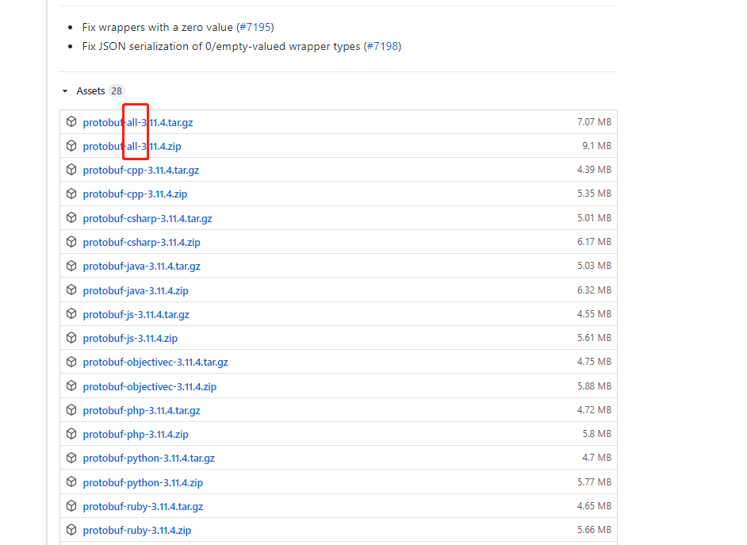

title: centos7下编译安装postgis3
abbrlink: a70e035f
date: 2020-06-05 09:02:55

tags: postgis

---


---

<!--more-->

本文认为已安装PostgreSQL，安装步骤如 [Centos7安装PostgreSQL](https://www.jianshu.com/p/639ebb43bfb4)，最好按照前文先把pg安装好，否则，在postgis,pgrouting安装时，指定pg的安装目录，直接抄路径应该不对，读者要指向自己的安装位置等。

CGAL4-11。因为4-11需要CMake3.11以上

```shell
cmake -version
# cmake version 2.8.12.2
```

升级cmake

```shell
 wget https://github.com/Kitware/CMake/releases/download/v3.16.8/cmake-3.16.8.tar.gz
 tar -zxvf cmake-3.16.8.tar.gz
 cd cmake-3.16.8
 ./bootstrap --prefix=/usr/local/cmake
 gamke
 gmake install
```

`postgis`还要安装其他依赖，比如`GEOS`,`proj`,`GDAL`，各版本需要的依赖版本，http://postgis.net/news/  ，如图。


本文基于GEOS 3.8.1,GDAL 3.0.4,PROJ 6.3.2,json-c 0.13.1

```shell
wget https://download.osgeo.org/geos/geos-3.8.1.tar.bz2
```

:blush:  安装proj-6.3.2时，遇到


然后我在命令行输入sqlite3的时候，结果是3.22，哪来的3.7.17？

https://stackoverflow.com/questions/62154342/configure-error-package-requirements-sqlite3-3-7-4-were-not-met


原来是sqlite-devel的版本，但我查询之后是最新的！！于是我删了sqlite-devl，得到的是`Checking for module 'sqlite3' No package 'sqlite3' found`

暴力升级也没有用，不得不看日志的下半部分。于是搜索关键词`PKG_CONFIG_PATH`。找到https://my.oschina.net/zzop/blog/499908这篇文章，其中说到：


:point_right:


`cp /usr/local/lib/pkgconfig/sqlite3.pc /usr/lib64/pkgconfig/`

重新编译就好了！


```sh

```

## 安装GDAL

遇到

```shell
collect2: error: ld returned 1 exit status
make[1]: *** [GNUmakefile:82: gdalinfo] Error 1
make: *** [GNUmakefile:112: apps-target] Error 2
```

解决办法可能是`make clean`,紧接着按之前的编译安装！

参考文章：https://stackoverflow.com/questions/60218227/trying-to-install-gdal-3-0-4-on-red-hat-8

```
./configure --prefix=/usr/local/gdal-3.0.4 --with-proj=/usr/local/proj-6.3.2 --with-geos=/usr/local/geos-3.8.1/bin/geos-config --with-sqlite3=/usr/local/bin/sqlite3 --with-libjson-c=/usr/local/json-c-0.13.1 --with-pg=yes --with-python=/root/.virtualenvs/aigisss_py/bin/python3.6 
```

## 安装protubuf

```shell
./configure  --prefix=/usr/local/protobuf-3.11.4
```

竟然说`bash: ./configure: No such file or directory`

解决方案

```shell
yum install automake
autoreconf -i
```

参考文章：https://stackoverflow.com/questions/24054761/configure-gives-error-in-ubuntu

出现编译错误

```shell
make[2]: *** [message.lo] Error 1 
make[1]: *** [all-recursive] Error 1
make: *** [all] Error 2
```

解决方案下载含有all的资源包



参考文章：https://github.com/protocolbuffers/protobuf/issues/6599

## 安装protobuf-c

```shell
export PKG_CONFIG_PATH=/usr/local/protobuf-3.11.4/lib/pkgconfig
./configure  --prefix=/usr/local/protobuf-c-1.3.3
```

## 安装SFCGAL 1.3.7

由于SFCGAL需要依赖Boost、CGAL、GMP、MPFR这四个软件，所以具体总共需要安装以下四个软件：

1. boost-devel.x86_64

2. gmp-devel.x86_64

3. mpfr-devel.x86_64

4. CGAL-4.14

   ```shell
   yum install boost boost-devel
   yum install gmp-devel.x86_64
   yum install mpfr-devel.x86_64
   ```

### 安装CGAL

```sh
xz -d CGAL-4.14.3.tar.xz
tar -xvf  CGAL-4.14.3.tar
cd CGAL-4.14.3
mkdir build && cd build
cmake ..
make && make install
```

### 安装SFCGAL

遇到以下这个问题：

```sh
c++: internal compiler error: Killed (program cc1plus)
Please submit a full bug report
```

解决方案：

```sh
sudo dd if=/dev/zero of=/swapfile bs=64M count=16
#count的大小就是增加的swap空间的大小，64M是块大小，所以空间大小是bs*count=1024MB
sudo mkswap /swapfile
#把刚才空间格式化成swap格式
chmod 0600 /swapfile  
#该目录权限，不改的话，在下一步启动时会报“swapon: /swapfile: insecure permissions 0644, 0600 suggested.”错误
sudo swapon /swapfile
#使用刚才创建的swap空间
```

安装编译：

```shell
wget  https://github.com/Oslandia/SFCGAL/archive/v1.3.7.tar.gz
tar -zxvf SFCGAL-1.3.7.tar.gz
cd SFCGAL-1.3.7  
mkdir build && cd build 
cmake -DCMAKE_INSTALL_PREFIX=/usr/local/sfcgal-1.3.7 ..
make  && make install
```

装完之后释放空间：

```sh
swapoff -a
#详细的用法可以：swapoff --help
#查看当前内存使用情况：free -m
```

参考文章：https://blog.csdn.net/qq_27148893/article/details/88936044

```shell
./configure --prefix=/usr/local/postgis-3.0.1 --with-gdalconfig=/usr/local/gdal-3.0.4/bin/gdal-config --with-pgconfig=/opt/pg12/bin/pg_config --with-geosconfig=/usr/local/geos-3.8.1/bin/geos-config --with-projdir=/usr/local/proj-6.3.2 --with-xml2config=/usr/local/libxml2-2.9.10/bin/xml2-config --with-jsondir=/usr/local/json-c-0.13.1 --with-protobufdir=/usr/local/protobuf-c-1.3.3 --with-sfcgal=/usr/local/sfcgal-1.3.7/bin/sfcgal-config
```

```sh
PG_HOME=/opt/pg12

LD_LIBRARY_PATH=$PG_HOME/lib:$LD_LIBRARY_PATH
PATH=$PG_HOME/bin:$PATH

PKG_CONFIG_PATH=$PG_HOME/lib/pkgconfig:$PKG_CONFIG_PATH

export CMAKE_HOME=/usr/bin/cmake
export PROTOBUF_HOME=/usr/local/protobuf-3.11.4

GDAL_HOME=/usr/local/gdal-3.0.4
GDAL_DATA=$GDAL_HOME/share/gdal
LD_LIBRARY_PATH=$GDAL_HOME/lib:/usr/local/lib64:$JRE_HOME/lib:$LD_LIBRARY_PATH
PATH=$GDAL_HOME/bin:$PATH

export PATH=$CMAKE_HOME/bin:$PROTOBUF_HOME/bin:/usr/local/protobuf-c-1.3.3/bin:$PATH
export PKG_CONFIG_PATH LD_LIBRARY_PATH
export LD_LIBRARY_PATH GDAL_DATA
```

