## 1、安装postgresql/postgis：

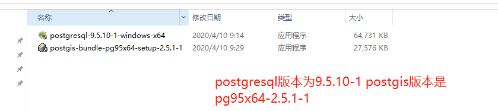

安装注意：先安装postgresql再安装postgis,注意用户名默认是postgres不要改动，密码需要安装者设置，用于后续数据库的登录，过程中一直点下一步即可，注意安装完postgresql弹出下图窗口后直接关闭！

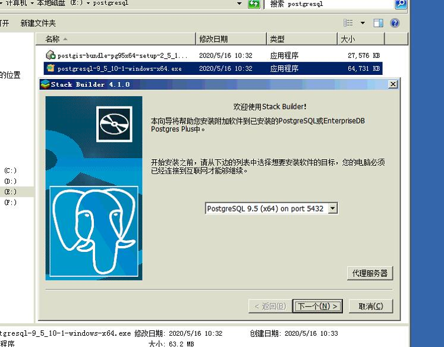

安装postgis最后会弹出类似下图窗口，直接都点是

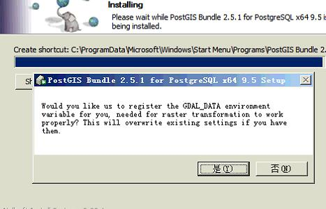

最终安装成功！

## 2、新建数据库

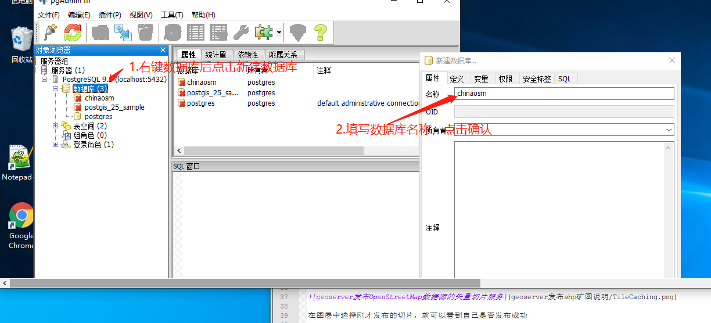

鼠标单击选中新建的数据库，进去sql语句命名窗口：

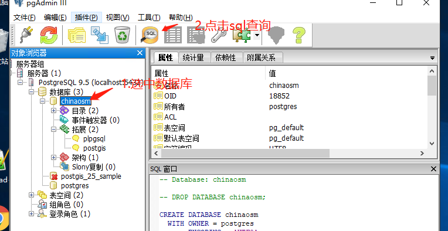

增加postgis扩展，sql语句为 create extension postgis，具体步骤见下图:

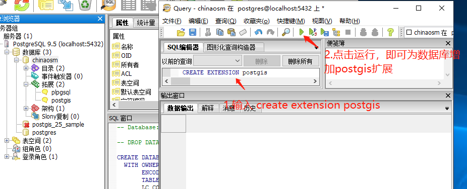

## 3、使用postgis桌面端工具将shp数据导入postgresql

打开postgis shapefile import/export manager，准备导入shp数据：

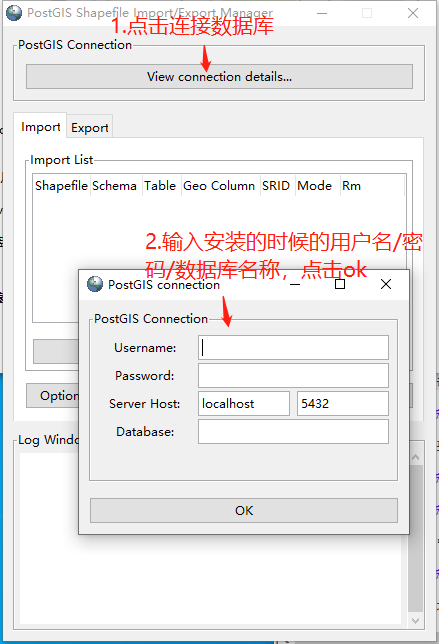

如果使用上述中国osm数据的话直接全选所有shp文件，点击open后，再点击import即可，需要一些时间等待导入完成，最终导入成功会有successed信息！

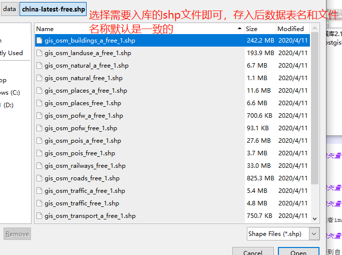

## 4、安装Geoserver

网盘中获取安装包，先装jdk，安装完成后在安装的目录bin里面启动geoserver，如图位置：

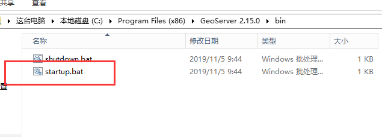

## 5、增加geoserver的矢量切片插件

下载矢量切片插件geoserver-2_14_2-vectortiles-plugin.rar，解压缩后将jar包拷贝到下图路径下面：

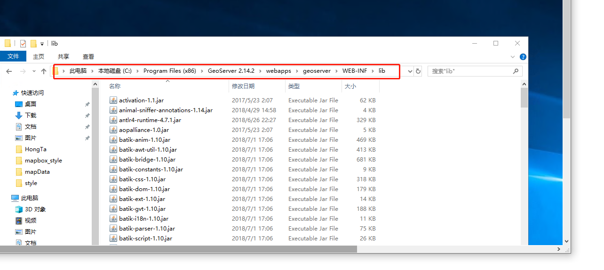

## 6、geoserver主界面

打开geoserver界面 http://ip:port（默认8080）/geoserver，用户名和密码默认是geoserver/admin

## 7、新建工作区：

注意工作区名称命名为chinaosm，后续需要发布的图层均在此新建工作区下完成，因此发布新图层的时候注意选择到正确的工作区！

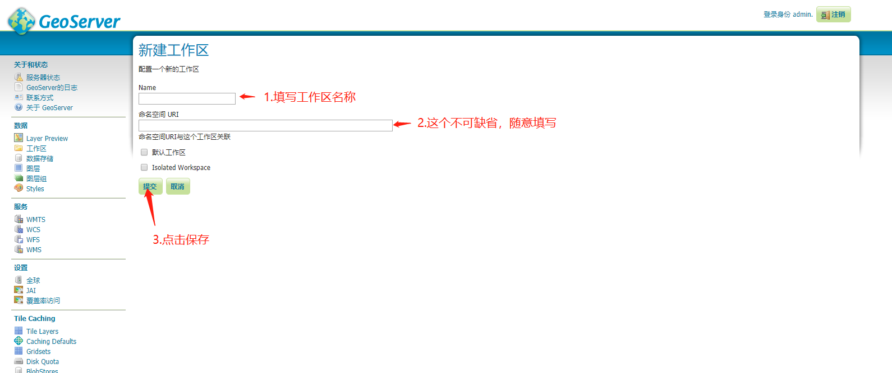

## 8、新建数据存储：

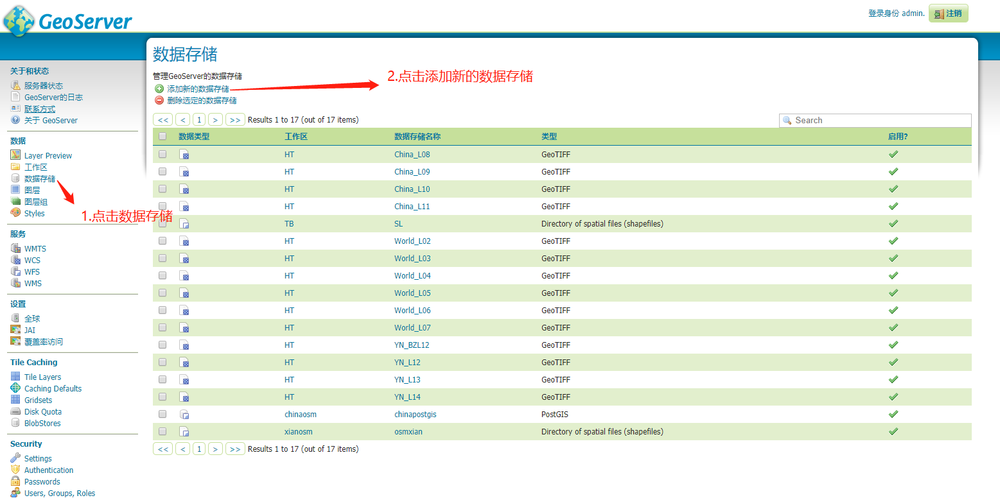

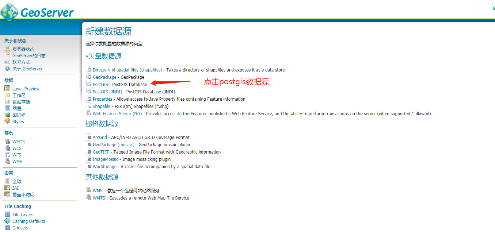

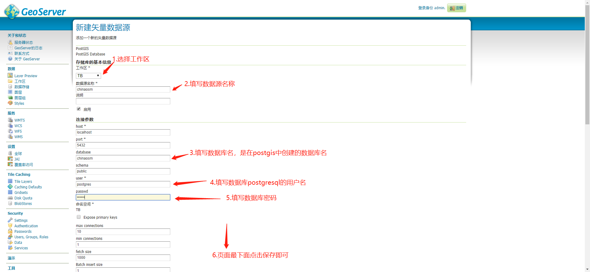

## 9、新建图层：

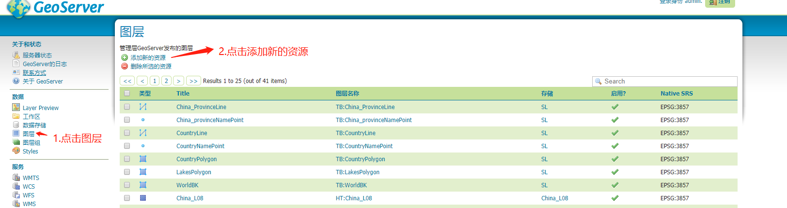

注意下图列表为====》工作空间名称：数据源名称

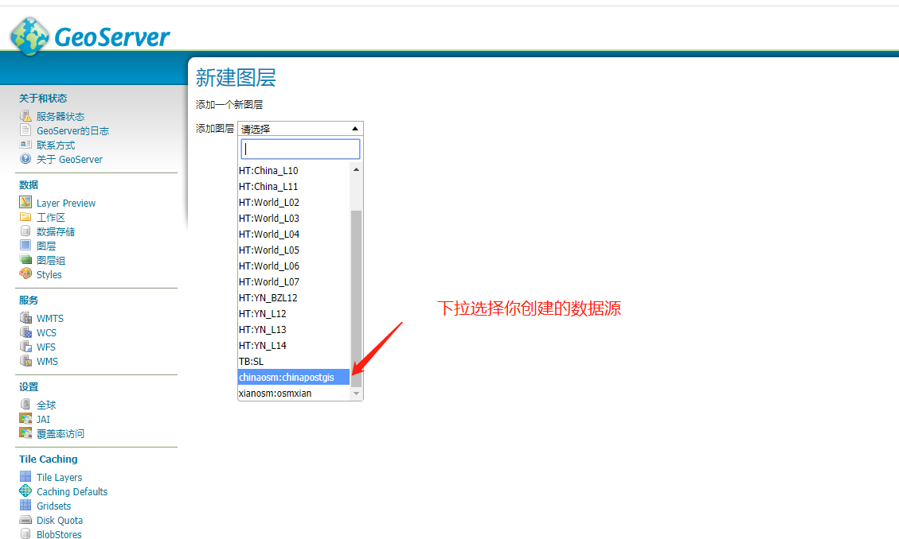

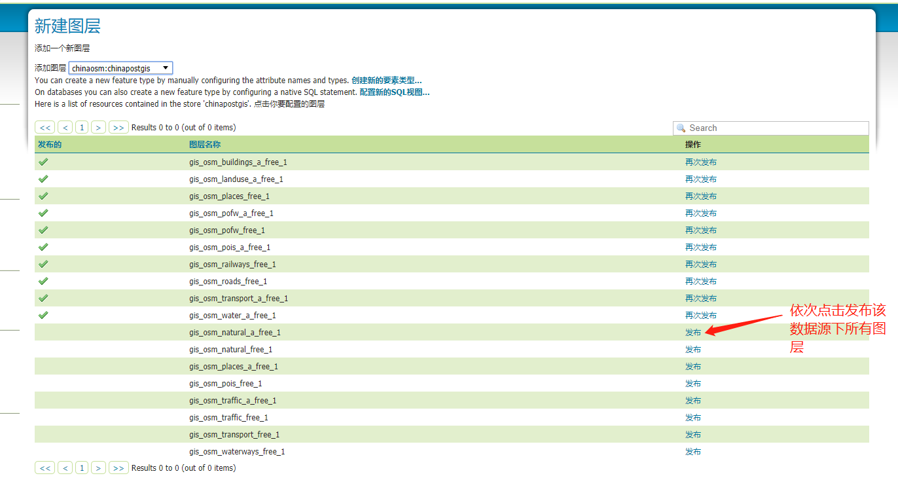

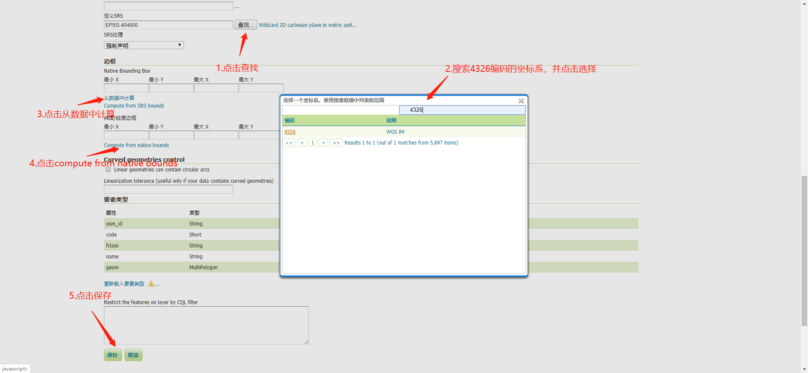

## 10、新建图层组：

新建图层组，作用是将之前新建的工作区中的所有新建图层放置到图层组中，进行统一管理与矢量切片的发布，注意图层组命名为chinaOSM，注意选择需要添加的工作区，添加所有图层！

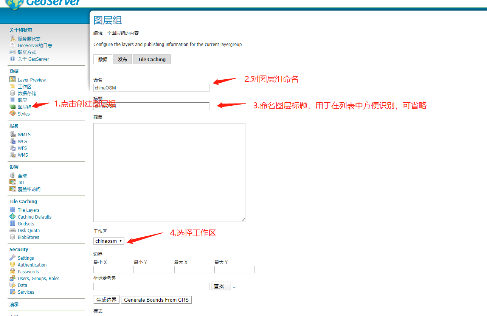

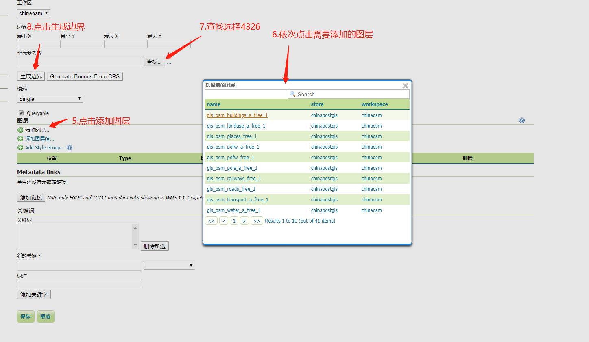

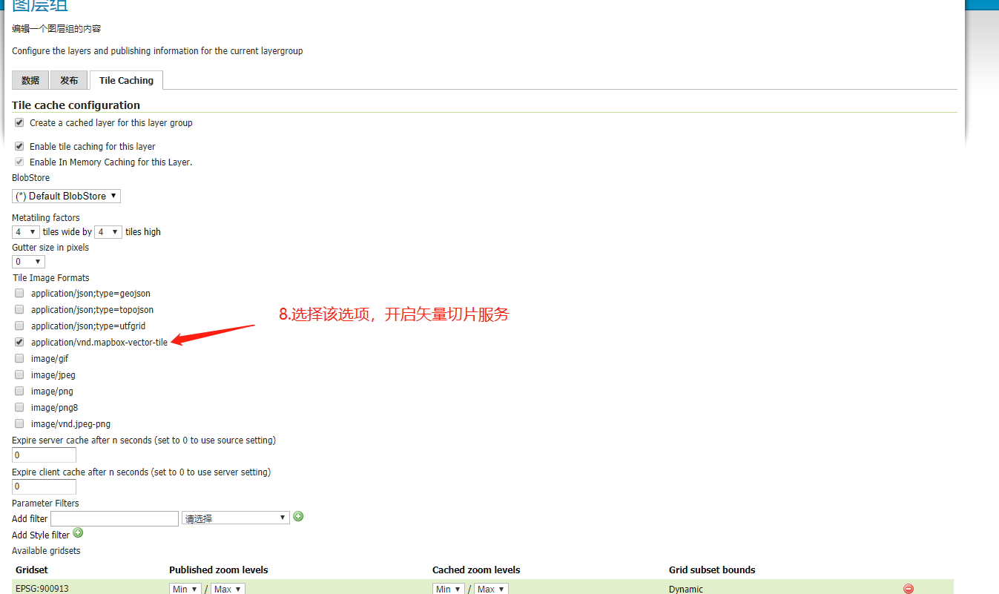

自此发布矢量切片服务完成！测试可在前端mapbox页面进行测试！

