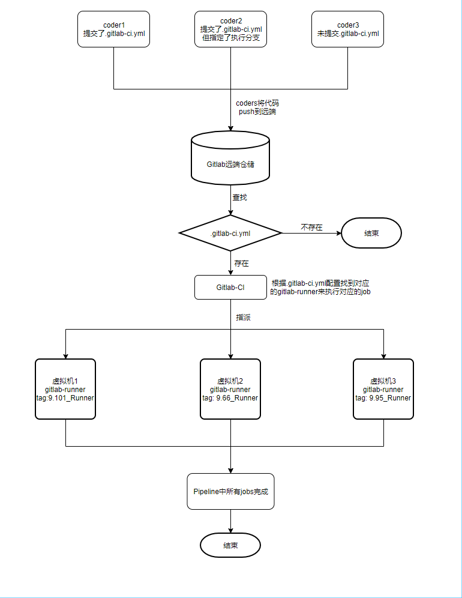
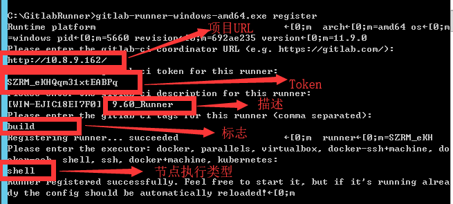
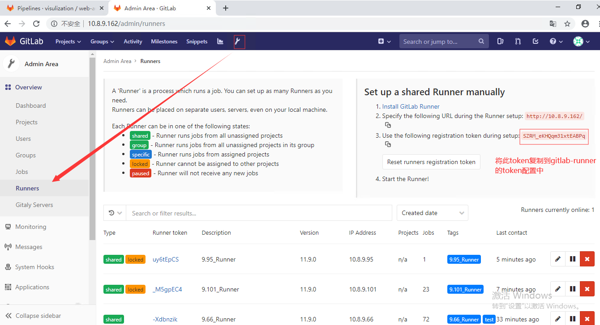
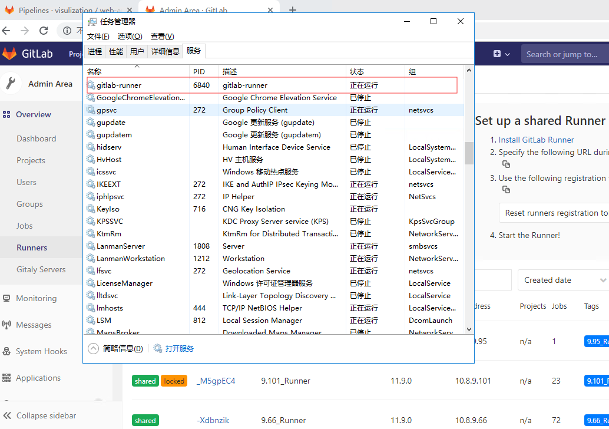
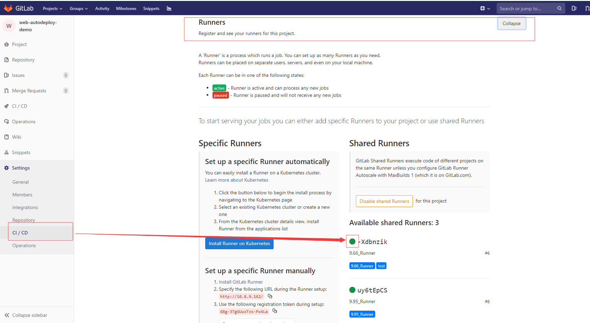
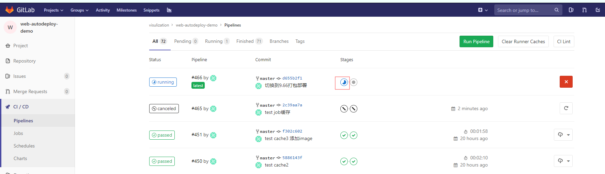
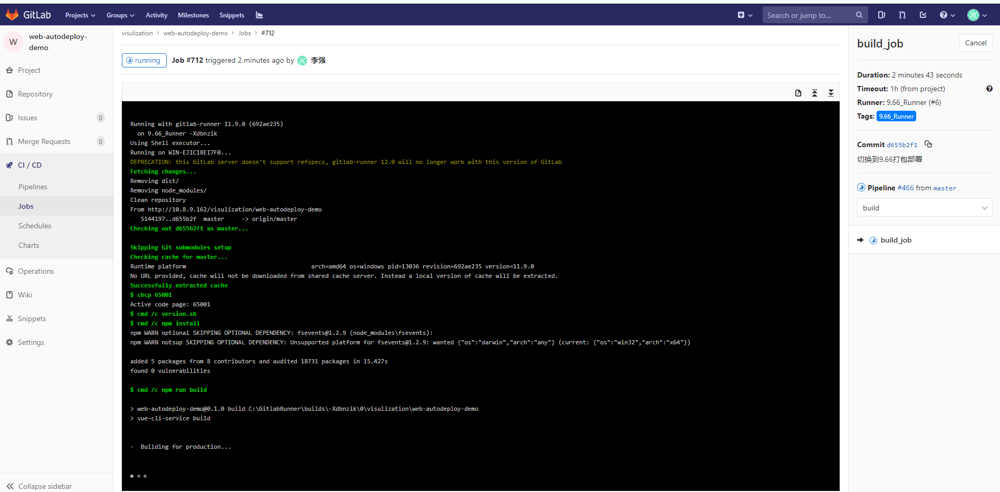
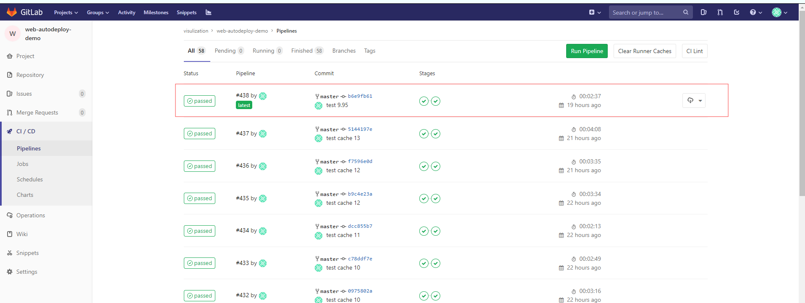
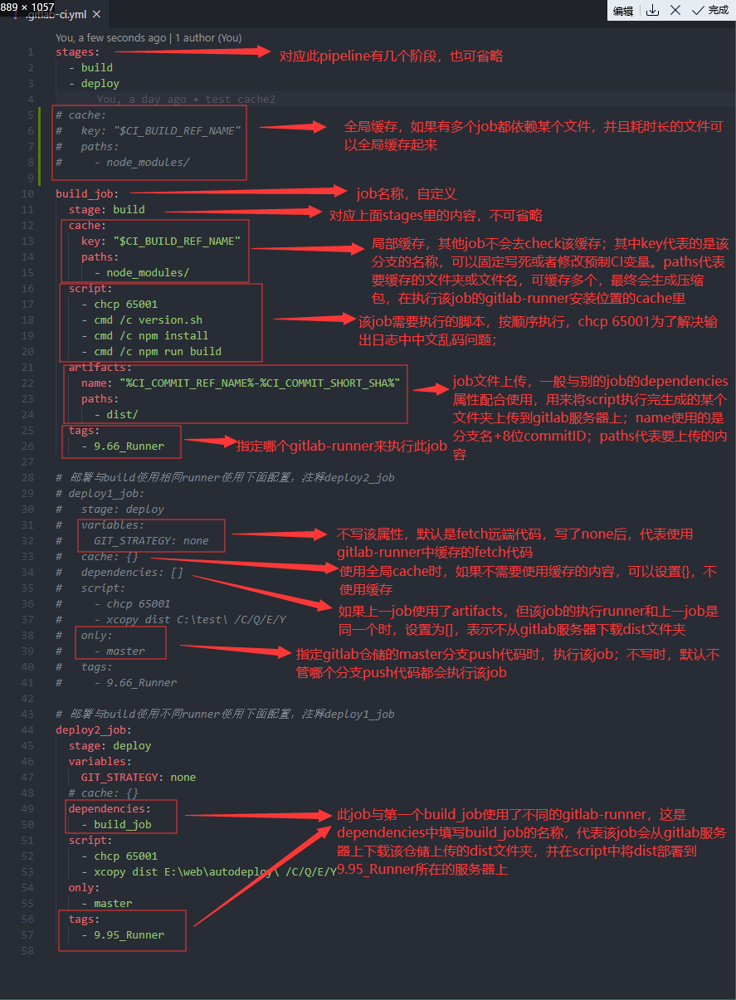
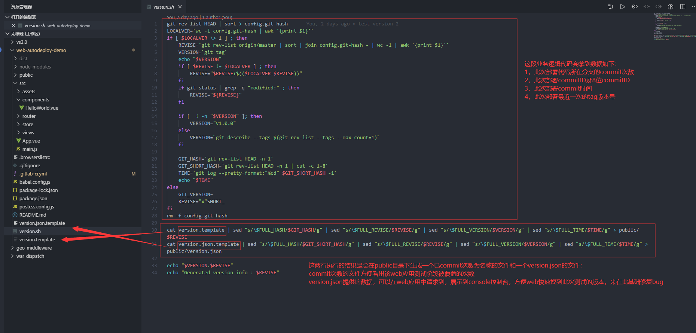

<!--more-->

## 前言：

### 此文章是公司同事培训时准备的资料

这里先为大家展示下 gitlab 与 gitlab-ci 的工作流程图，如下



## 环境准备

### 打包部署在同一虚拟机

> 1，虚拟机需要安装 gitlab-runner 服务；
>
> 2，安装 node 及 git 环境（如果 node 依赖有用到私仓，需要添加切换私仓镜像）

### 打包部署在不同虚拟机

> 1，打包虚拟机安装内容同 1.1；
>
> 2，部署虚拟机仅需安装 gitlab-runner 服务即可

### gitlab-runner 安装步骤

> 1，在服务器 C 盘或其他盘符新建一个 GitlabRunner 的文件夹，将文档根目录下的`gitlab-runner-windows-amd64.exe`程序拷贝到其中
>
> 2，在 GitlabRunner 文件夹目录下 shift+右键，“在此处打开命令窗口”
>
> 3，输入 `gitlab-runner-windows-amd64.exe register` 根据提示填写内容（如下图）
>
> 
>
> 其中 token 是通过管理员登陆 gitlab 后，在 Runners 中复制过来，如下图
>
> 
>
> **注意：tags 的配置可以配置多个，命令行中可以按照 description 的格式来写，后面 yml 文件中会用到**
>
> 4，输入 `gitlab-runner-windows-amd64.exe install` 没有报错后再输入 `gitlab-runner-windows-amd64.exe start`
>
> 5，打开任务管理器查看 gitlab-runner 是否正在运行，如下图
>
> 
>
> 6，最终自己登陆上 gitlab 后可以在 看到刚添加上的 gitlab-runner 的状态，如下图状态即为安装成功
>
> 

## 部署流程

### 部署服务器上配置开启 web-server

> 常用 web-server 有 IIS 和 nginx，配置好后，开启 web 服务后，将存放 web 页面的文件路径记录好，如下
>
> `E:\web\autodeploy\` 后面 yml 配置文件要用到

### gitlab 建立仓储或者使用已有的仓储

> 这里已 vue 项目为例
>
> 1，本地打开项目代码，新建一个名为 `.gitlab-ci.yml` 文件在项目根目录（与 package.json 同级）
>
> 2，`.gitlab-ci.yml` 中添加配置，详见三
>
> 3，`git push origin master` push 完成后，在 gitlab 仓储的 CI/CD 中的 Pipeline 中就可以看到部署进度（部署的时长与 npm install 的速度相关）所以建议减少高频 push 代码来触发自动化部署或者通过指定分支来做（在.gitlab-ci.yml 中解释如何操作）
>
> 4，push 到远端后，就可以在仓储 CI/CD 的 Pipelines 中看到这条流水线（如下图状态）
>
> 
>
> 5，也可以点开上图红框按钮，进入到当前 job 中查看部署日志状态（如下图），完成后日志结尾会提示 `Job succeeded`
>
> 
>
> 6，完成后，如下图状态，即为部署成功，这是就可以打开自己在 web-server 上配置的 ip 或者域名来访问网站（此处样例链接 http://autodeploy.rdapp/ ）
>
> 

## .gitlab-ci.yml 文件配置解释

### .gitlab-ci.yml 每步配置的解释，见下图：



### .gitlab-ci.yml 源码，可直接复制，针对项目部署情况修改使用

```yaml
stages:
  - build
  - deploy

# cache:
#   key: "$CI_BUILD_REF_NAME"
#   paths:
#     - node_modules/

build_job:
  stage: build
  cache:
    key: "$CI_BUILD_REF_NAME"
    paths:
      - node_modules/
  script:
    - chcp 65001
    - cmd /c version.sh
    - cmd /c npm install
    - cmd /c npm run build
  artifacts:
    name: "%CI_COMMIT_REF_NAME%-%CI_COMMIT_SHORT_SHA%"
    paths:
      - dist/
  tags:
    - 9.66_Runner

# 部署与build使用相同runner使用下面配置，注释deploy2_job
# deploy1_job:
#   stage: deploy
#   variables:
#     GIT_STRATEGY: none
#   cache: {}
#   dependencies: []
#   script:
#     - chcp 65001
#     - xcopy dist C:\test\ /C/Q/E/Y
#     拷贝当前目录下所有文件夹及内容
#     - xcopy . E:\test /C/Q/E/Y
#   only:
#     - master
#   tags:
#     - 9.66_Runner

# 部署与build使用不同runner使用下面配置，注释deploy1_job
deploy2_job:
  stage: deploy
  variables:
    GIT_STRATEGY: none
  # cache: {}
  dependencies:
    - build_job
  script:
    - chcp 65001
    - xcopy dist E:\web\autodeploy\ /C/Q/E/Y
  #  only:
  #    - master
  tags:
    - 9.95_Runner
```

## version.sh 文件配置解释

> 在第三部分中的.gitlab-ci.yml 代码中 build_job 的 script 中有这么一行命令 `- cmd /c version.sh`
>
> 这里通过执行 version.sh 这么一个 bash 命令文件来生成方便开发和测试的一种辅助功能，具体看下图



### version.sh 代码如下

```bash
git rev-list HEAD | sort > config.git-hash
LOCALVER=`wc -l config.git-hash | awk '{print $1}'`
if [ $LOCALVER \> 1 ] ; then
    REVISE=`git rev-list origin/master | sort | join config.git-hash - | wc -l | awk '{print $1}'`
	VERSION=`git tag`
	echo "$VERSION"
    if [ $REVISE != $LOCALVER ] ; then
        REVISE="$REVISE+$(($LOCALVER-$REVISE))"
    fi
    if git status | grep -q "modified:" ; then
        REVISE="${REVISE}"
    fi

	if [  ! -n "$VERSION" ]; then
        VERSION="v1.0.0"
	else
		VERSION=`git describe --tags $(git rev-list --tags --max-count=1)`
    fi

	GIT_HASH=`git rev-list HEAD -n 1`
	GIT_SHORT_HASH=`git rev-list HEAD -n 1 | cut -c 1-8`
    TIME=`git log --pretty=format:"%cd" $GIT_SHORT_HASH -1`
	echo "$TIME"
else
    GIT_VERSION=
    REVISE="x"SHORT_
fi
rm -f config.git-hash

cat version.template | sed "s/\$FULL_HASH/$GIT_HASH/g" | sed "s/\$FULL_REVISE/$REVISE/g" | sed "s/\$FULL_VERSION/$VERSION/g" | sed "s/\$FULL_TIME/$TIME/g" > public/$REVISE
cat version.json.template | sed "s/\$FULL_HASH/$GIT_SHORT_HASH/g" | sed "s/\$FULL_REVISE/$REVISE/g" | sed "s/\$FULL_VERSION/$VERSION/g" | sed "s/\$FULL_TIME/$TIME/g" > public/version.json

echo "$VERSION.$REVISE"
echo "Generated version info : $REVISE"
```

### version.template 代码如下：

```
Version $FULL_VERSION
Revise $FULL_REVISE
Git_hash $FULL_HASH
Git_time $FULL_TIME
```

### version.json.template 代码如下：

```
{
    "Tag_version": "$FULL_VERSION",
    "Commit_count": "$FULL_REVISE",
    "Current_commit_ID": "$FULL_HASH",
    "Current_commit_time": "$FULL_TIME"
}
```

## 补充

> 因 build 环节，可能会出现不同项目有不同的 npm 仓，有的包需要用到私仓或者 npm 公仓；这里做以下补充

第四部分的介绍属于扩展，根据项目，按需加

下面介绍需要使用多不同的 npm 镜像时如何处理：

### 修改.gitlab-ci.yml 文件，如下：

```yaml
stages:
  - build
  - deploy

build_job:
  stage: build
  script:
    - chcp 65001
    - cmd /c version.sh
    - cmd /c build.sh
  artifacts:
    name: "%CI_COMMIT_REF_NAME%-%CI_COMMIT_SHORT_SHA%"
    paths:
      - dist/
  tags:
    - 9.101_Runner

# 部署与build使用相同runner使用下面配置，注释deploy2_job
# deploy1_job:
#   stage: deploy
#   variables:
#     GIT_STRATEGY: none
#   cache: {}
#   dependencies: []
#   script:
#     - chcp 65001
#     - xcopy dist C:\test\ /C/Q/E/Y
#   only:
#     - master
#   tags:
#     - 9.66_Runner

# 部署与build使用不同runner使用下面配置，注释deploy1_job
deploy2_job:
  stage: deploy
  variables:
    GIT_STRATEGY: none
  # cache: {}
  dependencies:
    - build_job
  script:
    - chcp 65001
    - xcopy dist E:\web\autodeploy\ /C/Q/E/Y
  only:
    - master
  tags:
    - 9.95_Runner
```

> **注意：其中对 build_job 的内容做了修改**

### 与 version.sh 同级，新建 build.sh 文件，添加如下内容

```shell
npm install --registry https://registry.npmjs.org/
npm install --registry https://registry.npm.taobao.org/
npm install --registry http://registry.npm.rdapp.com/
npm run build
```

> 这里 install 的第一条和第二条选择一个即可，建议使用 taobao 镜像
>
> **注意：只有在 taobao 镜像也下载不下来库时，就需要值用 npmjs 的镜像**
