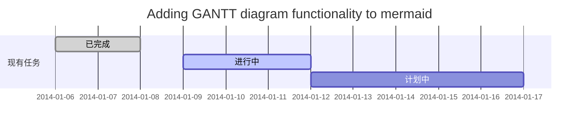

```markdown
gitGraph:
options
{
    "nodeSpacing": 150,
    "nodeRadius": 10
}
end
commit
branch newbranch
checkout newbranch
commit
commit
checkout master
commit
commit
merge newbranch
```


```
gantt
        dateFormat  YYYY-MM-DD
        title Adding GANTT diagram functionality to mermaid
        section 现有任务
        已完成               :done,    des1, 2014-01-06,2014-01-08
        进行中               :active,  des2, 2014-01-09, 3d
        计划中               :         des3, after des2, 5d
```



