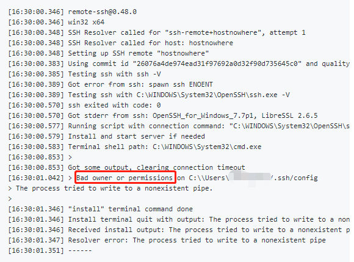
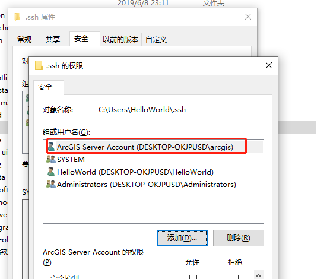
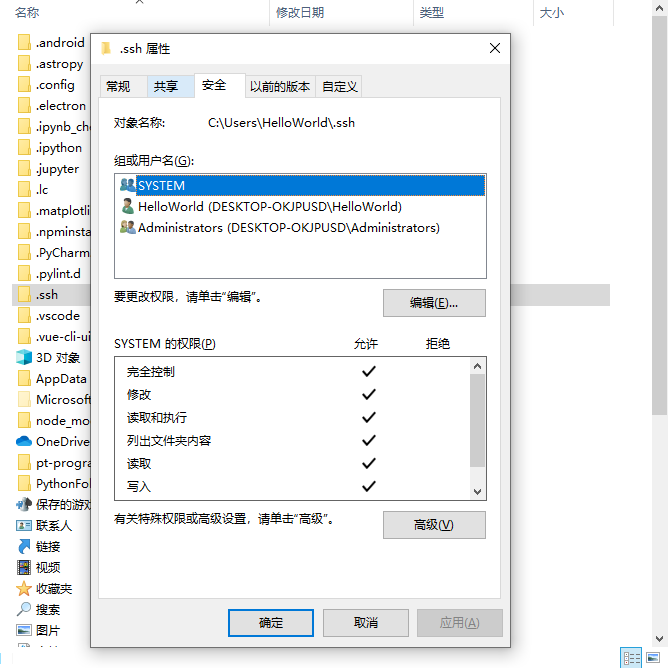
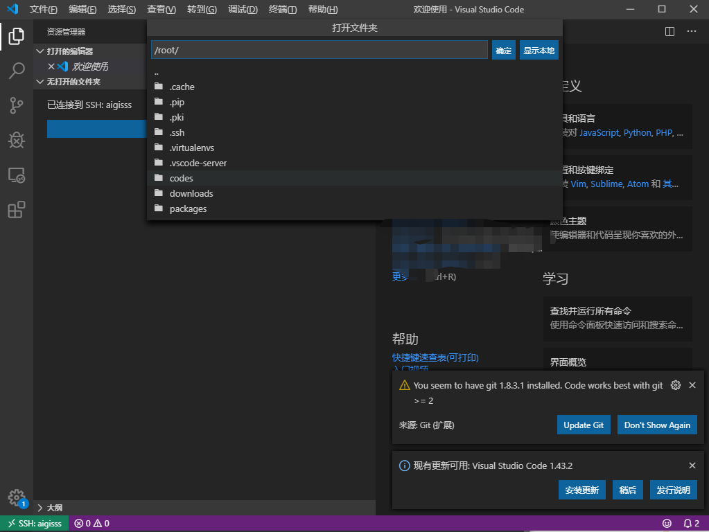

有了自己的云服务器，就想把自己的网站往上迁移。听闻 vscode 中`remote-SSH`的插件很好用，于是安装使用一下，木有想到的是，第一步就出错了——连接不上，报`Bad owner or permissions`的错！！

<!--more-->

网上试了很多种，方法，都没有解决，包括[禁用继承](https://blog.csdn.net/chaoenhu/article/details/103698804?depth_1-utm_source=distribute.pc_relevant.none-task&utm_source=distribute.pc_relevant.none-task)、[**openssh-portable**](https://github.com/PowerShell/openssh-portable) 。但是还是没有解决我的问题，但是在公司的电脑一下子就能连上。我就想着其中的区别，发现其中有点不同，结合上面的禁用继承的文章，于是把第一个用户名删了，我登录的是`HelloWorld`这个用户。

删完的图如下：

结果能登录上去了，如图：

> 另外可以参考[个人电脑配置免密登陆SSH](https://zhuanlan.zhihu.com/p/143146239)
