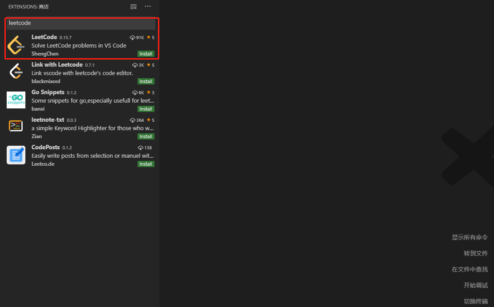
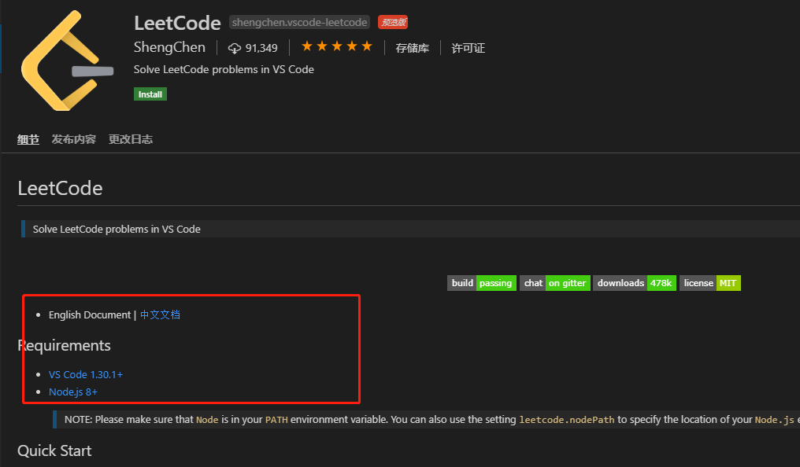
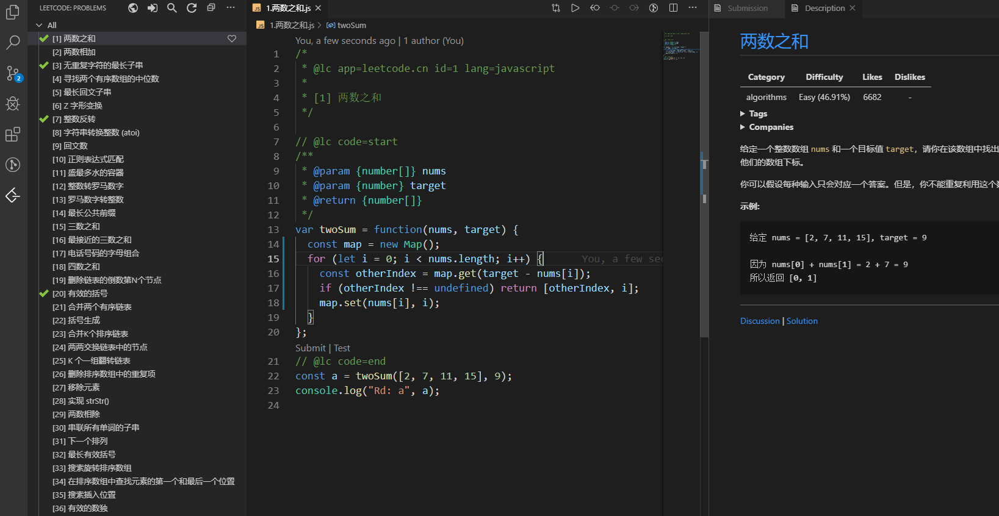
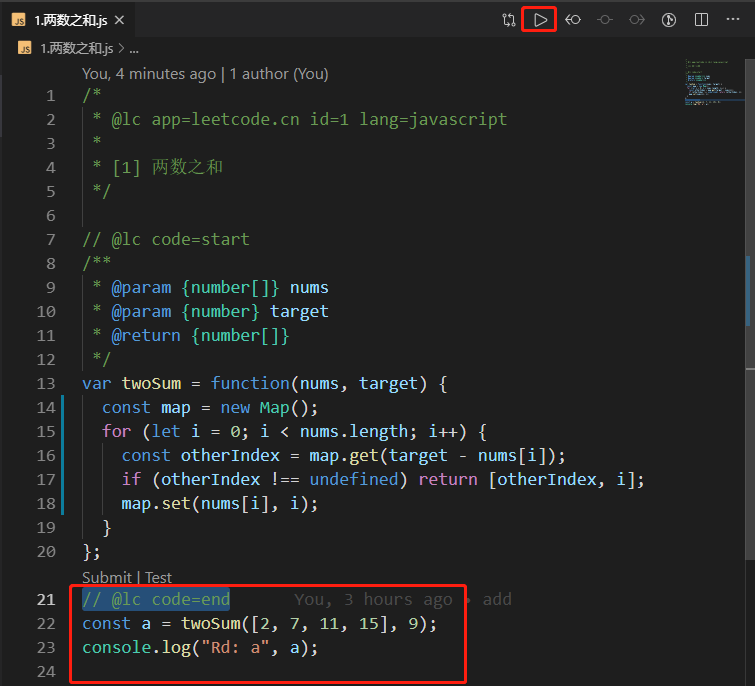
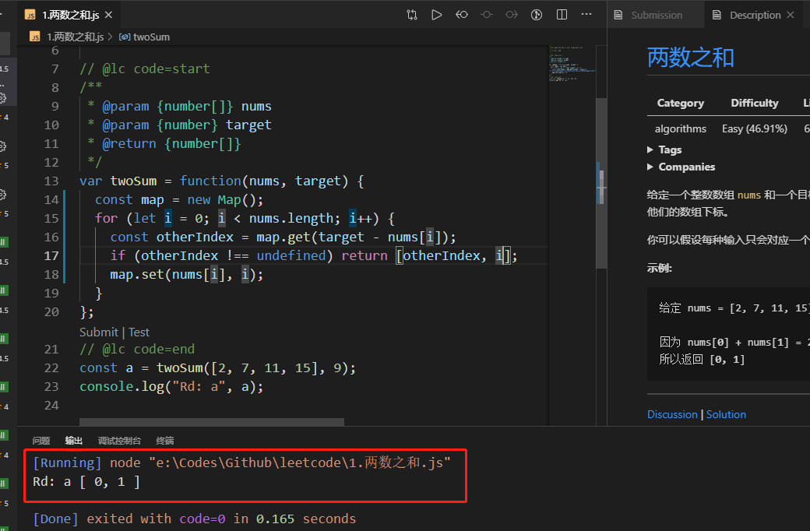
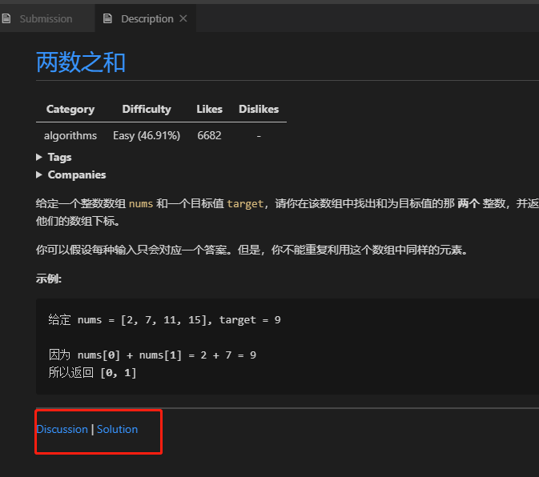

## 前言

在浏览器上使用 leetcode 总觉得不是很方便，如果能和 vscode 结合，应该是如鱼得水、如虎添翼、珠联璧合。

<!--more-->

事实上是在 vscode 的插件库中已经有了，直接搜索 leetcode，第一个出现的就是。

安装使用这个插件是有条件的，要有 node 环境

安装好了在左边就有一个 leetcode 的图标， 登入成功后刷新列表，即可查看题目。效果如下：

如果没有账号，就要去[力扣(_LeetCode_)官网](http://www.baidu.com/link?url=jhP_IixWVDUkFFNsbhVNBrTOS4Oo_OnhKJeg4oCJm4i)或者[_LeetCode_](http://www.baidu.com/link?url=E9ThnAR3OQJZeUDbdon7SeBLuvPl0Es9WY69eZVe9cS)注册账号！！

初步的可以在`// @lc code=end`下面结合`Code Runner`得到初步验证

更多用例的测试需要点`Test`来验证。

可以使用`Submit`来看看自己的代码的排名情况。

可以去讨论一下或者看看别人的的解决方法。提交到 github，然后就可以到处做题目了！！

