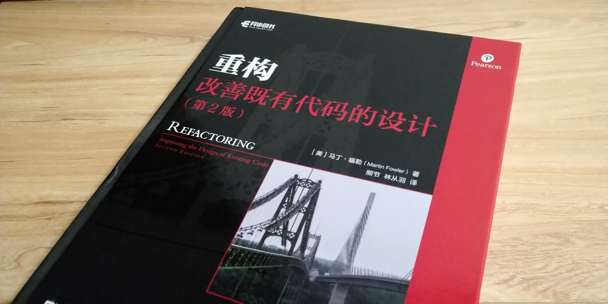

<!--more-->

# 前言

都能写出计算机可以理解代码，唯有写出人类容易理解的代码的，才是优秀的程序员。

    好代码的标准就是人们能否轻而易举地修改它
    

# 重构的原则
## 何谓重构
重构这个词既可以是名词也可以是动词，名词形式的定义的是：

对软件内部结构的调整，目的是在不改变软件可观察行为的前提下，提高其可理解性，降低其修改成本。

动词形式的定义的是：

使用一系列的重构手法，在不改变可观察行为的前提下，调整其结构

## 为何重构

- 重构改进软件的设计
- 重构时软件更容易理解
- 重构帮助找到bug
- 重构提高编程速度

## 何时重构

- 预备性重构：让添加的新功能更容易
- 帮助理解的重构：使代码更容易理解
- 捡垃圾式重构
- 有计划的重构和见机行事的重构
- 长期重构
- 复审代码时重构

## 何时不重构

- 重写比重构还容易

只有需要理解其工作原理时，对其重构才有价值。

